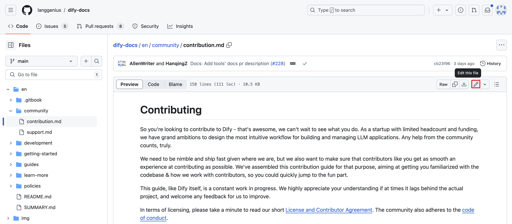

# مشارکت در مستندات Dify

مستندات Dify یک [پروژه متن باز](https://github.com/langgenius/dify-docs) است و ما از مشارکت شما استقبال می‌کنیم. چه خطایی در حین خواندن اسناد پیدا کرده باشید یا مشتاق باشید محتوای خود را ارائه دهید، ما شما را تشویق می‌کنیم که یک مشکل را ثبت کنید یا یک pull request در GitHub ایجاد کنید. ما به سرعت به PR شما رسیدگی می‌کنیم.

## نحوه مشارکت

ما مسائل مربوط به مستندات را به دو نوع اصلی تقسیم می‌کنیم:

* تصحیح محتوا (خطاهای تایپی / عدم دقت)
* اضافه کردن محتوا (مستندات جدید)

### خطاهای محتوا

اگر هنگام خواندن یک سند به خطایی برخوردید یا می‌خواهید تغییری را پیشنهاد دهید، لطفاً از دکمه "Edit on GitHub" که در جدول محتوا در سمت راست صفحه سند قرار دارد، استفاده کنید. از ویرایشگر آنلاین GitHub که در این سامانه تعبیه شده است، برای اعمال تغییرات خود استفاده کنید و سپس یک pull request با توضیح مختصر از ویرایش‌های خود ارسال کنید. لطفاً عنوان pull request خود را به صورت `Fix: Update xxx` قالب‌بندی کنید. ما بررسی خواهیم کرد و اگر همه چیز خوب به نظر برسد، تغییرات را ادغام خواهیم کرد.



همچنین می‌توانید لینک سند را در [صفحه Issues](https://github.com/langgenius/dify-docs/issues) با شرح کوتاهی از اصلاحات مورد نیاز ارسال کنید. ما به محض دریافت این موارد به آن‌ها رسیدگی خواهیم کرد.

### اضافه کردن محتوا

برای مشارکت در مستندات جدید در مخزن ما، لطفاً این مراحل را دنبال کنید:

1. مخزن را Fork کنید

مخزن را به حساب GitHub خود Fork کنید، سپس مخزن را به دستگاه محلی خود clone کنید:

```bash
git clone https://github.com/<your-github-account>/dify-docs.git
```

> نکته: شما همچنین می‌توانید از ویرایشگر کد آنلاین GitHub برای ارسال مستقیم فایل‌های جدید Markdown در دایرکتوری مناسب استفاده کنید.

1. دایرکتوری سند مربوطه را پیدا کنید و فایل خود را اضافه کنید

به عنوان مثال، اگر در حال مشارکت در مستندات برای ابزارهای شخص ثالث هستید، لطفاً فایل‌های `.md` جدید را به دایرکتوری `/guides/tools/tool-configuration/` اضافه کنید.

3. یک pull request ارسال کنید

هنگام ارسال یک pull request، لطفاً از قالب `Docs: Add xxx` برای عنوان استفاده کنید و توضیح مختصری را در قسمت نظر ارائه دهید. ما بررسی خواهیم کرد و اگر همه چیز مرتب باشد، تغییرات را ادغام خواهیم کرد.

## گرفتن کمک

اگر هنگام مشارکت در هر مرحله‌ای گیر کردید یا سوالی برایتان پیش آمد، می‌توانید سؤال خود را از طریق issue مربوط به GitHub بپرسید، یا به [Discord](https://discord.gg/AhzKf7dNgk) ما بروید تا به سرعت با ما گفتگو کنید.

از تلاش شما در بهبود مستندات Dify قدردانی می‌کنیم!
