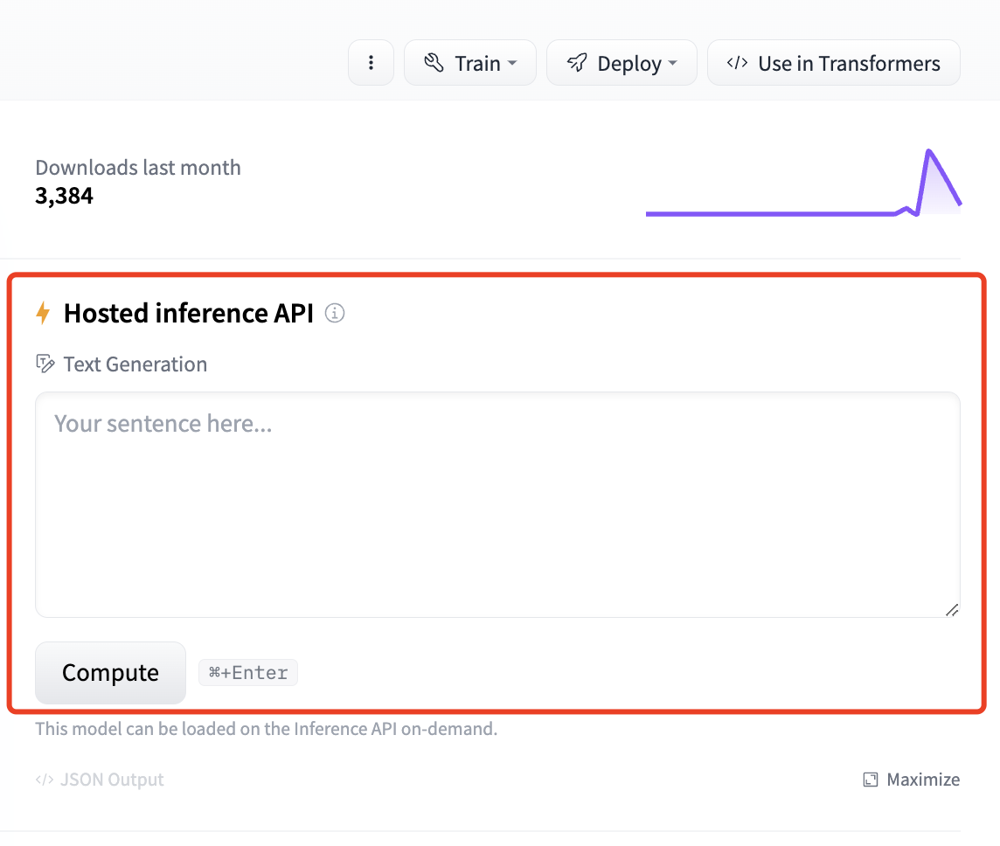
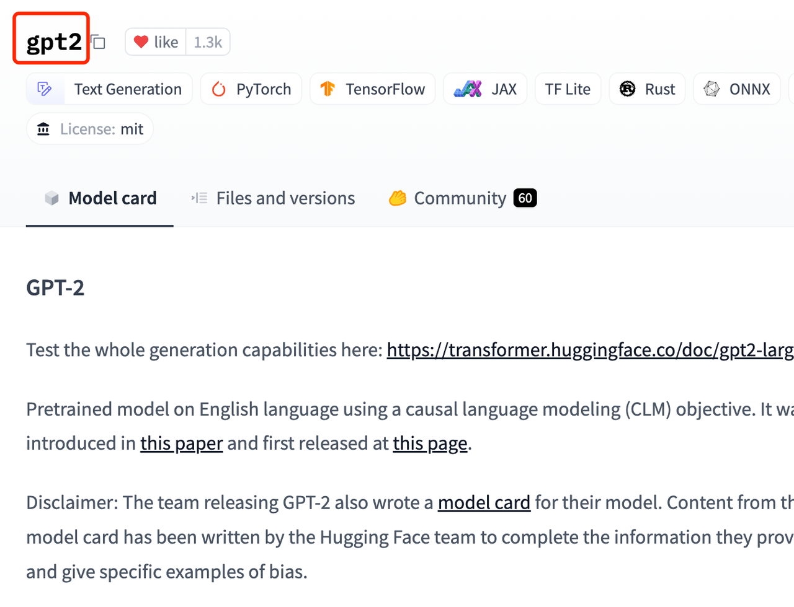
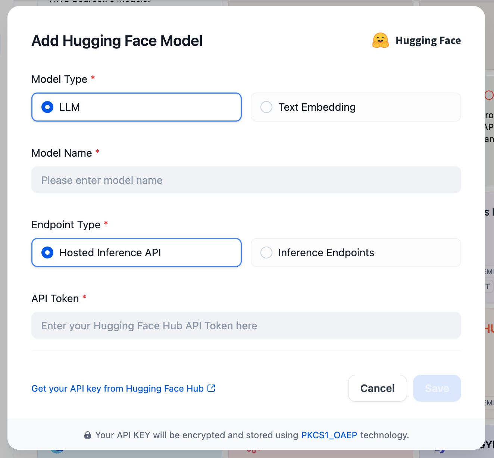
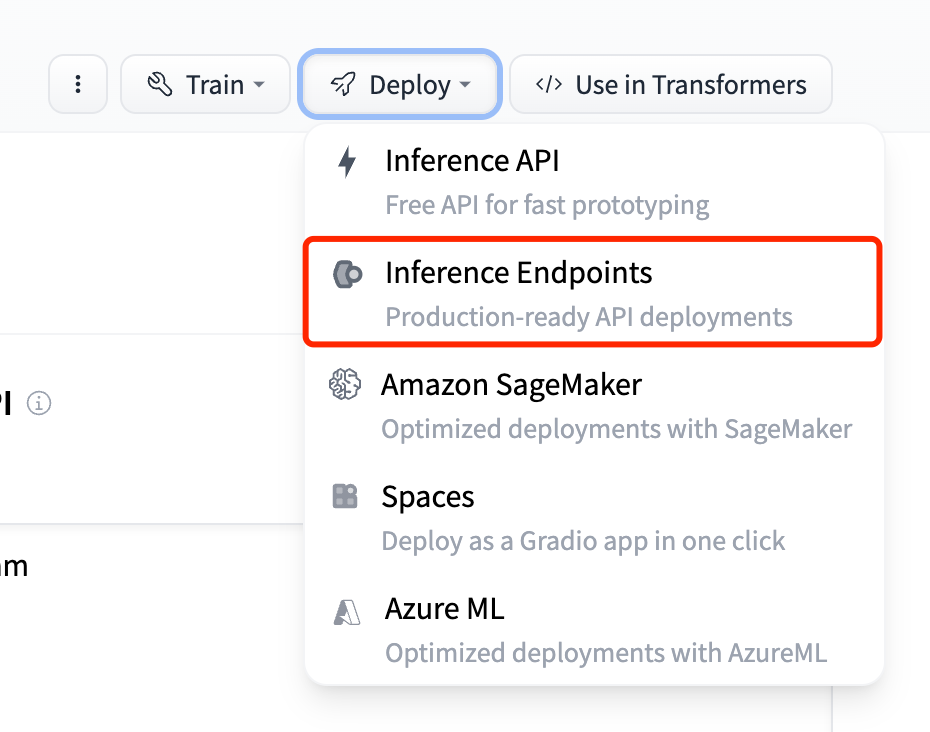
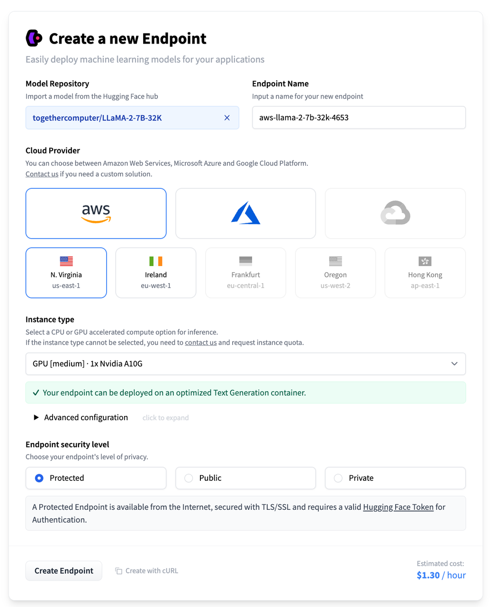
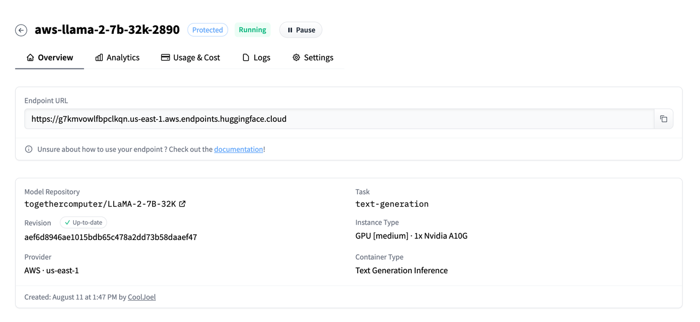
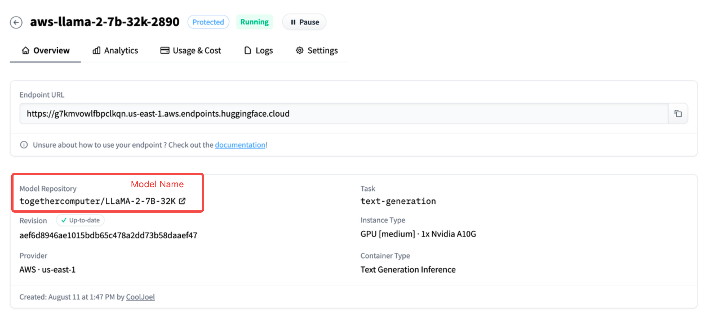

# ادغام مدل‌های متن‌باز از هاگینگ فیس

دیفای از تولید متن و توگنیزه پشتیبانی می‌کند. در زیر انواع مدل‌های هاگینگ فیس مربوطه آورده شده است:

* تولید متن: [text-generation](https://huggingface.co/models?pipeline_tag=text-generation&sort=trending)，[text2text-generation](https://huggingface.co/models?pipeline_tag=text2text-generation&sort=trending)
* توگنیزه: [feature-extraction](https://huggingface.co/models?pipeline_tag=feature-extraction&sort=trending)

مراحل خاص به شرح زیر است:

1. شما به یک حساب هاگینگ فیس نیاز دارید ([آدرس ثبت نام](https://huggingface.co/join)).
2. کلید API هاگینگ فیس را تنظیم کنید ([آدرس دریافت](https://huggingface.co/settings/tokens)).
3. یک مدل را برای ورود به [صفحه لیست مدل‌های هاگینگ فیس](https://huggingface.co/models?pipeline_tag=text-generation&sort=trending) انتخاب کنید.

<figure><figcaption></figcaption></figure>

دیفای از دو روش برای دسترسی به مدل‌ها در هاگینگ فیس پشتیبانی می‌کند:

1. API استنتاج میزبانی شده. این روش از مدل مستقر شده به طور رسمی توسط هاگینگ فیس استفاده می‌کند. هیچ هزینه‌ای لازم نیست. اما نقطه ضعف این است که فقط تعداد کمی از مدل‌ها از این روش پشتیبانی می‌کنند.
2. نقطه پایانی استنتاج. این روش از منابعی مانند AWS که توسط هاگینگ فیس دسترسی دارند برای استقرار مدل استفاده می‌کند و نیاز به پرداخت هزینه دارد.

### مدل‌هایی که به API استنتاج میزبانی شده دسترسی دارند

#### 1 انتخاب یک مدل

API استنتاج میزبانی شده فقط در صورتی پشتیبانی می‌شود که در سمت راست صفحه جزئیات مدل، ناحیه‌ای حاوی API استنتاج میزبانی شده وجود داشته باشد. همانطور که در شکل زیر نشان داده شده است:

<figure><figcaption></figcaption></figure>

در صفحه جزئیات مدل، می‌توانید نام مدل را دریافت کنید.

<figure><figcaption></figcaption></figure>

#### 2 استفاده از مدل‌های دسترسی در دیفای

در `Settings > Model Provider > Hugging Face > Model Type`، برای Endpoint Type، Hosted Inference API را انتخاب کنید. همانطور که در زیر نشان داده شده است:

<figure><figcaption></figcaption></figure>

API Token کلید API است که در ابتدای مقاله تنظیم شده است. نام مدل، نام مدل است که در مرحله قبل به دست آمده است.

### روش 2: نقطه پایانی استنتاج

#### 1 انتخاب مدل برای استقرار

نقطه پایانی استنتاج فقط برای مدل‌هایی با گزینه Inference Endpoints در زیر دکمه Deploy در سمت راست صفحه جزئیات مدل پشتیبانی می‌شود. همانطور که در زیر نشان داده شده است:

<figure><figcaption></figcaption></figure>

#### 2 استقرار مدل

دکمه Deploy را برای مدل کلیک کنید و گزینه Inference Endpoint را انتخاب کنید. اگر قبلاً کارت بانکی را متصل نکرده‌اید، باید کارت را متصل کنید. فقط مراحل را دنبال کنید. پس از اتصال کارت، رابط زیر ظاهر می‌شود: تنظیمات را با توجه به نیازها تغییر دهید و برای ایجاد یک نقطه پایانی استنتاج، روی Create Endpoint در گوشه پایین سمت چپ کلیک کنید.

<figure><figcaption></figcaption></figure>

پس از استقرار مدل، می‌توانید URL نقطه پایانی را مشاهده کنید.

<figure><figcaption></figcaption></figure>

#### 3 استفاده از مدل‌های دسترسی در دیفای

در `Settings > Model Provider > Hugging face > Model Type`، برای Endpoint Type، Inference Endpoints را انتخاب کنید. همانطور که در زیر نشان داده شده است:

<figure><figcaption></figcaption></figure>

API Token کلید API است که در ابتدای مقاله تنظیم شده است. `نام مدل Text-Generation می‌تواند دلخواه باشد، اما نام مدل Embeddings باید با هاگینگ فیس مطابقت داشته باشد. ` URL نقطه پایانی، URL نقطه پایانی است که پس از استقرار موفقیت‌آمیز مدل در مرحله قبل به دست آمده است.

<figure><figcaption></figcaption></figure>

> توجه: "نام کاربری / نام سازمان" برای Embeddings باید مطابق با روش استقرار شما در [Inference Endpoints](https://huggingface.co/docs/inference-endpoints/guides/access) هاگینگ فیس پر شود، با  "نام کاربری"[https://huggingface.co/settings/account] یا "[نام سازمان](https://ui.endpoints.huggingface.co/)".

