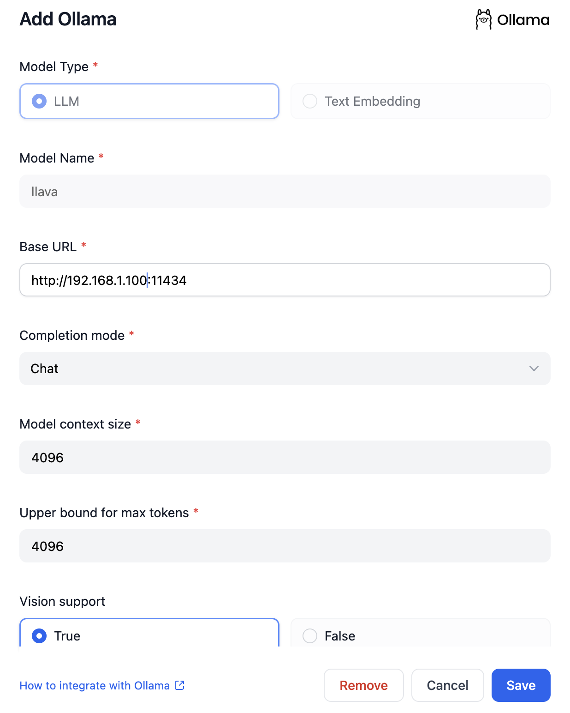
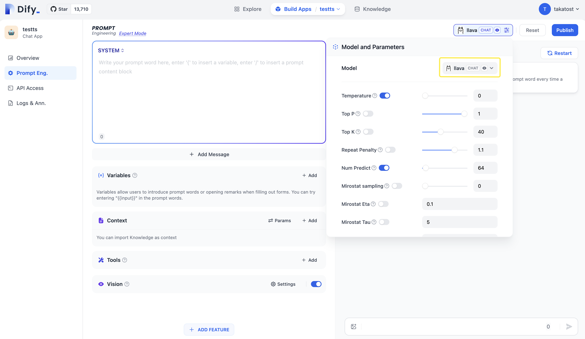

# ادغام مدل‌های محلی استقرار یافته توسط Ollama

.png>)

[Ollama](https://github.com/jmorganca/ollama) یک فریمورک استنباط محلی است که به کاربران امکان استقرار با یک کلیک مدل‌های زبانی بزرگ مانند Llama 2، Mistral، Llava و غیره را می‌دهد. Dify از قابلیت ادغام LLM و Text Embedding مدل‌های زبانی بزرگ مستقر شده با Ollama پشتیبانی می‌کند.

## ادغام سریع

###  دانلود و راه‌اندازی Ollama

1.  دانلود Ollama

    برای دانلود Ollama، به [https://ollama.ai/download](https://ollama.ai/download) مراجعه کنید.
2.  اجرای Ollama و چت با Llava

    ```bash
    ollama run llava
    ```

    پس از راه‌اندازی موفقیت‌آمیز، Ollama یک سرویس API را روی پورت 11434 محلی شروع می‌کند که می‌توان از طریق  `http://localhost:11434` به آن دسترسی داشت.

    برای مدل‌های دیگر، برای کسب اطلاعات بیشتر به [Ollama Models](https://ollama.ai/library) مراجعه کنید.
3.  ادغام Ollama در Dify

    در  `تنظیمات > ارائه دهنده‌های مدل > Ollama`، موارد زیر را پر کنید:

    

    *  نام مدل: `llava`
    *   آدرس پایه: `http://<your-ollama-endpoint-domain>:11434`

        آدرس پایه جایی که سرویس Ollama قابل دسترسی است را وارد کنید.

        اگر Dify با استفاده از داکر استقرار یافته است، استفاده از آدرس IP شبکه محلی، مانند  `http://192.168.1.100:11434` یا آدرس IP ماشین میزبان داکر، مانند  `http://172.17.0.1:11434` را در نظر بگیرید.

        برای استقرار کد منبع محلی،  `http://localhost:11434` را استفاده کنید.
    *  نوع مدل: `Chat`
    *   طول متن مدل: `4096`

        حداکثر طول متن مدل. در صورت عدم اطمینان، از مقدار پیش‌فرض 4096 استفاده کنید.
    *   حداکثر محدودیت توکن: `4096`

        حداکثر تعداد توکن‌های بازگردانده شده توسط مدل. اگر الزامات خاصی برای مدل وجود ندارد، این مقدار می‌تواند با طول متن مدل مطابقت داشته باشد.
    *   پشتیبانی از بینایی: `بله`

        اگر مدل از درک تصویر (چند وجهی)، مانند  `llava`، پشتیبانی می‌کند، این گزینه را علامت بزنید.

    پس از تأیید عدم وجود خطا، برای استفاده از مدل در برنامه، روی "ذخیره" کلیک کنید.

    روش ادغام برای مدل‌های Embedding مشابه LLM است، فقط نوع مدل را به Text Embedding تغییر دهید.
4.  استفاده از مدل‌های Ollama

    

    وارد صفحه  `Prompt Eng.` برنامه مورد نظر برای پیکربندی شوید، مدل  `llava` را در زیر ارائه دهنده Ollama انتخاب کنید و پس از تنظیم پارامترهای مدل از آن استفاده کنید.

## سؤالات متداول

### ⚠️  اگر برای استقرار Dify و Ollama از داکر استفاده می‌کنید، ممکن است با خطای زیر مواجه شوید:

```
httpconnectionpool(host=127.0.0.1, port=11434): max retries exceeded with url:/cpi/chat (Caused by NewConnectionError('<urllib3.connection.HTTPConnection object at 0x7f8562812c20>: fail to establish a new connection:[Errno 111] Connection refused'))

httpconnectionpool(host=localhost, port=11434): max retries exceeded with url:/cpi/chat (Caused by NewConnectionError('<urllib3.connection.HTTPConnection object at 0x7f8562812c20>: fail to establish a new connection:[Errno 111] Connection refused'))
```

این خطا زمانی رخ می‌دهد که سرویس Ollama از داخل کانتینر داکر قابل دسترسی نیست.  `localhost` معمولاً به خود کانتینر اشاره می‌کند، نه به ماشین میزبان یا سایر کانتینرها. برای حل این مشکل، باید سرویس Ollama را در شبکه  `http://localhost:11434`  پخش کنید.

### تنظیم متغیرهای محیطی در Mac

اگر Ollama به عنوان یک برنامه macOS اجرا شود، باید متغیرهای محیطی را با استفاده از  `launchctl` تنظیم کنید:

1.  برای هر متغیر محیطی،  `launchctl setenv` را صدا کنید.

    ```bash
    launchctl setenv OLLAMA_HOST "0.0.0.0"
    ```
2.  برنامه Ollama را مجدداً راه‌اندازی کنید.
3.  اگر مراحل فوق بی‌اثر بودند، می‌توانید از روش زیر استفاده کنید:

    مشکل در خود داکر نهفته است و برای دسترسی به میزبان داکر،  `host.docker.internal` را به جای  `localhost` در سرویس  `http://host.docker.internal:11434` قرار دهید تا به درستی کار کند.

### تنظیم متغیرهای محیطی در Linux

اگر Ollama به عنوان یک سرویس  `systemd` اجرا شود، باید متغیرهای محیطی را با استفاده از  `systemctl` تنظیم کنید:

1.  با فراخوانی  `systemctl edit ollama.service`، سرویس  `systemd` را ویرایش کنید. این عمل ویرایشگر را باز می‌کند.
2.  برای هر متغیر محیطی، یک خط  `Environment`  را در بخش  `[Service]`  اضافه کنید:

    ```ini
    [Service]
    Environment="OLLAMA_HOST=0.0.0.0"
    ```
3.  ذخیره و خروج کنید.
4.  `systemd` را مجدداً بارگیری کنید و Ollama را راه‌اندازی مجدد کنید:

    ```bash
    systemctl daemon-reload
    systemctl restart ollama
    ```

### تنظیم متغیرهای محیطی در Windows

در ویندوز، Ollama متغیرهای محیطی کاربر و سیستم شما را به ارث می‌برد.

1.  ابتدا با کلیک روی آن در نوار وظیفه، Ollama را ببندید.
2.  از طریق کنترل پنل، متغیرهای محیطی سیستم را ویرایش کنید.
3.  متغیر(های) جدید را برای حساب کاربری خود برای  `OLLAMA_HOST`،  `OLLAMA_MODELS` و غیره ویرایش یا ایجاد کنید.
4.  برای ذخیره تغییرات، روی OK/Apply کلیک کنید.
5.  `ollama` را از یک پنجره ترمینال جدید اجرا کنید.

## چگونه می‌توان Ollama را در شبکه خود منتشر کرد؟

Ollama به طور پیش‌فرض  `127.0.0.1` پورت  `11434` را می‌بندد. با استفاده از متغیر محیطی  `OLLAMA_HOST`، آدرس پیوند را تغییر دهید.

## اطلاعات بیشتر

برای کسب اطلاعات بیشتر درباره Ollama، به موارد زیر مراجعه کنید:

* [Ollama](https://github.com/jmorganca/ollama)
* [Ollama FAQ](https://github.com/ollama/ollama/blob/main/docs/faq.md)


