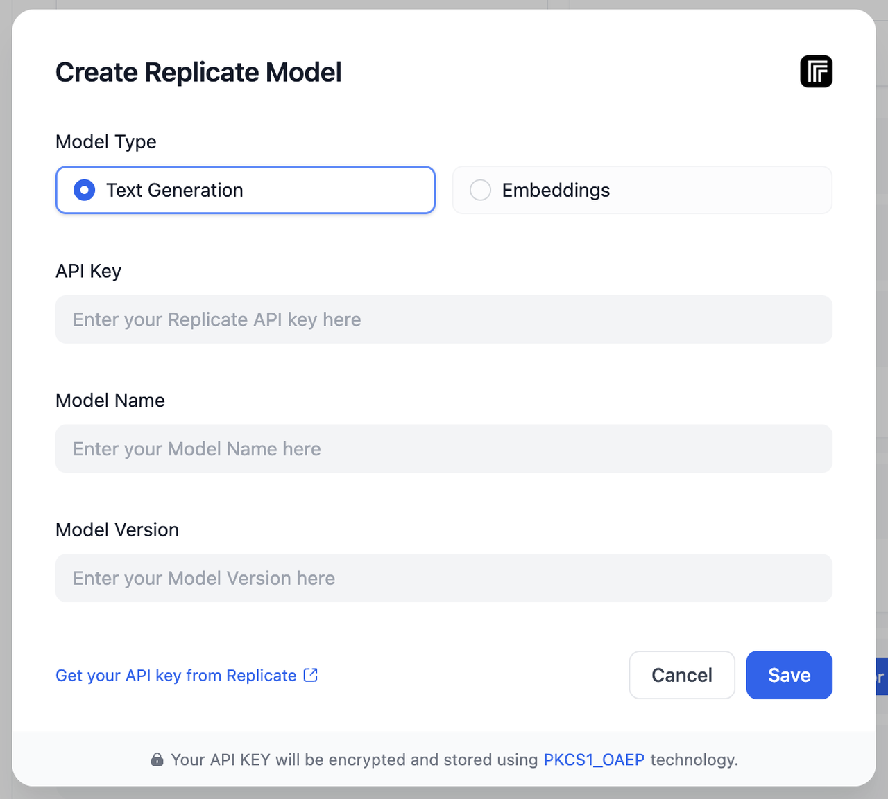
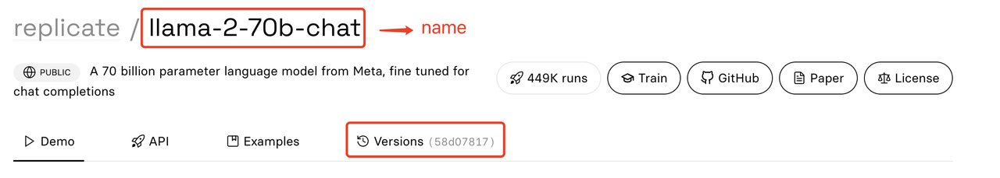

# ادغام مدل‌های منبع باز از Replicate

Dify از دسترسی به [مدل‌های زبان](https://replicate.com/collections/language-models) و [مدل‌های تعبیه](https://replicate.com/collections/embedding-models) در Replicate پشتیبانی می‌کند. مدل‌های زبان با مدل استدلال Dify و مدل‌های تعبیه با مدل تعبیه Dify مطابقت دارند.

مراحل خاص به شرح زیر است:

1. شما باید یک حساب Replicate داشته باشید ([آدرس ثبت نام](https://replicate.com/signin?next=/docs)).
2. کلید API را دریافت کنید ([آدرس دریافت](https://replicate.com/signin?next=/docs)).
3. یک مدل را انتخاب کنید. مدل را در [مدل‌های زبان](https://replicate.com/collections/language-models) و [مدل‌های تعبیه](https://replicate.com/collections/embedding-models) انتخاب کنید.
4. مدل‌ها را در `Settings > Model Provider > Replicate` Dify اضافه کنید.

<figure><figcaption></figcaption></figure>

کلید API، کلید API است که در مرحله 2 تنظیم شده است. نام مدل و نسخه مدل را می‌توانید در صفحه جزئیات مدل پیدا کنید:

<figure><figcaption></figcaption></figure>

