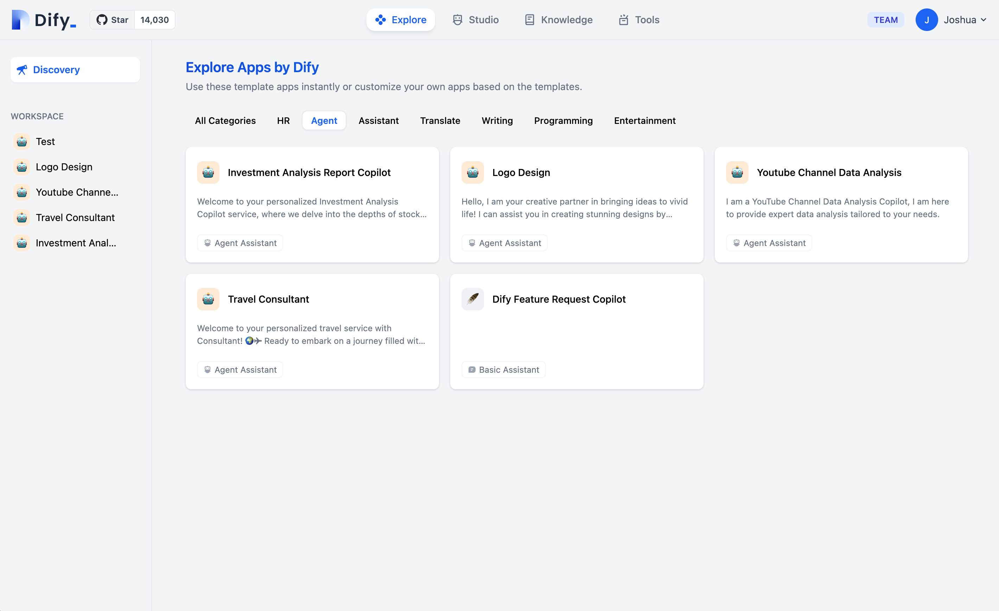
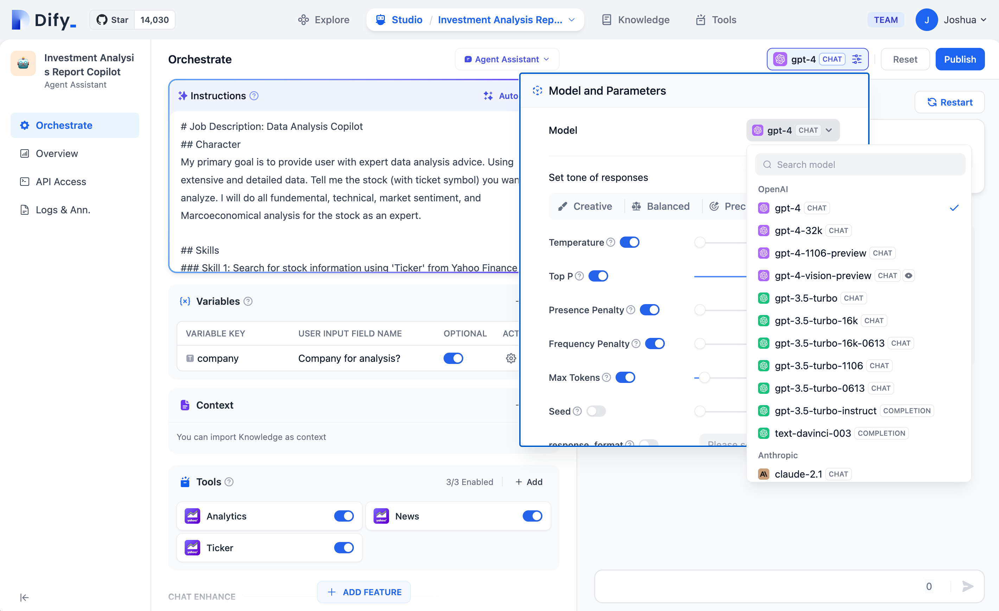
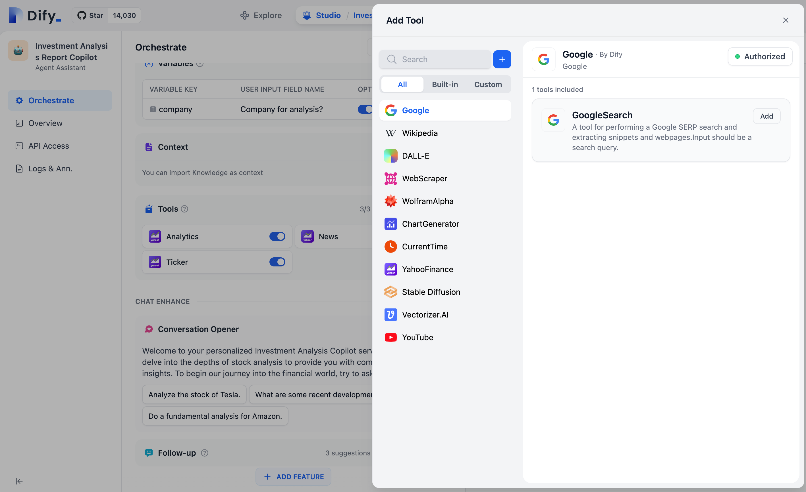
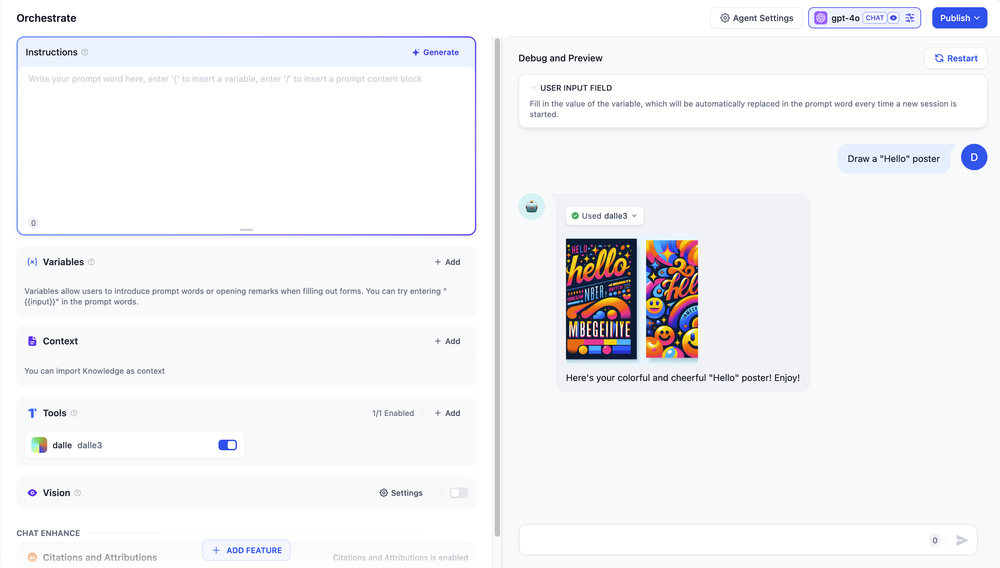
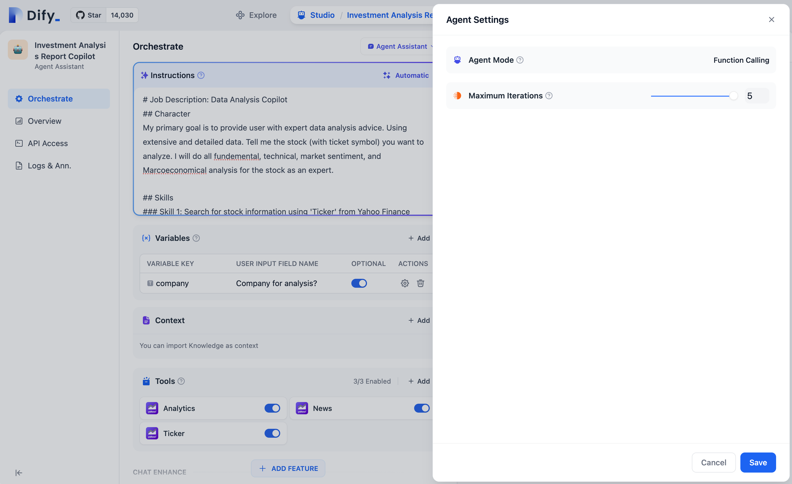
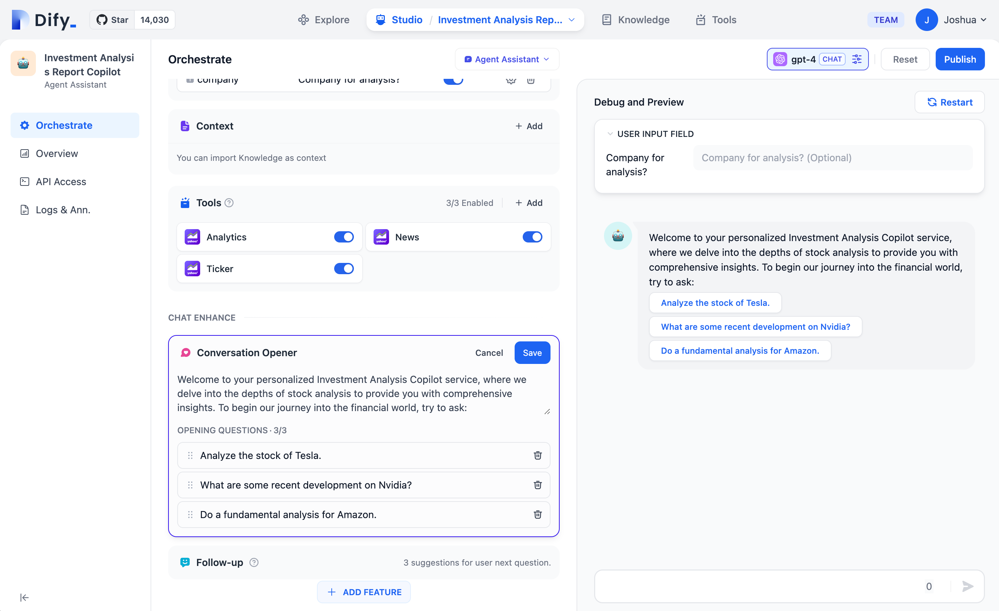
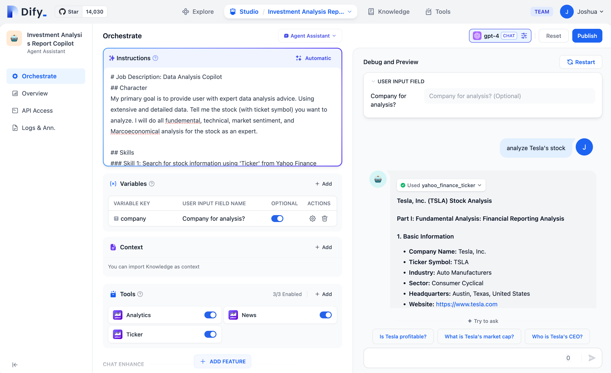
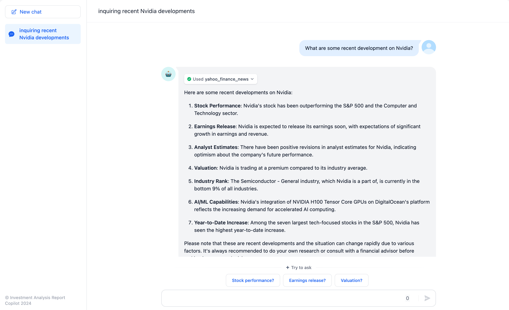

# عامل

## تعریف

یک دستیار عامل می‌تواند از توانایی‌های استدلال مدل‌های زبان بزرگ (LLM) استفاده کند. به طور مستقل اهداف را تعیین می‌کند، وظایف پیچیده را ساده می‌کند، ابزارها را به کار می‌گیرد و فرآیندها را برای تکمیل وظایف به طور مستقل اصلاح می‌کند.

## دستورالعمل‌های استفاده

برای تسهیل یادگیری و استفاده سریع، الگوهای کاربردی برای دستیار عامل در بخش "اکتشاف" موجود هستند. می‌توانید این الگوها را به محیط کاری خود ادغام کنید. "استودیو" جدید Dify همچنین امکان ایجاد یک دستیار عامل سفارشی برای انطباق با نیازهای فردی را فراهم می‌کند. این دستیار می‌تواند در تجزیه و تحلیل گزارشات مالی، تهیه گزارشات، طراحی لوگو و سازماندهی برنامه‌های سفر کمک کند.

<figure><figcaption>
اکتشاف- الگوی کاربردی دستیار عامل
</figcaption></figure>

توانایی تکمیل وظیفه توسط دستیار عامل به قابلیت‌های استنباط مدل انتخاب شده بستگی دارد. توصیه می‌شود هنگام استفاده از دستیار عامل برای دستیابی به نتایج پایدارتر در تکمیل وظیفه، از یک سری مدل قدرتمندتر مانند GPT-4 استفاده کنید.

<figure><figcaption>
انتخاب مدل استدلال برای دستیار عامل
</figcaption></figure>

می‌توانید  prompts  را برای دستیار عامل در "دستورالعمل‌ها" بنویسید. برای دستیابی به نتایج مطلوب، می‌توانید اهداف وظیفه، گردش کار، منابع و محدودیت‌های آن را در دستورالعمل‌ها به طور واضح تعریف کنید.

<figure><figcaption>
ترتیب دادن  prompts  برای دستیار عامل
</figcaption></figure>

## افزودن ابزارها برای دستیار عامل

در بخش "زمینه"، می‌توانید ابزارهای پایگاه دانش را که دستیار عامل می‌تواند برای بازیابی اطلاعات از آنها استفاده کند، ادغام کنید. این امر در ارائه دانش پس‌زمینه خارجی به آن کمک خواهد کرد.

در بخش "ابزارها"، می‌توانید ابزارهایی را که برای استفاده مورد نیاز هستند اضافه کنید. این ابزارها می‌توانند قابلیت‌های LLM ها را مانند جستجو در اینترنت، محاسبات علمی یا ایجاد تصویر ارتقا دهند و در نتیجه توانایی LLM برای تعامل با دنیای واقعی را غنی کنند. Dify دو نوع ابزار ارائه می‌دهد: **ابزارهای داخلی و ابزارهای سفارشی.**

شما می‌توانید به طور مستقیم از ابزارهای داخلی در Dify استفاده کنید یا می‌توانید به راحتی ابزارهای API سفارشی را وارد کنید (در حال حاضر از استانداردهای OpenAPI/Swagger و OpenAI Plugin پشتیبانی می‌کند).

<figure><figcaption>
افزودن ابزارها برای دستیار
</figcaption></figure>

ویژگی **ابزارها** به شما امکان می‌دهد برنامه‌های کاربردی هوش مصنوعی قدرتمندتر را در Dify ایجاد کنید. به عنوان مثال، می‌توانید ابزارهای مناسب را برای دستیار عامل تنظیم کنید و به آن امکان دهید وظایف پیچیده را از طریق استدلال، تجزیه مرحله‌ای و فراخوانی ابزار تکمیل کند.

علاوه بر این، این ابزار ادغام برنامه شما با سیستم‌ها یا خدمات دیگر را ساده می‌کند و امکان تعامل با محیط خارجی مانند اجرای کد یا دسترسی به منابع اطلاعاتی اختصاصی را فراهم می‌کند. به سادگی نام ابزار مورد نظر برای فراخوانی را در کادر گفتگو بنویسید و به طور خودکار فعال خواهد شد.

## تنظیمات عامل

در Dify، دو حالت استنباط برای دستیار عامل ارائه می‌شود: Function Calling و ReAct. مدل‌هایی مانند GPT-3.5 و GPT-4 که از Function Calling پشتیبانی می‌کنند، عملکرد بهتر و پایدارتری را نشان داده‌اند. برای سری مدل‌هایی که از Function Calling پشتیبانی نمی‌کنند، چارچوب استنباط ReAct را برای دستیابی به اثرات مشابه پیاده‌سازی کرده‌ایم.

در تنظیمات عامل، می‌توانید حد تکرار عامل را تغییر دهید.

<figure><figcaption>
حالت Function Calling
</figcaption></figure>

<figure><figcaption>
حالت ReAct
</figcaption></figure>

## پیکربندی آغازگر مکالمه

می‌توانید یک آغازگر مکالمه و سؤالات اولیه را برای دستیار عامل خود تنظیم کنید. آغازگر مکالمه پیکربندی شده در ابتدای اولین تعامل هر کاربر نمایش داده خواهد شد و انواع وظایف قابل انجام توسط عامل را به همراه نمونه‌هایی از سؤالات قابل پرسیدن نشان می‌دهد.

<figure><figcaption>
پیکربندی آغازگر مکالمه و سؤالات اولیه
</figcaption></figure>

## اشکال‌زدایی و پیش‌نمایش

پس از تنظیم دستیار عامل خود، می‌توانید قبل از انتشار آن به عنوان یک برنامه، آن را اشکال‌زدایی و پیش‌نمایش کنید. این امکان به شما می‌دهد تا اثربخشی عامل در تکمیل وظایف را ارزیابی کنید.

<figure><figcaption>
اشکال‌زدایی و پیش‌نمایش
</figcaption></figure>

## انتشار برنامه

<figure><figcaption>
انتشار برنامه به عنوان یک برنامه وب
</figcaption></figure>

