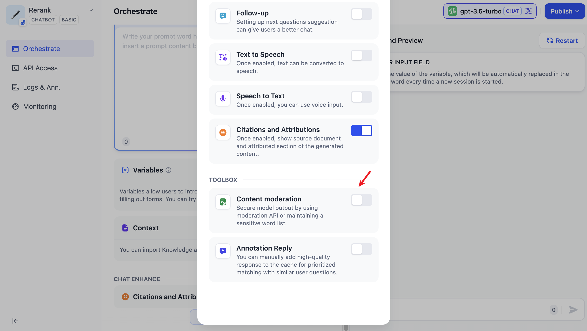
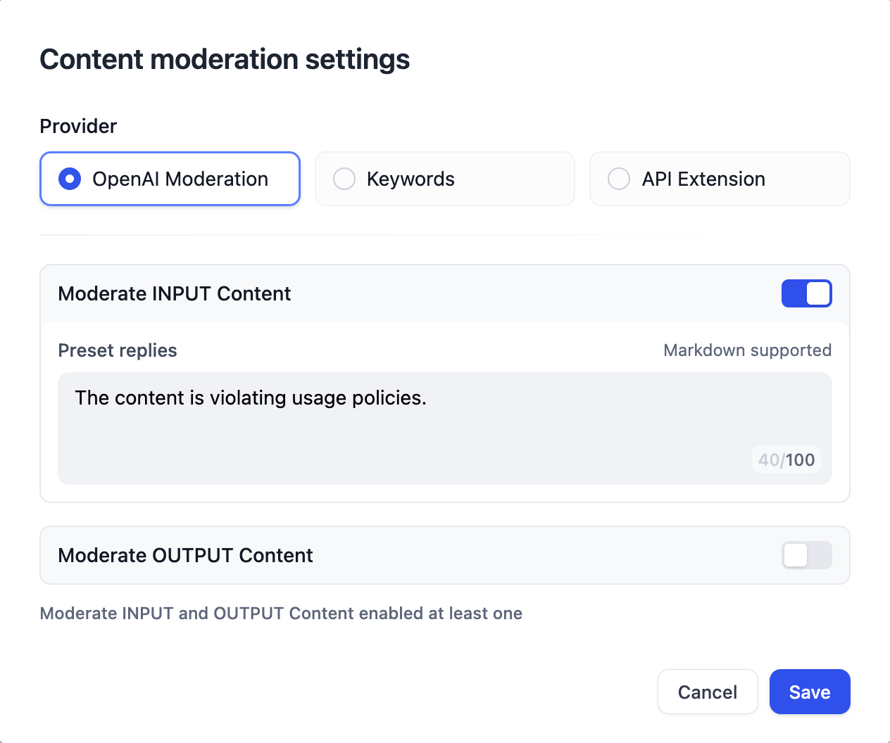
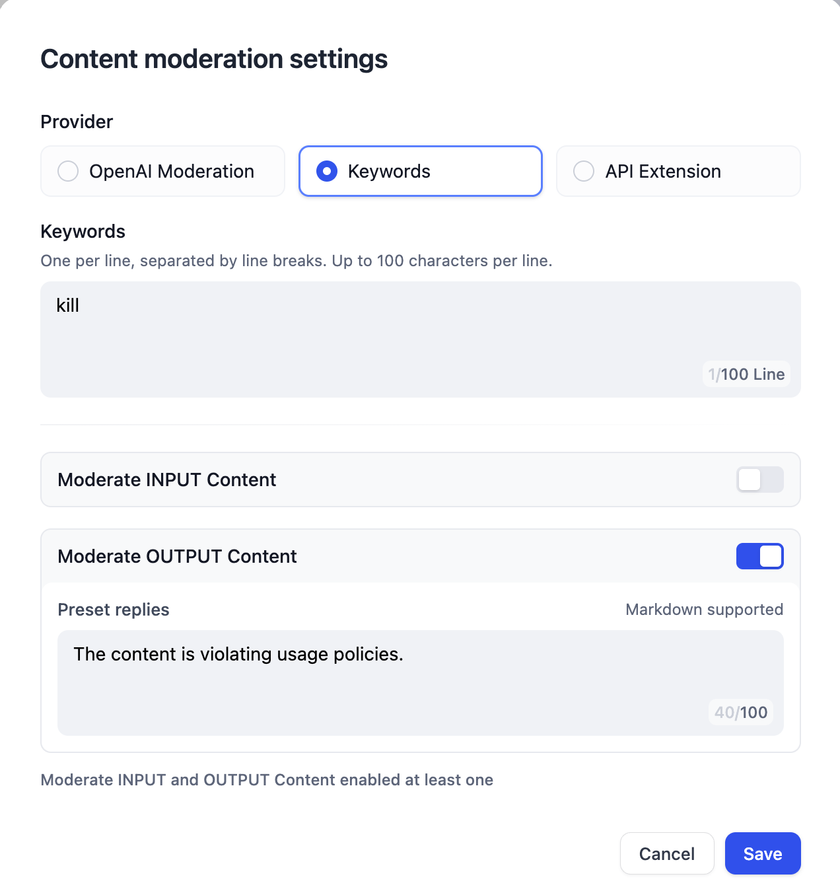
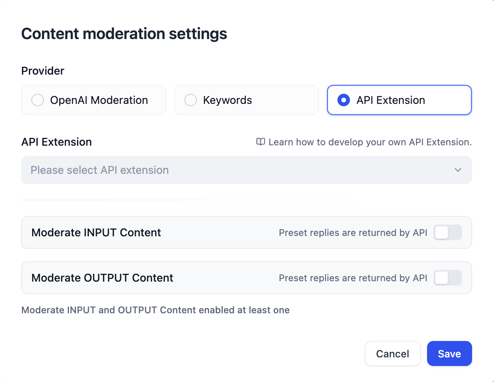

# ابزار تعدیل

در تعاملات ما با برنامه‌های هوش مصنوعی، اغلب نیاز به الزامات سخت‌گیرانه در مورد امنیت محتوا، تجربه کاربری و مقررات قانونی داریم. در این مرحله، ما به ویژگی "بررسی کلمات حساس" نیاز داریم تا محیط تعاملی بهتری برای کاربران نهایی ایجاد کنیم. در صفحه ارکستراسیون، روی "افزودن ویژگی" کلیک کنید و جعبه ابزار "بررسی محتوا" را در پایین پیدا کنید:

<figure><figcaption>
بررسی محتوا
</figcaption></figure>

## فراخوانی API تعدیل OpenAI

OpenAI، همراه با اکثر شرکت‌های ارائه دهنده LLM، ویژگی‌های تعدیل محتوا را در مدل‌های خود گنجانده است تا اطمینان حاصل شود که خروجی‌ها شامل محتواهای جنجالی مانند خشونت، محتوای جنسی و فعالیت‌های غیرقانونی نیست. علاوه بر این، OpenAI این قابلیت تعدیل محتوا را در دسترس قرار داده است که می‌توانید به [تعدیل OpenAI](https://platform.openai.com/docs/guides/moderation/overview) مراجعه کنید.

اکنون شما نیز می‌توانید مستقیماً API تعدیل OpenAI را در Dify فراخوانی کنید؛ می‌توانید به سادگی با وارد کردن "پاسخ از پیش تعیین شده" مربوطه، محتوای ورودی یا خروجی را بررسی کنید.

<figure><figcaption>
تنظیم تراز بار از افزودن مدل
</figcaption></figure>

## کلمات کلیدی

توسعه‌دهندگان می‌توانند کلمات حساس مورد نیاز خود را برای بررسی سفارشی کنند، مانند استفاده از "کشتن" به عنوان کلمه کلیدی برای انجام یک عمل حسابرسی زمانی که کاربران ورودی دارند. محتوای پاسخ از پیش تعیین شده باید "محتوا در حال نقض خط مشی‌های استفاده است" باشد. می‌توان پیش‌بینی کرد که هنگامی که کاربر یک بخش متن حاوی "کشتن" را در ترمینال وارد می‌کند، ابزار بررسی کلمات حساس را فعال می‌کند و محتوای پاسخ از پیش تعیین شده را برمی‌گرداند.

<figure><figcaption>
تنظیم تراز بار از افزودن مدل
</figcaption></figure>

## افزونه تعدیل

شرکت‌های مختلف اغلب مکانیسم‌های خاص خود را برای تعدیل کلمات حساس دارند. هنگام توسعه برنامه‌های هوش مصنوعی خود، مانند یک ChatBot پایگاه دانش داخلی، شرکت‌ها نیاز دارند که محتوای درخواست ورودی از سوی کارمندان را برای کلمات حساس تعدیل کنند. برای این منظور، توسعه‌دهندگان می‌توانند یک افزونه API بر اساس مکانیسم‌های تعدیل کلمات حساس داخلی شرکت خود بنویسند که سپس می‌توان آن را در Dify فراخوانی کرد تا به درجه بالایی از سفارشی‌سازی و حفاظت از حریم خصوصی برای بررسی کلمات حساس دست یابد.

<figure><figcaption>
افزونه تعدیل
</figcaption></figure>
