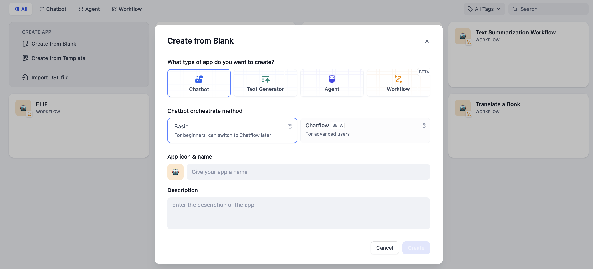
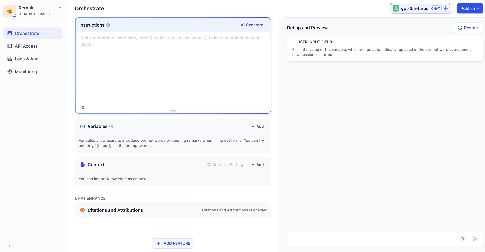
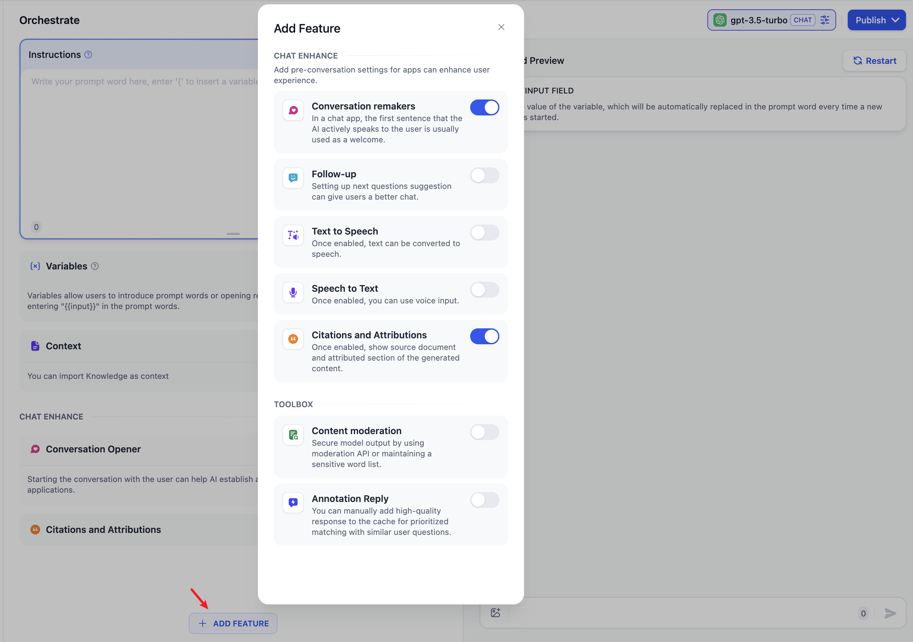
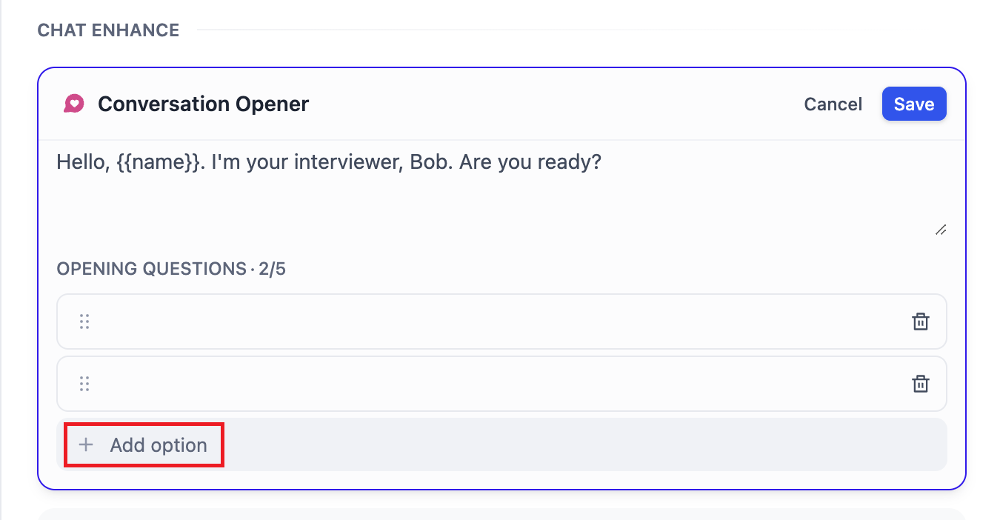
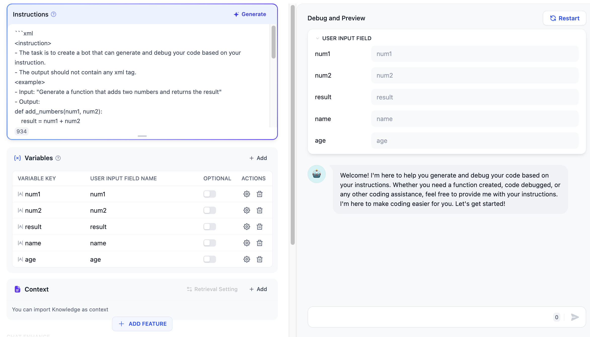
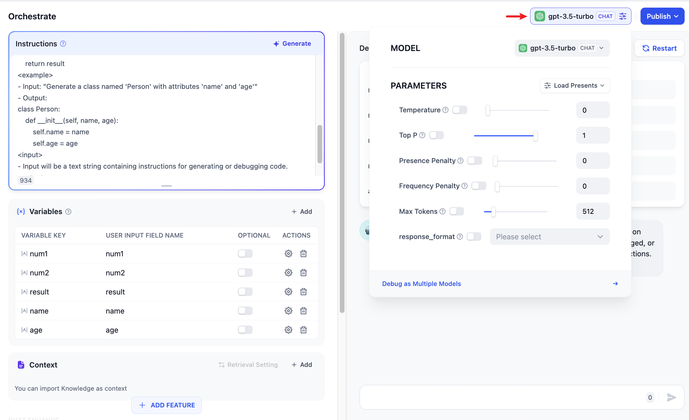
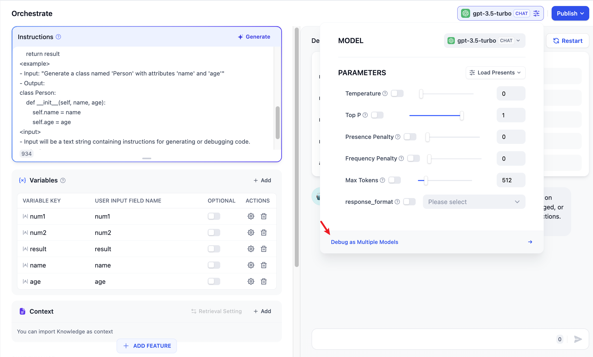
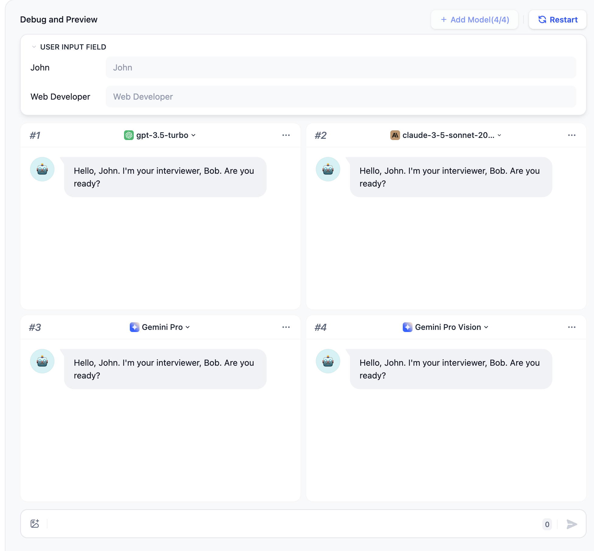

# دستیار مکالمه

برنامه های مکالمه برای برقراری گفتگوی مداوم با کاربر از حالت یک سوال-یک جواب استفاده می کنند.

### سناریوهای قابل اجرا

برنامه های مکالمه را می توان در زمینه هایی مانند خدمات مشتری، آموزش آنلاین، مراقبت های بهداشتی، خدمات مالی و غیره استفاده کرد. این برنامه ها می توانند به سازمان ها در بهبود کارایی، کاهش هزینه های نیروی کار و ارائه تجربه کاربری بهتر کمک کنند.

### نحوه نوشتن

برنامه های مکالمه از موارد زیر پشتیبانی می کنند: اعلان، متغیرها، زمینه، سخنان آغازین و پیشنهاداتی برای سوال بعدی.

در اینجا، ما از یک برنامه مصاحبه کننده به عنوان مثال برای معرفی نحوه نوشتن برنامه های مکالمه استفاده می کنیم.

#### مرحله 1 ایجاد یک برنامه

برای ایجاد یک برنامه، روی دکمه "ایجاد برنامه" در صفحه اصلی کلیک کنید. نام برنامه را وارد کنید و **"برنامه چت"** را به عنوان نوع برنامه انتخاب کنید.

<figure><figcaption>
ایجاد برنامه
</figcaption></figure>

#### مرحله 2: نوشتن برنامه

پس از ایجاد برنامه با موفقیت، به طور خودکار به صفحه مرور برنامه هدایت می شوید. روی دکمه در منوی سمت چپ کلیک کنید: **"ارکستره کردن"** برای نوشتن برنامه.

<figure><figcaption></figcaption></figure>

**2.1 وارد کردن اعلان ها**

 عبارات اعلان برای هدایت هوش مصنوعی در ارائه پاسخ های حرفه ای و دقیق تر استفاده می شوند. شما می توانید از ژنراتور اعلان داخلی برای ساخت اعلان های مناسب استفاده کنید. اعلان ها از وارد کردن متغیرهای فرم مانند `{{input}}` پشتیبانی می کنند. مقادیر موجود در متغیرهای اعلان با مقادیر وارد شده توسط کاربر جایگزین می شود.

مثال:

1. دستور سناریو مصاحبه را وارد کنید.
2. اعلان به طور خودکار در جعبه محتوا سمت راست تولید می شود.
3. شما می توانید متغیرهای سفارشی را در اعلان وارد کنید تا آن را به نیازها یا جزئیات خاص تنظیم کنید.

برای تجربه بهتر، یک گفتگوی آغازین اضافه می کنیم: `"سلام، {{name}}. من مصاحبه کننده شما، باب هستم. آماده ای؟"`

برای اضافه کردن گفتگوی آغازین، روی دکمه "افزودن ویژگی" در گوشه بالا سمت چپ کلیک کنید و ویژگی "سخنان آغازین مکالمه" را فعال کنید:

<figure><figcaption></figcaption></figure>

سپس سخنان آغازین را ویرایش کنید:

**2.2 اضافه کردن زمینه**

اگر یک برنامه بخواهد محتوایی را بر اساس مکالمات متنی خصوصی تولید کند، می تواند از ویژگی [دانش](../knowledge-base/) ما استفاده کند. برای اضافه کردن پایگاه دانش، روی دکمه "افزودن" در زمینه کلیک کنید.

**2.3 اشکال زدایی**

ورودی کاربر را در سمت راست وارد کنید و محتوای پاسخ را بررسی کنید.

اگر نتایج رضایت بخش نیست، می توانید اعلان ها و پارامترهای مدل را تنظیم کنید. برای تنظیم پارامترهای مدل، روی نام مدل در گوشه بالا سمت راست کلیک کنید:

**اشکال زدایی با چندین مدل:**

اگر اشکال زدایی با یک مدل به تنهایی ناکارآمد به نظر می رسد، می توانید از ویژگی **اشکال زدایی به عنوان چندین مدل** برای آزمایش دسته ای اثربخشی پاسخ مدل ها استفاده کنید.

از افزودن حداکثر 4 LLM در یک زمان پشتیبانی می کند.

> ⚠️ هنگام استفاده از ویژگی اشکال زدایی چند مدل، اگر فقط برخی از مدل های بزرگ قابل مشاهده هستند، به این دلیل است که کلیدهای دیگر مدل های بزرگ هنوز اضافه نشده اند. شما می توانید به صورت دستی کلیدهای چندین مدل را در [“اضافه کردن ارائه دهنده جدید”](https://docs.dify.ai/guides/model-configuration/new-provider) اضافه کنید.

**2.4 منتشر کردن برنامه**

پس از اشکال زدایی برنامه، برای ایجاد یک برنامه هوش مصنوعی مستقل، روی دکمه **"انتشار"** در گوشه بالا سمت راست کلیک کنید. علاوه بر تجربه برنامه از طریق یک URL عمومی، می توانید توسعه ثانویه را بر اساس API ها انجام دهید، آن را در وب سایت ها جاسازی کنید و موارد دیگر. برای جزئیات، لطفا به [انتشار](https://docs.dify.ai/guides/application-publishing) مراجعه کنید.

اگر می خواهید برنامه ای که به اشتراک می گذارید را سفارشی کنید، می توانید [قالب وب اپ](https://github.com/langgenius/webapp-conversation) منبع باز ما را Fork کنید. بر اساس این قالب، می توانید برنامه را مطابق نیازها و الزامات سبک خاص خود تغییر دهید.

