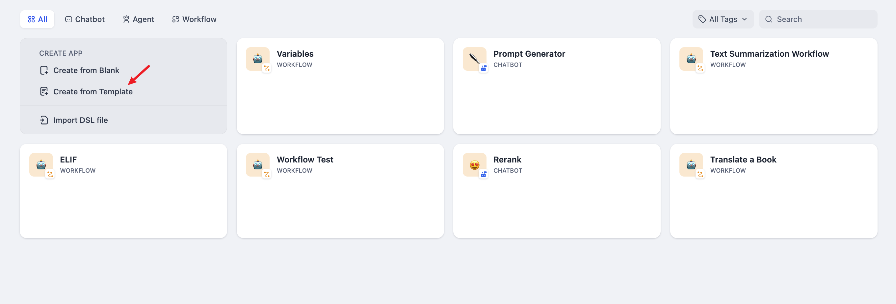
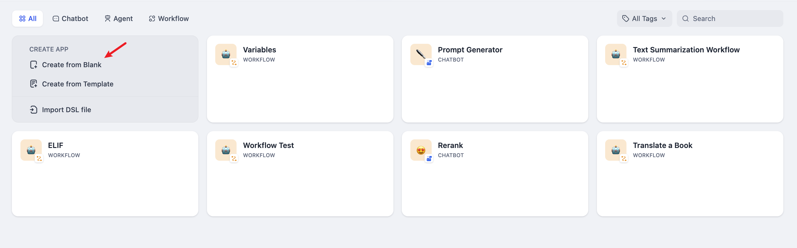
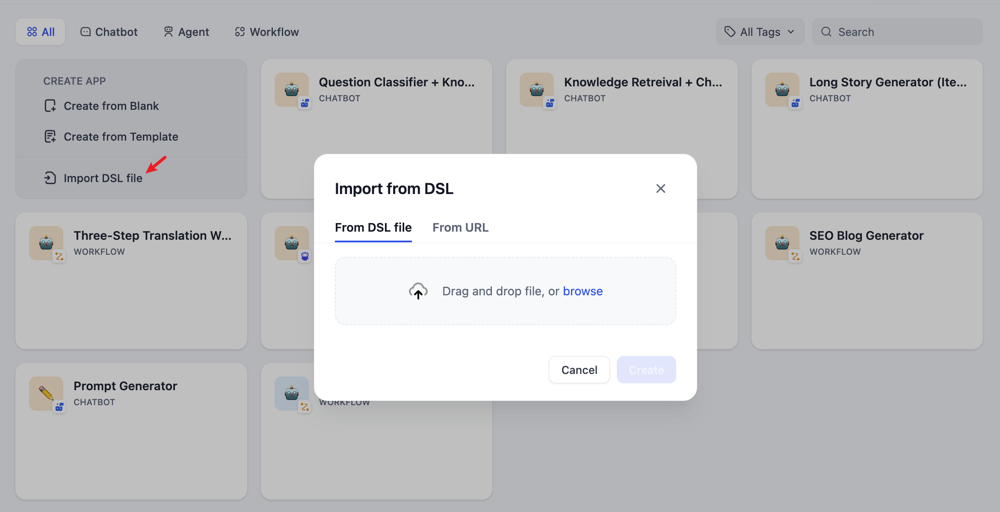
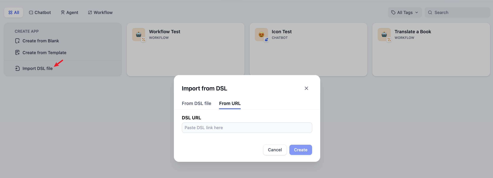

# ایجاد اپلیکیشن

شما می توانید به سه روش در استودیوی Dify اپلیکیشن بسازید:

* ایجاد اپلیکیشن بر اساس یک الگوی آماده (برای مبتدیان توصیه می‌شود)
* ایجاد اپلیکیشن خالی
* ایجاد اپلیکیشن از طریق فایل DSL (محلی/آنلاین)

### ایجاد اپلیکیشن از یک الگو

هنگام اولین استفاده از Dify، ممکن است با ایجاد اپلیکیشن آشنایی نداشته باشید. برای کمک به کاربران جدید در سریع‌تر درک انواع اپلیکیشن‌هایی که در Dify قابل ساخت هستند، مهندسین Prompt تیم Dify، الگوهای اپلیکیشن با کیفیت بالا برای سناریوهای مختلف ایجاد کرده‌اند.

می‌توانید از منوی ناوبری "Studio" را انتخاب کرده، سپس در لیست اپلیکیشن‌ها "Create from Template" را انتخاب کنید.

<figure><figcaption><p>ایجاد اپلیکیشن از یک الگو</p></figcaption></figure>

هر الگویی را انتخاب کنید و روی **Use this template** کلیک کنید.

<figure><figcaption><p>الگوهای اپلیکیشن Dify</p></figcaption></figure>

### ایجاد یک اپلیکیشن جدید

اگر نیاز دارید یک اپلیکیشن خالی در Dify ایجاد کنید، می‌توانید "Studio" را از منوی ناوبری انتخاب کرده، سپس در لیست اپلیکیشن‌ها "Create from Blank" را انتخاب کنید.

هنگام اولین بار ایجاد اپلیکیشن، ممکن است نیاز باشد ابتدا [مفاهیم پایه](./#application\_type) از چهار نوع اپلیکیشن مختلف در Dify را درک کنید: چت بات، ژنراتور متن، عامل و گردش کار.

<figure><figcaption><p>ایجاد اپلیکیشن خالی</p></figcaption></figure>

هنگام انتخاب نوع اپلیکیشن خاص، می‌توانید آن را با ارائه نام، انتخاب یک آیکون مناسب (یا بارگذاری تصویر مورد علاقه خود به عنوان آیکون) و نوشتن یک شرح واضح و مختصر از هدف آن، سفارشی سازی کنید. این جزئیات به اعضای تیم کمک می‌کند تا در آینده به راحتی اپلیکیشن را درک و استفاده کنند.

### ایجاد از یک فایل DSL


Dify DSL یک استاندارد فایل مهندسی اپلیکیشن هوش مصنوعی تعریف شده توسط Dify.AI است. فرمت فایل YML است. این استاندارد شامل شرح اولیه اپلیکیشن، پارامترهای مدل، پیکربندی هماهنگ سازی و اطلاعات دیگر است.


#### وارد کردن فایل DSL محلی

اگر یک الگو (فایل DSL) از جامعه یا افراد دیگر دریافت کرده‌اید، می‌توانید "Import DSL File" را از استودیو انتخاب کنید. پس از وارد کردن، همه اطلاعات پیکربندی اپلیکیشن اصلی مستقیماً بارگیری خواهد شد.

<figure><figcaption><p>ایجاد اپلیکیشن با وارد کردن یک فایل DSL</p></figcaption></figure>

#### وارد کردن فایل DSL از URL

همچنین می‌توانید فایل‌های DSL را از طریق URL وارد کنید، با استفاده از فرمت لینک زیر:

```URL
https://example.com/your_dsl.yml
```

<figure><figcaption><p>ایجاد اپلیکیشن با وارد کردن یک فایل DSL</p></figcaption></figure>

