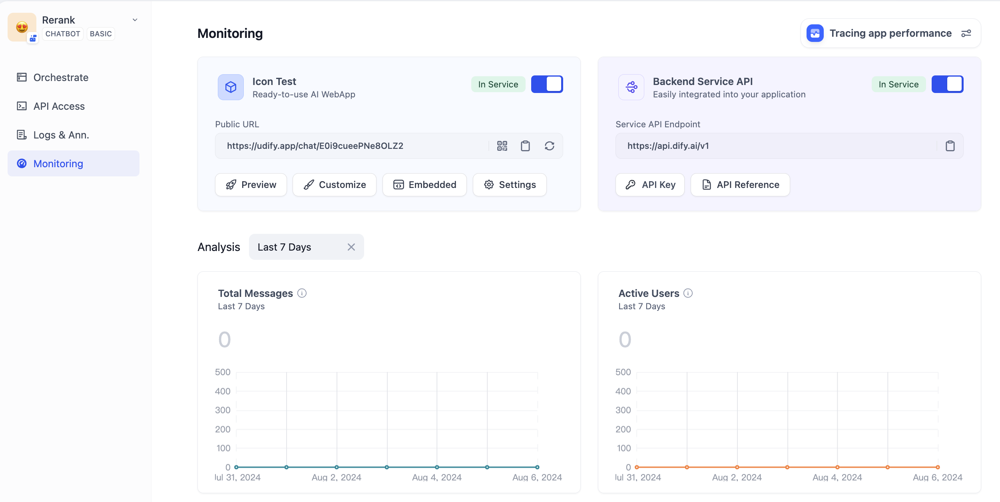
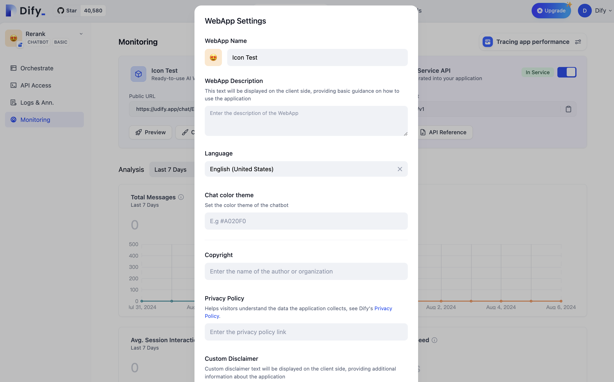

# انتشار به عنوان یک وب اپلیکیشن تک صفحه‌ای

یکی از مزایای ایجاد برنامه‌های کاربردی هوش مصنوعی با Dify این است که می‌توانید در عرض چند دقیقه یک وب اپلیکیشن هوش مصنوعی تک صفحه‌ای را منتشر کنید که برای همه کاربران در اینترنت قابل دسترسی باشد.

* اگر از نسخه منبع باز خود میزبانی استفاده می‌کنید، برنامه روی سرور شما اجرا می‌شود.
* اگر از سرویس ابری استفاده می‌کنید، برنامه در [https://udify.app/](https://udify.app/) میزبانی می‌شود.

### انتشار یک وب سایت هوش مصنوعی

کلید **"در سرویس / غیرفعال"** را تغییر دهید، URL وب اپلیکیشن شما فوراً به طور عمومی در اینترنت به اشتراک گذاشته خواهد شد.

<figure><figcaption></figcaption></figure>

ما رابط کاربری از پیش تعیین شده وب اپلیکیشن را برای دو نوع برنامه زیر تنظیم کرده‌ایم:

* **تولید متن (پیش نمایش)**


[text-generator.md](text-generator.md)


* **گفتگو (پیش نمایش)**


[conversation-application.md](conversation-application.md)


### تنظیم سایت هوش مصنوعی شما

با کلیک روی دکمه "تنظیمات" می‌توانید زبان، تم رنگی، مالکیت حق چاپ، لینک سیاست حفظ حریم خصوصی و سلب مسئولیت را تغییر دهید.

در حال حاضر، وب اپلیکیشن از چندین زبان پشتیبانی می‌کند: انگلیسی، چینی ساده، چینی سنتی، پرتغالی، آلمانی، ژاپنی، کره‌ای، اوکراینی و ویتنامی. اگر می‌خواهید از زبان‌های بیشتری پشتیبانی شود، می‌توانید در GitHub یک Issue ارسال کنید تا درخواست پشتیبانی کنید یا یک PR ارسال کنید تا کد را مشارکت دهید.


[web-app-settings.md](web-app-settings.md)


### جاسازی سایت هوش مصنوعی شما

همچنین می‌توانید وب اپلیکیشن Dify را در پروژه وب، وبلاگ یا هر صفحه وب دیگری ادغام کنید. برای اطلاعات بیشتر، لطفا به [جاسازی در وب‌سایت‌ها](https://docs.dify.ai/guides/application-publishing/embedding-in-websites) مراجعه کنید.

