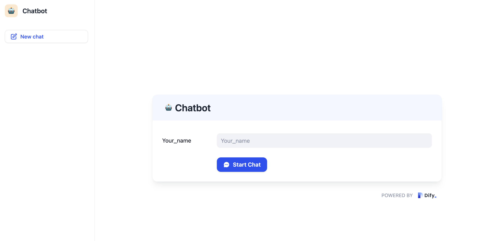
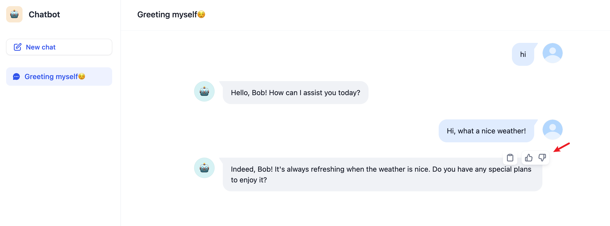
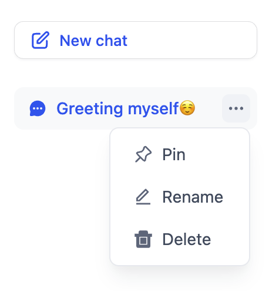
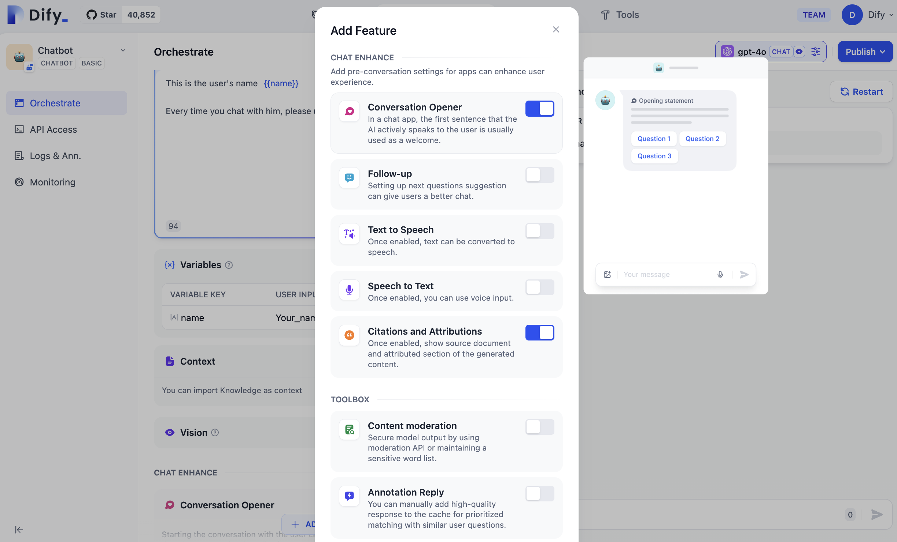
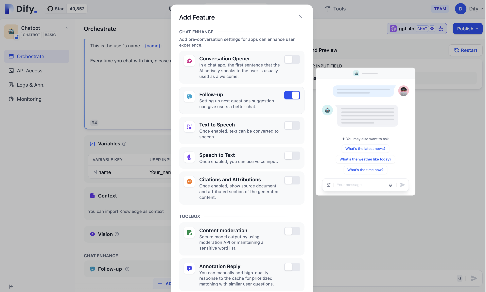

# برنامه کاربردی مکالمه

برنامه‌های کاربردی مکالمه‌ای، در قالب پرسش و پاسخ، درگیر گفتگوی مداوم با کاربران می‌شوند. این برنامه‌ها از ویژگی‌های زیر پشتیبانی می‌کنند (مطمئن شوید که این توابع در طول ارکستراسیون برنامه فعال هستند):

* متغیرهایی که قبل از مکالمه پر می‌شوند.
* ایجاد، سنجاق کردن و حذف مکالمات.
* جملات آغازین مکالمه.
* پیشنهادات سوال برای قدم بعدی.
* تبدیل گفتار به متن.
* منابع و انتساب‌ها.

### متغیرهایی که قبل از مکالمه پر می‌شوند

اگر در طول ارکستراسیون برنامه، نیاز به پر کردن متغیر را تنظیم کرده‌اید، قبل از ورود به پنجره مکالمه، باید اطلاعات خواسته شده را پر کنید:

<figure><figcaption></figcaption></figure>

جزئیات لازم را وارد کنید و برای شروع چت، روی دکمه "شروع مکالمه" کلیک کنید. برای کپی کردن محتوای مکالمه، ماوس را روی پاسخ هوش مصنوعی قرار دهید و  "پسندیدن" یا "نپسندیدن" را به عنوان بازخورد ارائه دهید.

<figure><figcaption></figcaption></figure>

### ایجاد، سنجاق کردن و حذف مکالمات

برای شروع یک مکالمه جدید، روی دکمه "مکالمه جدید" کلیک کنید. برای سنجاق یا حذف یک مکالمه، ماوس را روی آن قرار دهید.

<figure><figcaption></figcaption></figure>

### آغازگر مکالمه

اگر ویژگی "آغازگر مکالمه" در صفحه ارکستراسیون برنامه فعال باشد، برنامه کاربردی هوش مصنوعی به طور خودکار اولین خط گفتگو را هنگام ایجاد یک مکالمه جدید آغاز می‌کند.

<figure><figcaption></figcaption></figure>

### پیگیری

اگر ویژگی "پیگیری" در صفحه ارکستراسیون برنامه فعال باشد، سیستم به طور خودکار 3 پیشنهاد سوال مرتبط بعد از مکالمه تولید می‌کند:

<figure><figcaption></figcaption></figure>

### تبدیل گفتار به متن

اگر ویژگی "تبدیل گفتار به متن" در طول ارکستراسیون برنامه فعال باشد، در کادر ورودی برنامه وب، یک آیکون ورودی گفتار خواهید دید. برای تبدیل گفتار به متن، روی آیکون کلیک کنید:

_لطفاً اطمینان حاصل کنید که محیط دستگاه شما برای استفاده از میکروفون مجاز است._

<figure><figcaption></figcaption></figure>

### منابع و انتساب‌ها

هنگام آزمایش اثر پایگاه دانش در برنامه، می‌توانید به **فضای کار - افزودن تابع - نقل قول و انتساب** بروید تا ویژگی انتساب نقل قول را فعال کنید. برای راهنمایی‌های دقیق، لطفاً به [نقل قول و انتساب](https://docs.dify.ai/guides/knowledge-base/retrieval-test-and-citation#id-2.-citation-and-attribution) مراجعه کنید.

