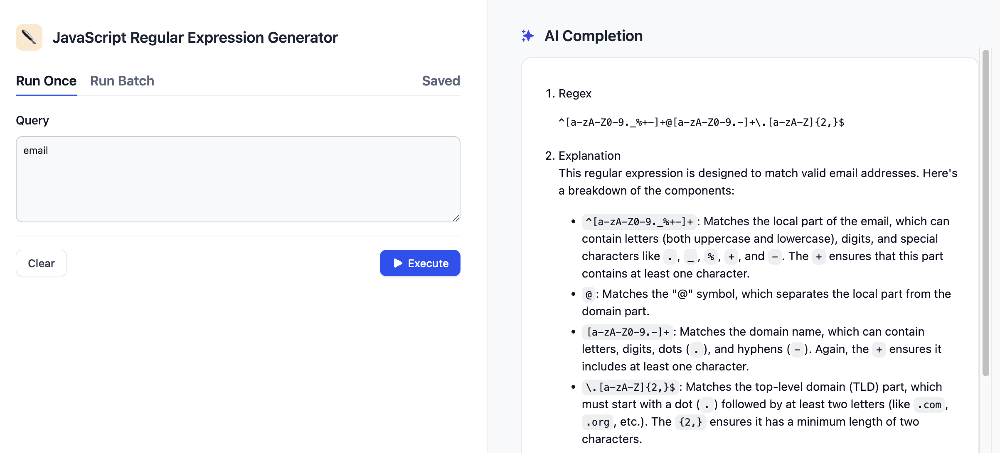
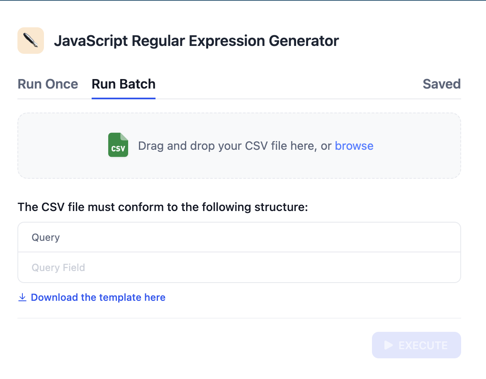
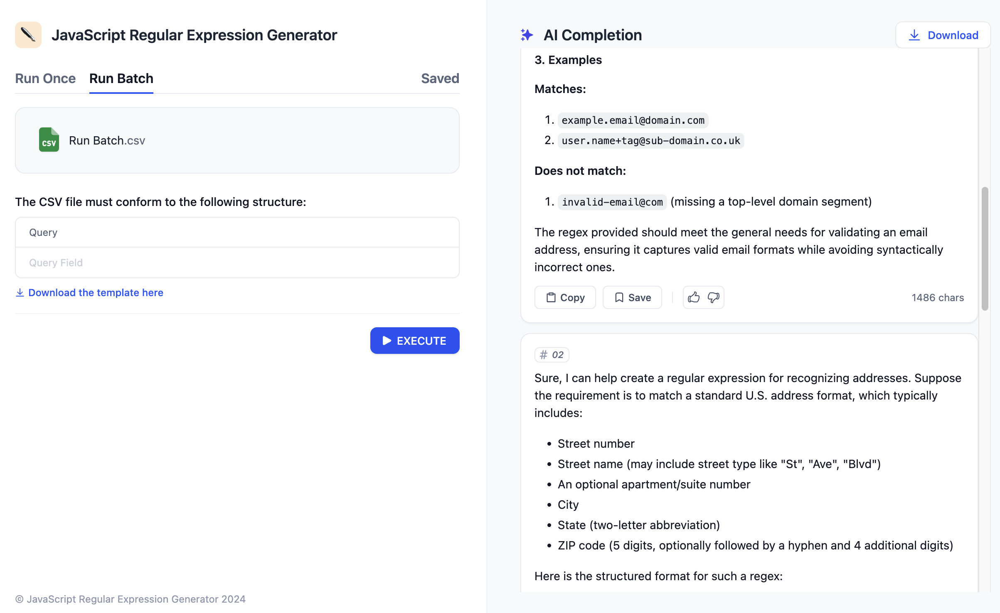
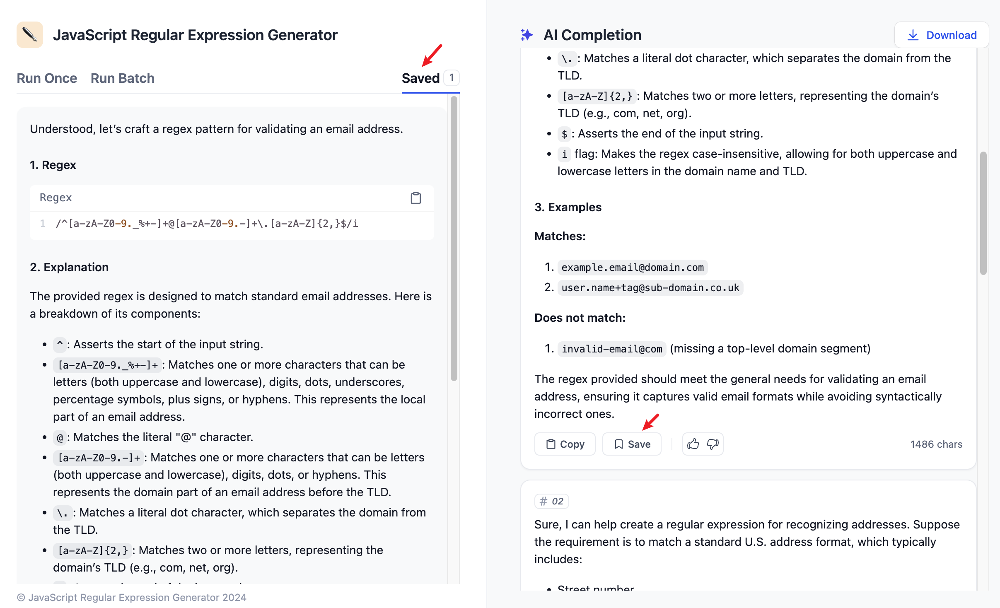
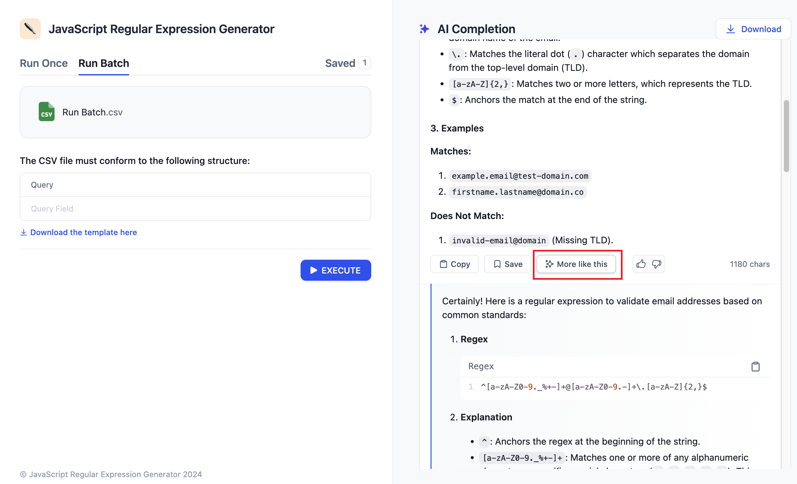

# برنامه تولید متن

برنامه تولید متن برنامه‌ای است که به طور خودکار متن با کیفیت بالا را با توجه به درخواست‌های ارائه شده توسط کاربر تولید می‌کند. این برنامه می‌تواند انواع مختلفی از متن را تولید کند، مانند خلاصه مقالات، ترجمه‌ها و غیره.

برنامه‌های تولید متن از ویژگی‌های زیر پشتیبانی می‌کنند:

1. اجرای یک باره.
2. اجرای در دسته‌ها.
3. ذخیره نتایج اجرا.
4. تولید نتایج مشابه بیشتر.

بیایید آن‌ها را به طور جداگانه معرفی کنیم.

### اجرای یک باره

محتوای کوئری را وارد کنید، روی دکمه اجرا کلیک کنید، و نتیجه در سمت راست نمایش داده می‌شود، همانطور که در تصویر زیر نشان داده شده است:

<figure><figcaption></figcaption></figure>

در بخش نتایج تولید شده، برای کپی کردن محتوا به کلیپ بورد، روی دکمه "کپی" کلیک کنید. برای ذخیره محتوا، روی دکمه "ذخیره" کلیک کنید. می‌توانید محتوای ذخیره شده را در تب "ذخیره شده" مشاهده کنید. همچنین می‌توانید محتوای تولید شده را "پسند" یا "نپسند" کنید.

### اجرای در دسته‌ها

گاهی اوقات، باید یک برنامه را چندین بار اجرا کنیم. به عنوان مثال: یک برنامه وب وجود دارد که می‌تواند مقالات را بر اساس موضوعات تولید کند. اکنون می‌خواهیم 100 مقاله در مورد موضوعات مختلف تولید کنیم. سپس این کار باید 100 بار انجام شود، که بسیار مشکل است. همچنین، باید منتظر اتمام یک کار قبل از شروع کار بعدی باشید.

در سناریوی فوق، از تابع عملیات دسته استفاده می‌شود، که برای کار کردن راحت است (موضوع را در یک فایل `csv` وارد کنید، فقط یک بار اجرا کنید) و همچنین زمان تولید را ذخیره می‌کند (چندین کار به طور همزمان اجرا می‌شوند). نحوه استفاده به شرح زیر است:

#### مرحله 1 وارد صفحه اجرای دسته شوید

روی تب "اجرای دسته" کلیک کنید تا وارد صفحه اجرای دسته شوید.

<figure><figcaption></figcaption></figure>

#### مرحله 2 الگو را دانلود کرده و محتوا را پر کنید

روی دکمه **"الگو را از اینجا دانلود کنید"** کلیک کنید تا فایل الگو را دریافت کنید. فایل را ویرایش کنید و محتوای مورد نیاز را پر کنید، سپس آن را به عنوان یک فایل `.csv` ذخیره کنید. در نهایت، فایل کامل شده را به Dify آپلود کنید.

#### مرحله 3 فایل را آپلود کرده و اجرا کنید

<figure><figcaption></figcaption></figure>

اگر نیاز به صادرات محتوای تولید شده دارید، می‌توانید روی دکمه "دانلود" در گوشه بالا سمت راست کلیک کنید تا به عنوان یک فایل `csv` صادر کنید.

**توجه:** رمزگذاری فایل `csv` آپلود شده باید `Unicode` باشد. در غیر این صورت، نتیجه با شکست مواجه خواهد شد. راه حل: هنگام صادرات به یک فایل `csv` با Excel، WPS و غیره، `Unicode` را برای رمزگذاری انتخاب کنید.

### ذخیره نتایج اجرا

برای ذخیره نتایج اجرا، روی دکمه "ذخیره" در زیر نتایج تولید شده کلیک کنید. در تب "ذخیره شده" می‌توانید تمام محتوای ذخیره شده را مشاهده کنید.

<figure><figcaption></figcaption></figure>

### تولید نتایج مشابه بیشتر

اگر تابع "بیشتر شبیه به این" در صفحه Orchestrate برنامه روشن باشد، با کلیک کردن روی دکمه "بیشتر شبیه به این" در برنامه وب، محتوایی مشابه نتیجه فعلی تولید می‌شود. همانطور که در زیر نشان داده شده است:

<figure><figcaption></figcaption></figure>

