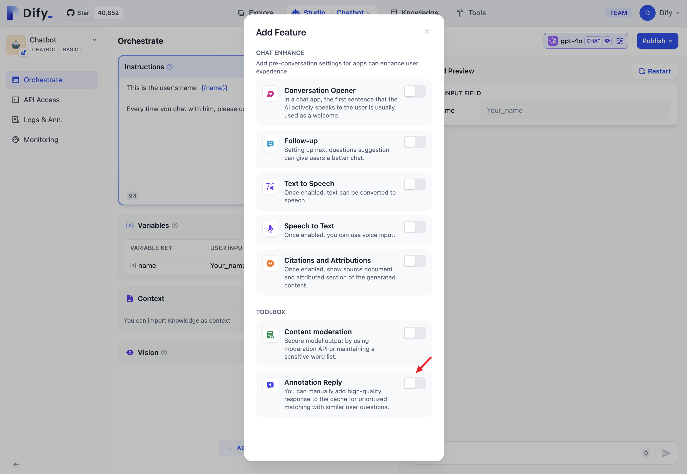
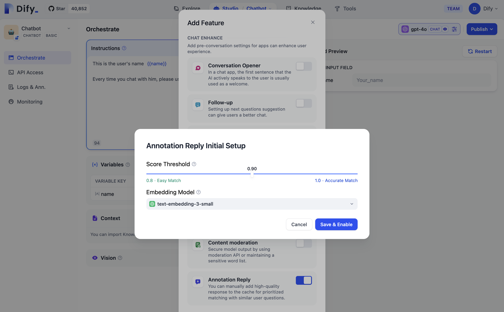
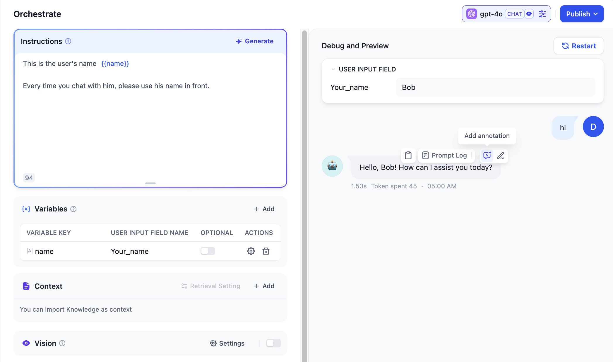
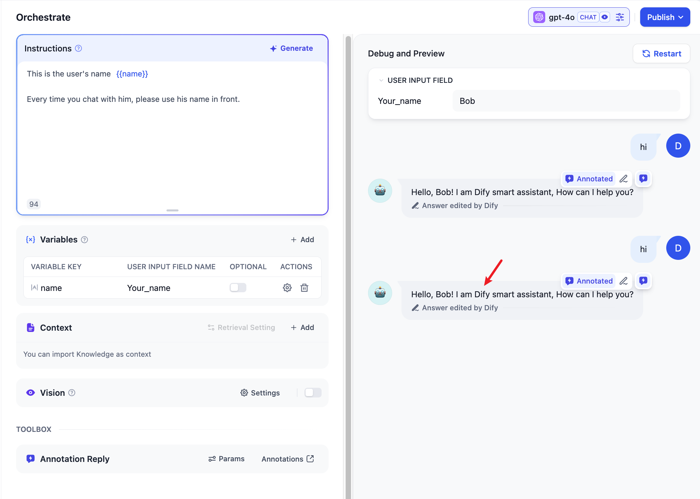
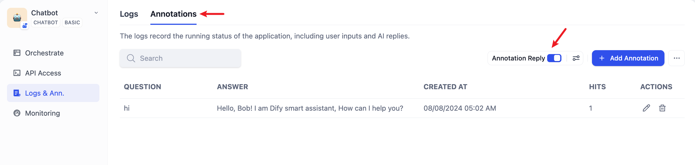
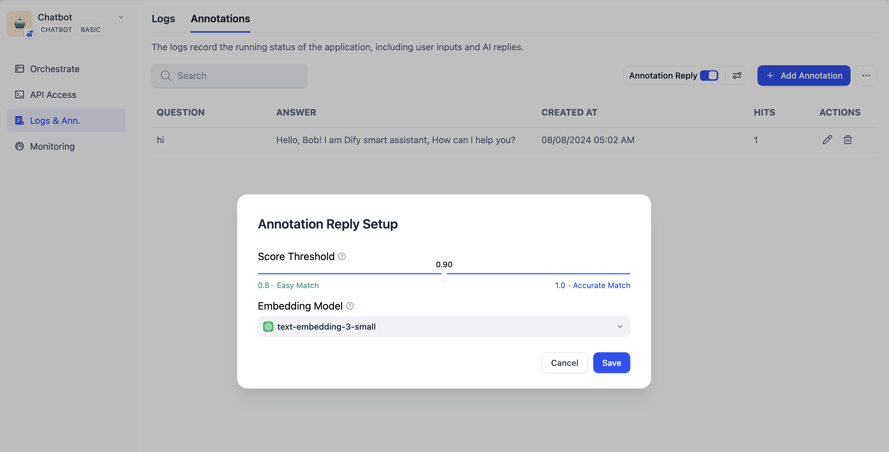
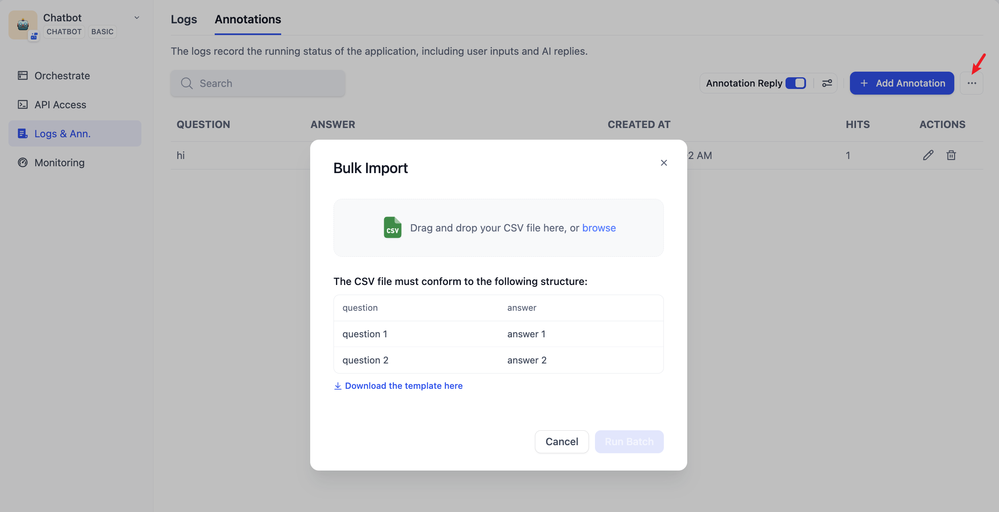
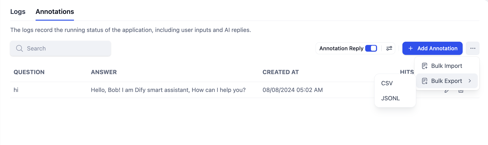
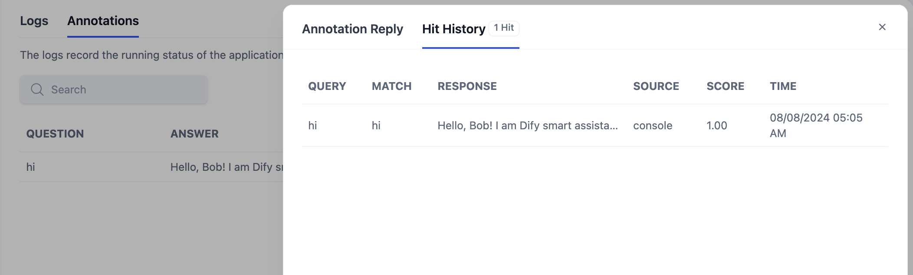

# پاسخ به یادداشت‌ها

قابلیت پاسخ به یادداشت‌ها، پاسخ‌های پرسش و پاسخ با کیفیت بالا را از طریق ویرایش و حاشیه‌نویسی دستی، ارائه می‌دهد.

سناریوهای قابل اجرا:

* **پاسخ‌های سفارشی برای فیلدهای خاص:** در سناریوهای خدمات مشتری یا پایگاه دانش برای شرکت‌ها، دولت‌ها و غیره، ارائه دهندگان خدمات ممکن است بخواهند اطمینان حاصل کنند که برخی سؤالات خاص با نتایج قطعی پاسخ داده می‌شوند. بنابراین، سفارشی کردن خروجی برای سؤالات خاص ضروری است. به عنوان مثال، ایجاد "پاسخ‌های استاندارد" برای سؤالات خاص یا علامت گذاری برخی سؤالات به عنوان "غیرقابل پاسخ".
* **تنظیم سریع برای محصولات POC یا DEMO:** هنگام ساخت سریع محصولات نمونه اولیه، پاسخ‌های سفارشی که از طریق پاسخ‌های یادداشت شده به دست می‌آیند، می‌توانند به طور مؤثری تولید مورد انتظار نتایج پرسش و پاسخ را ارتقا دهند و در نتیجه رضایت مشتری را بهبود بخشند.

قابلیت پاسخ به یادداشت‌ها در واقع مجموعه‌ای دیگر از سیستم‌های تقویت شده با بازیابی را ارائه می‌دهد که به شما امکان می‌دهد مرحله تولید LLM را دور بزنید و از مشکلات هذیان RAG جلوگیری کنید.

### گردش کار

1. پس از فعال کردن قابلیت پاسخ به یادداشت‌ها، می‌توانید پاسخ‌های مکالمات LLM را یادداشت کنید. می‌توانید پاسخ‌های با کیفیت بالا از پاسخ‌های LLM را مستقیماً به عنوان یادداشت اضافه کنید یا پاسخ با کیفیت بالا را با توجه به نیاز خود ویرایش کنید. این یادداشت‌های ویرایش شده به طور دائم ذخیره می‌شوند.
2. هنگامی که کاربر دوباره سؤالی مشابه می‌پرسد، سیستم سؤال را وکتور می‌کند و به دنبال سؤالات یادداشت شده مشابه می‌گردد.
3. اگر تطابقی یافت شد، پاسخ مربوطه از یادداشت مستقیماً برگردانده می‌شود و روند LLM یا RAG را دور می‌زند.
4. اگر هیچ تطابقی یافت نشد، سؤال به روند معمولی (عبور به LLM یا RAG) ادامه خواهد داد.
5. هنگامی که قابلیت پاسخ به یادداشت‌ها غیرفعال می‌شود، سیستم دیگر پاسخ‌های از یادداشت‌ها را تطبیق نخواهد داد.

<figure><figcaption>
گردش کار پاسخ به یادداشت‌ها
</figcaption></figure>

### فعال کردن پاسخ به یادداشت‌ها در تنظیمات راهنما

با مراجعه به "**تنظیمات -> افزودن ویژگی‌ها**" کلید پاسخ به یادداشت‌ها را فعال کنید:

<figure><figcaption>
فعال کردن پاسخ به یادداشت‌ها در تنظیمات راهنما
</figcaption></figure>

هنگام فعال کردن، باید پارامترهای مربوط به پاسخ به یادداشت‌ها را تنظیم کنید که شامل: آستانه امتیاز و مدل توکار.

**آستانه امتیاز:** این آستانه تشابه را برای تطبیق پاسخ‌های یادداشت شده تنظیم می‌کند. فقط یادداشت‌هایی با امتیاز بالاتر از این آستانه بازیابی می‌شوند.

**مدل توکار:** این برای وکتور کردن متن یادداشت شده استفاده می‌شود. تغییر مدل، توکارها را دوباره تولید خواهد کرد.

ذخیره و فعال کردن را کلیک کنید و تنظیمات بلافاصله اعمال می‌شوند. سیستم توکارها را برای همه یادداشت‌های ذخیره شده با استفاده از مدل توکار تولید می‌کند.

<figure><figcaption>
تنظیم پارامترها برای پاسخ به یادداشت‌ها
</figcaption></figure>

### اضافه کردن یادداشت‌ها در صفحه عیب‌یابی مکالمه

می‌توانید مستقیماً یادداشت‌ها را در اطلاعات پاسخ مدل در صفحات عیب‌یابی و پیش‌نمایش اضافه یا ویرایش کنید.

<figure><figcaption>
اضافه کردن پاسخ به یادداشت‌ها
</figcaption></figure>

پاسخ را به پاسخ با کیفیت بالا مورد نیاز خود ویرایش کنید و آن را ذخیره کنید.

<figure><figcaption>
ویرایش پاسخ به یادداشت‌ها
</figcaption></figure>

سؤال کاربر را دوباره وارد کنید و سیستم از یادداشت ذخیره شده برای پاسخ مستقیم به سؤال کاربر استفاده خواهد کرد.

<figure><figcaption>
پاسخ به سؤالات کاربران با یادداشت‌های ذخیره شده
</figcaption></figure>

### فعال کردن پاسخ به یادداشت‌ها در لاگ‌ها و یادداشت‌ها

با مراجعه به "**لاگ‌ها و یادداشت‌ها -> یادداشت‌ها**" کلید پاسخ به یادداشت‌ها را فعال کنید:

<figure><figcaption>
فعال کردن پاسخ به یادداشت‌ها در لاگ‌ها و یادداشت‌ها
</figcaption></figure>

### تنظیم پارامترها برای پاسخ به یادداشت‌ها در بک‌اند یادداشت‌ها

پارامترهایی که می‌توان برای پاسخ به یادداشت‌ها تنظیم کرد شامل: آستانه امتیاز و مدل توکار.

**آستانه امتیاز:** این آستانه تشابه را برای تطبیق پاسخ‌های یادداشت شده تنظیم می‌کند. فقط یادداشت‌هایی با امتیاز بالاتر از این آستانه بازیابی می‌شوند.

**مدل توکار:** این برای وکتور کردن متن یادداشت شده استفاده می‌شود. تغییر مدل، توکارها را دوباره تولید خواهد کرد.

<figure><figcaption>
تنظیم پارامترها برای پاسخ به یادداشت‌ها
</figcaption></figure>

### وارد کردن انبوه جفت‌های پرسش و پاسخ یادداشت شده

در قابلیت وارد کردن انبوه، می‌توانید الگوی وارد کردن یادداشت‌ها را دانلود کنید، جفت‌های پرسش و پاسخ یادداشت شده را مطابق با قالب الگو ویرایش کنید، و سپس آن‌ها را به طور انبوه وارد کنید.

<figure><figcaption>
وارد کردن انبوه جفت‌های پرسش و پاسخ یادداشت شده
</figcaption></figure>

### خروجی انبوه جفت‌های پرسش و پاسخ یادداشت شده

از طریق قابلیت خروجی انبوه، می‌توانید همه جفت‌های پرسش و پاسخ یادداشت شده ذخیره شده در سیستم را به طور همزمان صادر کنید.

<figure><figcaption>
خروجی انبوه جفت‌های پرسش و پاسخ یادداشت شده
</figcaption></figure>

### مشاهده تاریخچه ضربه به یادداشت

در قابلیت تاریخچه ضربه به یادداشت، می‌توانید تاریخچه ویرایش همه ضربه‌ها به یادداشت، سؤالات ضربه کاربر، پاسخ‌های پاسخ، منبع ضربه‌ها، امتیاز تشابه تطبیق، زمان ضربه و اطلاعات دیگر را مشاهده کنید. می‌توانید از این اطلاعات برای بهبود مداوم محتوای یادداشت شده خود استفاده کنید.

<figure><figcaption>
مشاهده تاریخچه ضربه به یادداشت
</figcaption></figure>
