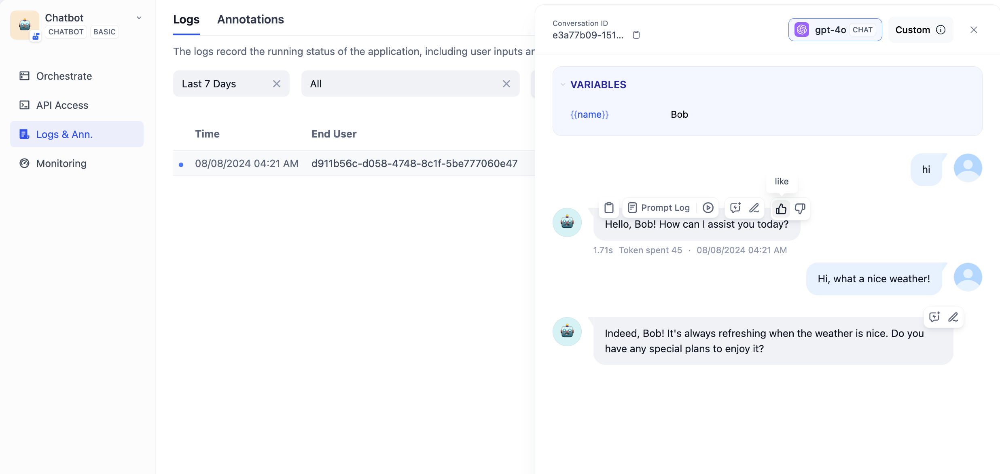

# لاگ‌ها و حاشیه‌نویسی


لطفاً مطمئن شوید که برنامه شما هنگام جمع‌آوری داده‌های کاربری از مقررات محلی پیروی می‌کند. روش معمول انتشار سیاست حفظ حریم خصوصی و دریافت رضایت کاربر است.


ویژگی **لاگ‌ها** برای مشاهده و حاشیه‌نویسی عملکرد برنامه‌های Dify طراحی شده است. Dify لاگ‌ها را برای تمام تعاملات با برنامه، چه از طریق وب‌اپ یا API، ضبط می‌کند. اگر مهندس راهنمایی یا اپراتور LLM هستید، این ویژگی تجربه‌ای بصری از عملیات برنامه‌های LLM در اختیار شما قرار می‌دهد.

### استفاده از کنسول لاگ‌ها

می‌توانید لاگ‌ها را در ناوبری سمت چپ برنامه پیدا کنید. این صفحه معمولاً موارد زیر را نمایش می‌دهد:

* سوابق تعامل بین کاربران و هوش مصنوعی در بازه زمانی انتخاب‌شده
* نتایج ورودی کاربر و خروجی هوش مصنوعی، که برای برنامه‌های مکالمه‌ای معمولاً مجموعه‌ای از جریان‌های پیام هستند
* امتیازدهی از طرف کاربران و اپراتورها، و همچنین حاشیه‌نویسی‌های بهبود از طرف اپراتورها

لاگ‌ها در حال حاضر سوابق تعامل از فرآیند اشکال‌زدایی راهنمایی را شامل نمی‌شوند.

### حاشیه‌نویسی‌های بهبود


این حاشیه‌نویسی‌ها برای تنظیم دقیق مدل در نسخه‌های آینده Dify به منظور بهبود دقت مدل و سبک پاسخ استفاده خواهند شد. نسخه پیش‌نمایش فعلی فقط از حاشیه‌نویسی‌ها پشتیبانی می‌کند.


<figure><figcaption>
برای بهبود برنامه خود، لاگ‌ها را علامت‌گذاری کنید
</figcaption></figure>

با کلیک کردن بر روی یک ورودی لاگ، پنل جزئیات لاگ در سمت راست رابط کاربری باز می‌شود. در این پنل، اپراتورها می‌توانند تعامل را حاشیه‌نویسی کنند:

* برای پیام‌های با عملکرد خوب، انگشت شست بالا را بدهید.
* برای پیام‌های با عملکرد ضعیف، انگشت شست پایین را بدهید.
* پاسخ‌های بهبودیافته را برای بهبود علامت‌گذاری کنید، که نشان‌دهنده متنی است که انتظار دارید هوش مصنوعی پاسخ دهد.

لطفاً توجه داشته باشید که اگر چندین مدیر در تیم یک ورودی لاگ را حاشیه‌نویسی کنند، آخرین حاشیه‌نویسی روی موارد قبلی را لغو خواهد کرد.

