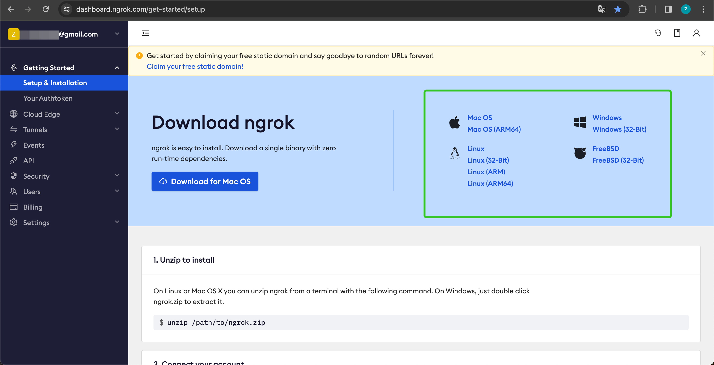
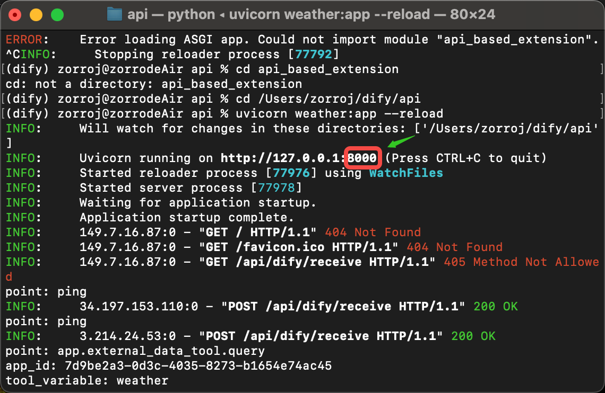

# توسعه‌ی افزونه مبتنی بر API

توسعه‌دهندگان می‌توانند با استفاده از ماژول توسعه‌ی API، قابلیت‌های ماژول‌ها را گسترش دهند. در حال حاضر، توسعه‌ی ماژول‌ها در این افزونه‌ها پشتیبانی می‌شود:

* `moderation`
* `external_data_tool`

قبل از توسعه‌ی قابلیت‌های ماژول، یک API و کلید API برای احراز هویت آماده کنید. این دو مورد نیز می‌توانند به طور خودکار توسط Dify تولید شوند. علاوه بر توسعه‌ی قابلیت‌های مربوطه در ماژول، دستورالعمل‌های زیر را دنبال کنید تا Dify بتواند به درستی با API شما ارتباط برقرار کند.

<figure><figcaption><p>اضافه کردن توسعه‌ی API</p></figcaption></figure>

## مشخصات API

Dify API شما را طبق مشخصات زیر فراخوانی خواهد کرد:

```
POST {Your-API-Endpoint}
```

### هدر

| هدر          | مقدار             | توضیحات                                                                                                                                         |
| --------------- | ----------------- | -------------------------------------------------------------------------------------------------------------------------------------------- |
| `Content-Type`  | application/json  | محتوا درخواست به صورت JSON است.                                                                                                       |
| `Authorization` | Bearer {api\_key} | کلید API به عنوان یک توکن ارسال می‌شود. شما باید `api_key` را تحلیل کنید و در صورت تطابق با کلید API ارائه شده، امنیت API را تضمین کنید. |

### بدنه‌ی درخواست

```JSON
{
    "point":  string, // نقطه توسعه، ماژول‌های مختلف ممکن است نقاط توسعه‌ی متعدد داشته باشند
    "params": {
        ...  // پارامترهایی که به هر نقطه توسعه‌ی ماژول ارسال می‌شوند
    }
}
```

### پاسخ API

```JSON
{
    ...  // برای محتوایی که توسط API برگردانده می‌شود، به مشخصات طراحی ماژول خاص برای نقاط توسعه‌ی مختلف مراجعه کنید.
}

```

## بررسی

هنگامی که توسعه‌ی API را در Dify پیکربندی می‌کنید، Dify یک درخواست به API Endpoint ارسال می‌کند تا در دسترس بودن API را بررسی کند. هنگام دریافت `point=ping` توسط API Endpoint، API باید `result=pong` را به شرح زیر برگرداند:

### هدر

```JSON
Content-Type: application/json
Authorization: Bearer {api_key}
```

### بدنه‌ی درخواست

```JSON
{
    "point": "ping"
}
```

### پاسخ API مورد انتظار

```JSON
{
    "result": "pong"
}
```

\\

## به عنوان مثال

در اینجا از ابزار داده‌های خارجی به عنوان نمونه استفاده می‌کنیم، جایی که سناریو، بازیابی اطلاعات آب و هوایی خارجی بر اساس منطقه به عنوان متن است.

### مشخصات API

`POST https://fake-domain.com/api/dify/receive`

### **هدر**

```JSON
Content-Type: application/json
Authorization: Bearer 123456
```

### **بدنه‌ی درخواست**

```JSON
{
    "point": "app.external_data_tool.query",
    "params": {
        "app_id": "61248ab4-1125-45be-ae32-0ce91334d021",
        "tool_variable": "weather_retrieve",
        "inputs": {
            "location": "London"
        },
        "query": "How's the weather today?"
    }
}
```

### **پاسخ API**

```JSON
{
    "result": "City: London\nTemperature: 10°C\nRealFeel®: 8°C\nAir Quality: Poor\nWind Direction: ENE\nWind Speed: 8 km/h\nWind Gusts: 14 km/h\nPrecipitation: Light rain"
}
```

### کد نمونه

این کد مبتنی بر فریم ورک Python FastAPI است.

#### **نصب وابستگی‌ها.**

<pre><code><strong>pip install 'fastapi[all]' uvicorn
</strong></code></pre>

#### کد را مطابق با مشخصات رابط بنویسید.

<pre><code>from fastapi import FastAPI, Body, HTTPException, Header
<strong>from pydantic import BaseModel
</strong>
app = FastAPI()


class InputData(BaseModel):
    point: str
    params: dict


@app.post("/api/dify/receive")
async def dify_receive(data: InputData = Body(...), authorization: str = Header(None)):
    """
    دریافت داده‌های پرس و جو API از Dify.
    """
    expected_api_key = "123456"  # TODO کلید API این API
    auth_scheme, _, api_key = authorization.partition(' ')

    if auth_scheme.lower() != "bearer" or api_key != expected_api_key:
        raise HTTPException(status_code=401, detail="Unauthorized")

    point = data.point

    # for debug
    print(f"point: {point}")

    if point == "ping":
        return {
            "result": "pong"
        }
    if point == "app.external_data_tool.query":
        return handle_app_external_data_tool_query(params=data.params)
    # elif point == "{point name}":
        # TODO پیاده سازی نقطه دیگر در اینجا

    raise HTTPException(status_code=400, detail="Not implemented")


def handle_app_external_data_tool_query(params: dict):
    app_id = params.get("app_id")
    tool_variable = params.get("tool_variable")
    inputs = params.get("inputs")
    query = params.get("query")

    # for debug
    print(f"app_id: {app_id}")
    print(f"tool_variable: {tool_variable}")
    print(f"inputs: {inputs}")
    print(f"query: {query}")

    # TODO پیاده سازی پرس و جوی ابزار داده خارجی خود را در اینجا، 
    #  بازگشت باید یک دیکشنری با کلید "result" باشد و مقدار آن نتیجه‌ی پرس و جو است
    if inputs.get("location") == "London":
        return {
            "result": "City: London\nTemperature: 10°C\nRealFeel®: 8°C\nAir Quality: Poor\nWind Direction: ENE\nWind "
                      "Speed: 8 km/h\nWind Gusts: 14 km/h\nPrecipitation: Light rain"
        }
    else:
        return {"result": "Unknown city"}
</code></pre>

#### راه‌اندازی سرویس API.

پورت پیش‌فرض 8000 است. آدرس کامل API: `http://127.0.0.1:8000/api/dify/receive` با کلید API پیکربندی شده "123456" است.

<pre><code><strong>uvicorn main:app --reload --host 0.0.0.0
</strong></code></pre>

#### این API را در Dify پیکربندی کنید.

<figure><figcaption></figcaption></figure>

#### این توسعه‌ی API را در App انتخاب کنید.

<figure><figcaption></figcaption></figure>

هنگام اشکال‌زدایی App، Dify درخواست API پیکربندی شده را ارسال می‌کند و محتوای زیر (مثال) را ارسال می‌کند:

```JSON
{
    "point": "app.external_data_tool.query",
    "params": {
        "app_id": "61248ab4-1125-45be-ae32-0ce91334d021",
        "tool_variable": "weather_retrieve",
        "inputs": {
            "location": "London"
        },
        "query": "How's the weather today?"
    }
}
```

پاسخ API:

```JSON
{
    "result": "City: London\nTemperature: 10°C\nRealFeel®: 8°C\nAir Quality: Poor\nWind Direction: ENE\nWind Speed: 8 km/h\nWind Gusts: 14 km/h\nPrecipitation: Light rain"
}
```

### اشکال‌زدایی محلی

از آنجایی که نسخه‌ی ابری Dify نمی‌تواند به سرویس‌های API شبکه داخلی دسترسی داشته باشد، می‌توانید از Ngrok برای نمایش عمومی آدرس انتهای سرویس API محلی خود برای اشکال‌زدایی کد محلی مبتنی بر ابر استفاده کنید. مراحل به شرح زیر است:

1. به وب سایت رسمی Ngrok به آدرس [https://ngrok.com](https://ngrok.com/) مراجعه کنید، ثبت نام کنید و فایل Ngrok را دانلود کنید.

<figure><figcaption></figcaption></figure>

2. پس از دانلود، به دایرکتوری دانلود بروید. فایل فشرده را از حالت فشرده خارج کنید و مطابق دستورالعمل، اسکریپت راه‌اندازی را اجرا کنید:

```
$ unzip /path/to/ngrok.zip
$ ./ngrok config add-authtoken 你的Token
```

3. پورت سرویس API محلی خود را بررسی کنید.

<figure><figcaption></figcaption></figure>

دستور زیر را برای شروع اجرا کنید:

```
$ ./ngrok http [port number]
```

پس از راه‌اندازی موفقیت‌آمیز، چیزی شبیه به این را خواهید دید:

<figure><figcaption></figcaption></figure>

4. آدرس "Forwarding" را پیدا کنید، مانند نمونه دامنه `https://177e-159-223-41-52.ngrok-free.app` و آن را به عنوان دامنه عمومی خود استفاده کنید.

* به عنوان مثال، برای نمایش سرویس در حال اجرا در سیستم محلی خود، URL نمونه `http://127.0.0.1:8000/api/dify/receive` را با `https://177e-159-223-41-52.ngrok-free.app/api/dify/receive` جایگزین کنید.

اکنون این API Endpoint به طور عمومی در دسترس است. می‌توانید این Endpoint را برای اشکال‌زدایی محلی در Dify پیکربندی کنید. برای مراحل پیکربندی، به مستندات یا راهنمای مربوطه مراجعه کنید.

### استقرار توسعه‌ی API با Cloudflare Workers

ما توصیه می‌کنیم که از Cloudflare Workers برای استقرار توسعه‌ی API خود استفاده کنید، زیرا Cloudflare Workers می‌تواند به راحتی یک آدرس عمومی ارائه دهد و می‌تواند به صورت رایگان استفاده شود.

[cloudflare-workers.md](cloudflare-workers.md "mention")


