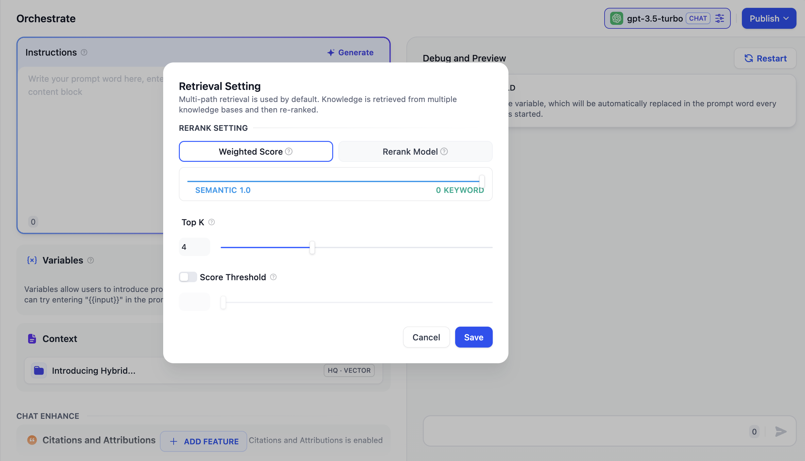
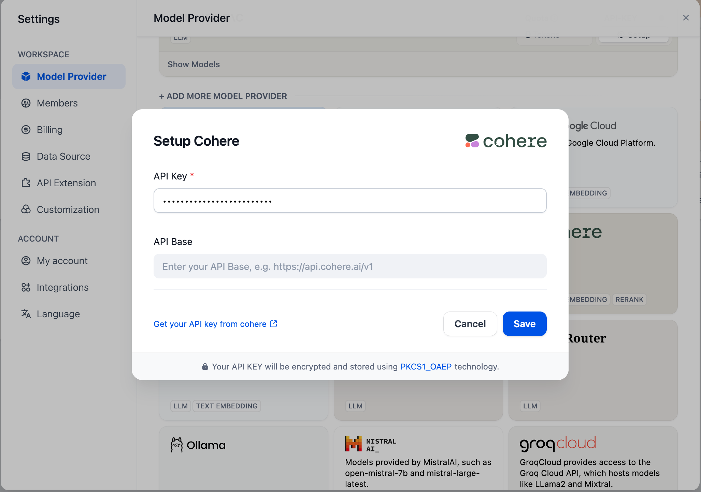

# یکپارچه سازی پایگاه دانش در برنامه

### ایجاد برنامه ای که با پایگاه دانش یکپارچه شده است

یک **"پایگاه دانش"** می تواند به عنوان یک منبع اطلاعات خارجی برای ارائه پاسخ های دقیق به سوالات کاربران از طریق LLM مورد استفاده قرار گیرد. شما می توانید یک پایگاه دانش موجود را با هر نوع برنامه [نوع برنامه](https://docs.dify.ai/guides/application-orchestrate#application\_type) در Dify مرتبط کنید.

به عنوان مثال،  با استفاده از یک دستیار چت، این فرآیند به شرح زیر است:

1. به **دانش -- ایجاد دانش -- آپلود فایل** بروید.
2. به **استودیو -- ایجاد برنامه -- انتخاب ربات چت** بروید.
3.  **متن** را وارد کنید، روی **افزودن** کلیک کنید و یکی از پایگاه های دانش ایجاد شده را انتخاب کنید.
4. در **تنظیمات متن -- تنظیمات بازیابی**، **تنظیمات بازیابی** را پیکربندی کنید.
5. **نقل قول و انتساب** را در **افزودن ویژگی ها** فعال کنید.
6. در **دیباگ و پیش نمایش**، سوالات کاربران مرتبط با پایگاه دانش را برای دیباگ وارد کنید.
7. پس از دیباگ، روی دکمه **انتشار** کلیک کنید تا یک برنامه AI  بر اساس دانش خودتان ایجاد کنید!

***

### اتصال دانش و تنظیم حالت بازیابی

در برنامه هایی که از چندین پایگاه دانش استفاده می کنند، پیکربندی حالت بازیابی برای افزایش دقت محتوای بازیابی شده ضروری است. برای تنظیم حالت بازیابی برای پایگاه های دانش، به **متن -- تنظیمات بازیابی -- تنظیمات دوباره مرتب سازی** بروید.

#### تنظیمات بازیابی

بازیابنده، تمام پایگاه های دانش مرتبط با برنامه را برای محتوای متنی مرتبط با سوال کاربر اسکن می کند. سپس نتایج ادغام می شوند. در زیر نمودار فنی برای حالت بازیابی چند مسیر وجود دارد:

<figure><figcaption></figcaption></figure>

این روش به طور همزمان تمام پایگاه های دانش متصل شده در **"متن"** را برای یافتن قطعات متن مرتبط در چندین پایگاه دانش، جمع آوری تمام محتوایی که با سوال کاربر مطابقت دارد، و در نهایت اعمال استراتژی دوباره مرتب سازی برای شناسایی مناسب ترین محتوا برای پاسخ به کاربر، مورد پرس و جو قرار می دهد. این رویکرد بازیابی با بهره گیری از چندین پایگاه دانش به طور همزمان، نتایج جامع تر و دقیق تری ارائه می دهد.

<figure><figcaption></figcaption></figure>

به عنوان مثال، در برنامه A، با سه پایگاه دانش K1، K2، و K3. زمانی که یک کاربر سوالی ارسال می کند، چندین قطعه محتوا مرتبط از این پایگاه های دانش بازیابی و ترکیب می شوند. برای اطمینان از شناسایی مناسب ترین محتوا، استراتژی دوباره مرتب سازی برای یافتن محتوایی که بهترین ارتباط را با پرس و جو کاربر دارد، به کار گرفته می شود و دقت و قابلیت اطمینان نتایج را بهبود می بخشد.

در سناریوهای عملی سوال و جواب، منابع محتوا و روش های بازیابی برای هر پایگاه دانش ممکن است متفاوت باشد. برای مدیریت محتوای ترکیبی بازگردانده شده از بازیابی، استراتژی [دوباره مرتب سازی](https://docs.dify.ai/learn-more/extended-reading/retrieval-augment/rerank) به عنوان یک مکانیسم مرتب سازی دقیق عمل می کند. این اطمینان می دهد که محتوای کاندید به خوبی با سوال کاربر هماهنگ است و رتبه بندی نتایج را در چندین پایگاه دانش برای شناسایی مناسب ترین محتوا بهینه می کند و در نتیجه کیفیت پاسخ و تجربه کلی کاربر را بهبود می بخشد.

با توجه به هزینه های مرتبط با استفاده از دوباره مرتب سازی و نیازهای تجاری، حالت بازیابی چند مسیر دو تنظیم دوباره مرتب سازی را ارائه می دهد:

**امتیاز وزنی**

این تنظیم از مکانیسم های امتیازدهی داخلی استفاده می کند و نیازی به مدل دوباره مرتب سازی خارجی ندارد و در نتیجه **از هرگونه هزینه پردازش اضافی جلوگیری می کند**. می توانید با تنظیم نوار لغزنده نسبت وزن برای معنای شناسی یا کلمات کلیدی، مناسب ترین استراتژی تطبیق محتوا را انتخاب کنید.

*   **ارزش معنایی شناسی 1**

    این حالت فقط بازیابی معنایی شناسی را فعال می کند. با استفاده از مدل Embedding، عمق جستجو را می توان حتی اگر کلمات دقیق از پرس و جو در پایگاه دانش ظاهر نشوند، افزایش داد، زیرا فاصله برداری را برای بازگرداندن محتوای مرتبط محاسبه می کند. علاوه بر این، هنگام برخورد با محتوای چند زبانه، بازیابی معنایی شناسی می تواند معانی را در زبان های مختلف به دست آورد و نتایج جستجوی دقیق تری در چند زبان را به دست آورد.
*   **ارزش کلمه کلیدی 1**

    این حالت فقط بازیابی کلمه کلیدی را فعال می کند. متن ورودی کاربر را با متن کامل پایگاه دانش مطابقت می دهد و آن را برای سناریوهایی که کاربر اطلاعات یا اصطلاحات دقیق را می داند، ایده آل می کند. این روش به طور کارآمد منابع را مصرف می کند و آن را برای بازیابی سریع اطلاعات از مخازن اسناد بزرگ مناسب می کند.
*   **وزن های سفارشی کلمه کلیدی و معنایی شناسی**

    علاوه بر فعال کردن فقط حالت های بازیابی معنایی شناسی یا کلمه کلیدی، وزن امتیاز سفارشی انعطاف پذیر را ارائه می دهیم. شما می توانید با تنظیم مداوم وزن هر دو، بهترین نسبت وزن را برای سناریوی تجاری خود تعیین کنید.

**مدل دوباره مرتب سازی**

مدل دوباره مرتب سازی یک سیستم امتیازدهی خارجی است که امتیاز مرتبط بودن بین سوال کاربر و هر سند کاندید ارائه شده را محاسبه می کند و نتایج رتبه بندی معنایی را بهبود می بخشد و لیستی از اسناد را بر اساس مرتبط بودن از بالا به پایین مرتب می کند.

در حالی که این روش هزینه های اضافی را به همراه دارد، اما در مدیریت محتوای پیچیده پایگاه دانش، مانند محتوایی که پرس و جوهای معنایی و تطبیق کلمات کلیدی را ترکیب می کند، یا مواردی که شامل محتوای بازگردانده شده چند زبانه است، مهارت بیشتری دارد.

> برای کسب اطلاعات بیشتر در مورد [دوباره مرتب سازی](https://docs.dify.ai/learn-more/extended-reading/retrieval-augment/rerank) کلیک کنید.

Dify در حال حاضر از چندین مدل دوباره مرتب سازی پشتیبانی می کند. برای استفاده از مدل های دوباره مرتب سازی خارجی، باید یک کلید API ارائه دهید. کلید API را برای مدل دوباره مرتب سازی (مانند Cohere، Jina AI، و غیره) در صفحه "ارائه کننده مدل" وارد کنید.

<figure><figcaption>
پیکربندی مدل دوباره مرتب سازی در ارائه دهنده مدل
</figcaption></figure>

**پارامترهای قابل تنظیم**

*   **TopK**

    این پارامتر بخش های متنی را که بیشترین شباهت را به سوال کاربر دارند، فیلتر می کند. این سیستم به طور پویا تعداد بخش ها را بر اساس اندازه پنجره متن مدل انتخاب شده تنظیم می کند. یک مقدار بالاتر منجر به یادآوری بخش های متنی بیشتر می شود.
*   **آستانه امتیاز**

    این پارامتر آستانه شباهت را برای فیلتر کردن بخش های متنی ایجاد می کند. فقط آن بخش هایی که دارای امتیاز شباهت بازیابی برداری بیش از آستانه تعیین شده هستند، یادآوری می شوند. یک مقدار آستانه بالاتر منجر به یادآوری متن های کمتری می شود، اما آن هایی که یادآوری می شوند، احتمالاً مرتبط تر هستند. این پارامتر را بر اساس نیازهای خاص خود برای دقت در مقابل یادآوری تنظیم کنید.

حالت چند یادآوری می تواند نتایج یادآوری با کیفیت بالاتری را هنگام بازیابی از چندین پایگاه دانش به دست آورد؛ بنابراین، **توصیه می شود حالت یادآوری را به چند یادآوری تنظیم کنید**.

### سوالات متداول

1. **چگونه باید تنظیمات دوباره مرتب سازی را در حالت چند یادآوری انتخاب کنم؟**

اگر کاربران اطلاعات یا اصطلاحات دقیق را می دانند و بازیابی کلمه کلیدی می تواند به طور دقیق نتایج تطبیق را ارائه دهد، **کلمه کلیدی را به 1** در "وزن امتیاز" تنظیم کنید.

اگر واژگان دقیق در پایگاه دانش ظاهر نشود، یا اگر پرس و جوهای چند زبانه وجود داشته باشد، توصیه می شود **تنظیم معنایی شناسی را به 1** در "وزن امتیاز" تنظیم کنید.

اگر کارکنان تجاری با سناریوهای پرس و جو واقعی کاربران آشنا هستند و می خواهند نسبت معنایی شناسی یا کلمات کلیدی را به طور فعال تنظیم کنند، توصیه می شود نسبت را خودتان در "وزن امتیاز" تنظیم کنید.

اگر محتوای موجود در پایگاه دانش پیچیده است و نمی توان با شرایط ساده مانند معنایی شناسی یا کلمات کلیدی با آن مطابقت داشت، در حالی که به پاسخ های دقیق نیاز دارید، و اگر مایل به متحمل هزینه های اضافی هستید، توصیه می شود از **مدل دوباره مرتب سازی** برای بازیابی محتوا استفاده کنید.

2. **اگر در یافتن "وزن امتیاز" یا نیاز به پیکربندی مدل دوباره مرتب سازی با مشکل مواجه شدم چه باید بکنم؟**

در اینجا نحوه تاثیر روش بازیابی پایگاه دانش بر بازیابی چند مسیر آمده است:

<figure><figcaption></figcaption></figure>

3. **اگر نتوانم "وزن امتیاز" را هنگام مراجعه به چندین پایگاه دانش تنظیم کنم و یک پیام خطا ظاهر شود چه باید بکنم؟**

این مشکل به این دلیل رخ می دهد که مدل های Embedding مورد استفاده در چندین پایگاه دانش ارجاع داده شده ناسازگار هستند و این اطلاع رسانی برای جلوگیری از تضاد در محتوای بازیابی شده، صادر می شود. توصیه می شود مدل دوباره مرتب سازی را در "ارائه دهنده مدل" تنظیم و فعال کنید یا تنظیمات بازیابی پایگاه های دانش را یکسان کنید.

4. **چرا نمی توانم گزینه "وزن امتیاز" را در حالت چند یادآوری پیدا کنم و فقط مدل دوباره مرتب سازی را می بینم؟**

لطفا بررسی کنید که آیا پایگاه دانش شما از حالت شاخص "اقتصادی" استفاده می کند یا خیر. در این صورت، آن را به حالت شاخص "با کیفیت بالا" تغییر دهید.

