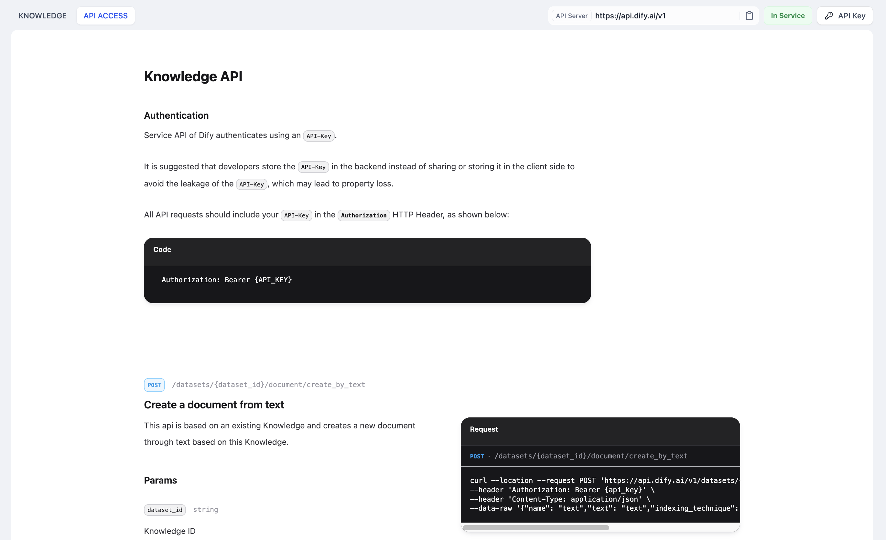
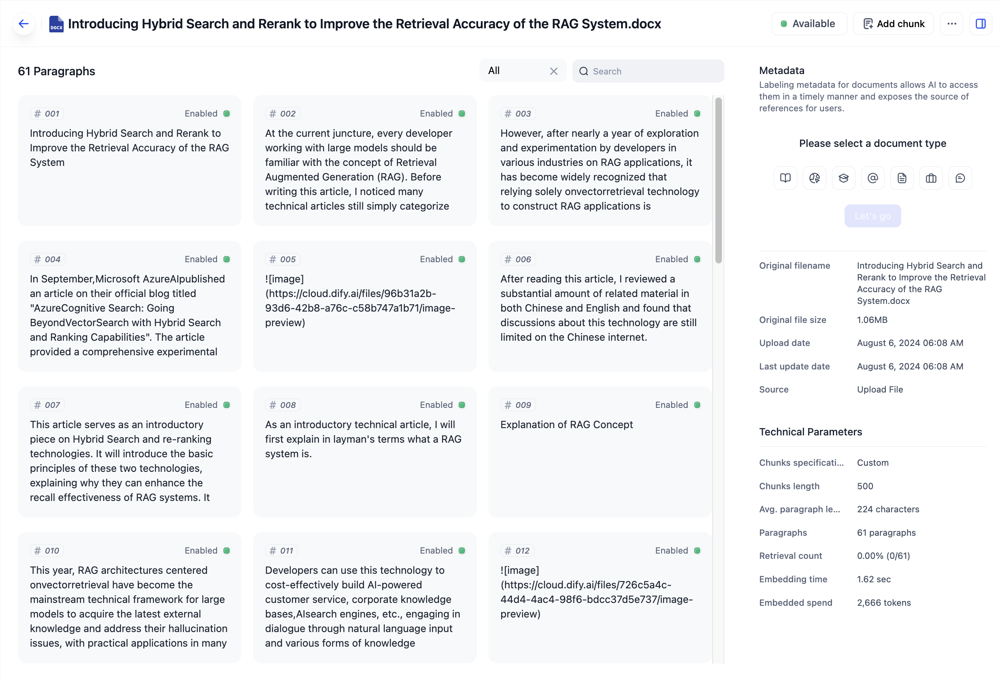
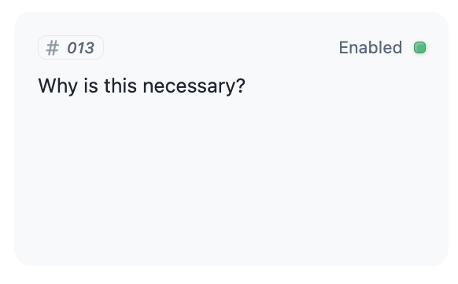
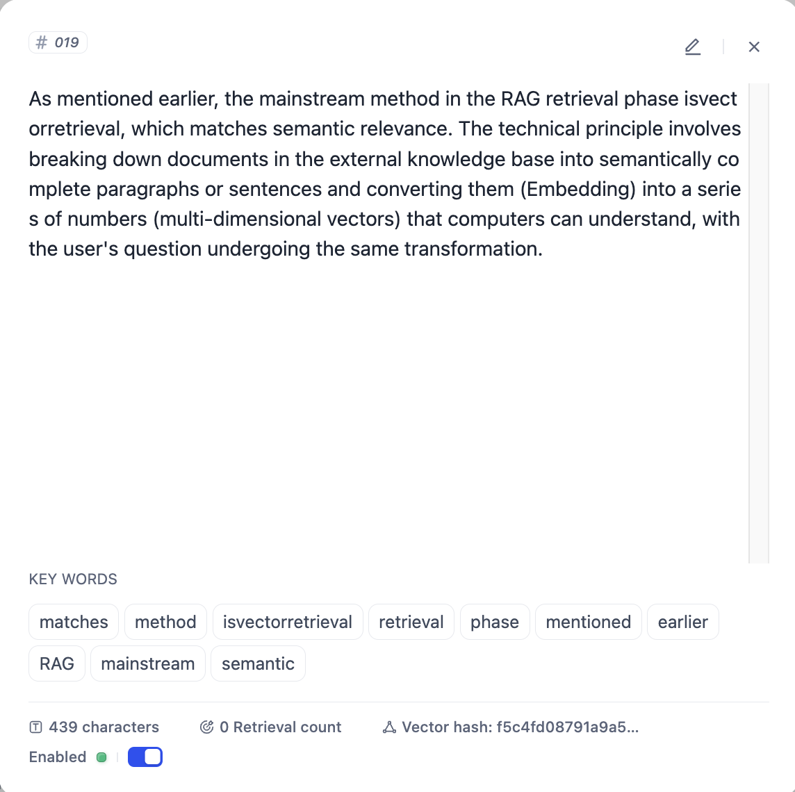
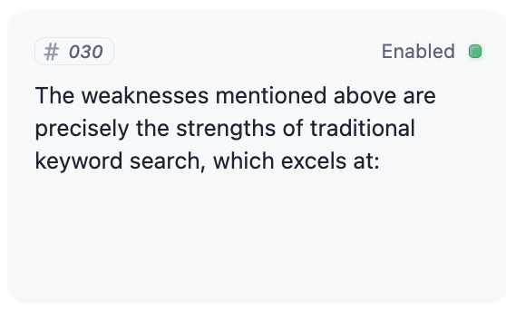
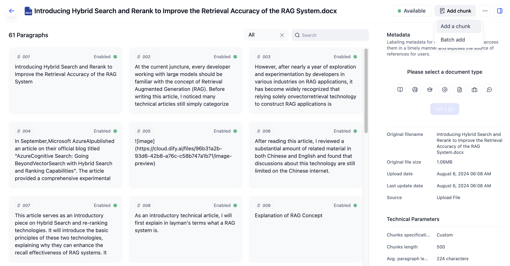
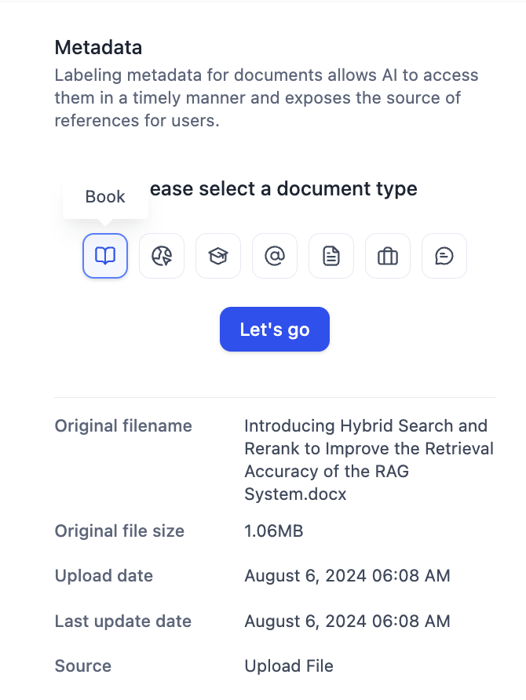
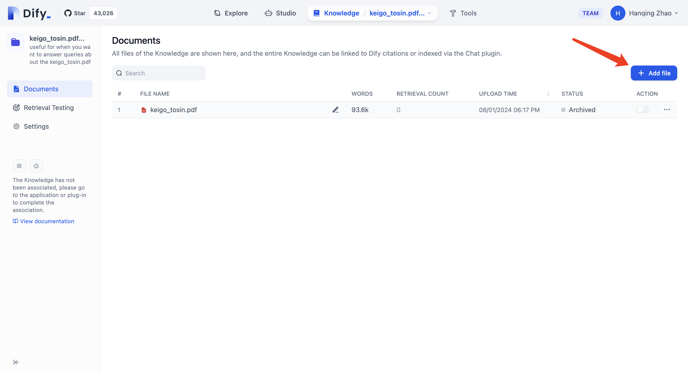

# پایگاه دانش و نگهداری اسناد

## مدیریت پایگاه دانش

> صفحه پایگاه دانش فقط برای مالک تیم، مدیران تیم و کاربران با مجوز ویرایشگر قابل دسترسی است.

در صفحه اصلی تیم Dify، روی تب "پایگاه دانش" در بالا کلیک کنید، پایگاه دانشی را که می خواهید مدیریت کنید انتخاب کنید، سپس روی **تنظیمات** در پنل ناوبری سمت چپ کلیک کنید تا تنظیمات را انجام دهید. می‌توانید نام پایگاه دانش، توضیحات، مجوزهای دسترسی، حالت نمایه سازی، مدل تعبیه و تنظیمات بازیابی را تغییر دهید.

<figure><figcaption>
تنظیمات پایگاه دانش
</figcaption></figure>

**نام پایگاه دانش**: برای تمایز بین پایگاه‌های دانش مختلف استفاده می‌شود.

**توضیحات پایگاه دانش**: برای شرح اطلاعات ارائه شده در اسناد موجود در پایگاه دانش استفاده می‌شود.

**مجوزهای دسترسی**: کنترل دسترسی را برای پایگاه دانش با سه سطح تعریف می‌کند:

1. **"فقط من"**: دسترسی را به مالک پایگاه دانش محدود می‌کند.
2. **"تمام اعضای تیم"**: دسترسی به همه اعضای تیم را می‌دهد.
3. **"اعضای جزئی تیم"**: دسترسی انتخابی به اعضای خاص تیم را مجاز می‌کند.

کاربران بدون مجوز مناسب، نمی‌توانند به پایگاه دانش دسترسی داشته باشند. هنگام اعطای دسترسی به اعضای تیم (گزینه‌های 2 یا 3)، کاربران مجاز مجوزهای کامل، از جمله مشاهده، ویرایش و حذف حقوق برای محتوای پایگاه دانش را دریافت می‌کنند.

**حالت نمایه سازی**: برای توضیحات دقیق‌تر، لطفاً [به مستندات مراجعه کنید](https://docs.dify.ai/guides/knowledge-base/create-knowledge-and-upload-documents#5-indexing-method).

**مدل تعبیه**: به شما امکان می‌دهد تا مدل تعبیه را برای پایگاه دانش تغییر دهید. تغییر مدل تعبیه، همه اسناد در پایگاه دانش را مجدداً تعبیه می‌کند و تعبیه‌های اصلی حذف می‌شوند.

**تنظیمات بازیابی**: برای توضیحات دقیق‌تر، لطفاً [به مستندات مراجعه کنید](https://docs.dify.ai/guides/knowledge-base/create-knowledge-and-upload-documents#6-retrieval-settings).

***

### مدیریت API پایگاه دانش

پایگاه دانش Dify یک مجموعه کامل از API‌های استاندارد را ارائه می‌دهد. توسعه‌دهندگان می‌توانند از فراخوانی‌های API برای انجام عملیات روزانه مدیریت و نگهداری مانند اضافه کردن، حذف، اصلاح و پرس و جو اسناد و بخش‌ها در پایگاه دانش استفاده کنند. لطفاً به [مستندات API پایگاه دانش](maintain-dataset-via-api.md) مراجعه کنید.

<figure><figcaption>
مدیریت API پایگاه دانش
</figcaption></figure>

## نگهداری متن در پایگاه دانش

### مشاهده بخش‌های متن

هر سند آپلود شده در پایگاه دانش به شکل بخش‌های متن ذخیره می‌شود. می‌توانید محتوای متنی خاص هر بخش را در لیست بخش‌ها مشاهده کنید.

<figure><figcaption>
مشاهده بخش‌های سند آپلود شده
</figcaption></figure>

***

### بررسی کیفیت بخش

کیفیت بخش‌های سند، به طور قابل توجهی بر عملکرد Q\&A برنامه کاربردی پایگاه دانش تأثیر می‌گذارد. توصیه می‌شود قبل از مرتبط کردن پایگاه دانش با برنامه، کیفیت بخش‌ها را به صورت دستی بررسی کنید.

اگرچه روش‌های خودکار بخش بندی بر اساس طول کاراکتر، شناسه‌ها یا بخش بندی معنایی NLP می‌تواند به طور قابل توجهی حجم کار بخش بندی متن در مقیاس بزرگ را کاهش دهد، کیفیت بخش به ساختار متنی فرمت‌های مختلف سند و زمینه معنایی مرتبط است. بررسی و تصحیح دستی می‌تواند به طور موثر کمبودهای بخش بندی ماشینی در تشخیص معنایی را جبران کند.

هنگام بررسی کیفیت بخش، به موارد زیر توجه کنید:

* **بخش‌های متن بیش از حد کوتاه**: منجر به از دست رفتن معنایی می‌شود.

<figure><figcaption>
بخش‌های متن بیش از حد کوتاه
</figcaption></figure>

* **بخش‌های متن بیش از حد طولانی**: منجر به نویز معنایی می‌شود که بر دقت تطبیق تأثیر می‌گذارد.

<figure><figcaption>
بخش‌های متن بیش از حد طولانی
</figcaption></figure>

* **قطع معنایی آشکار**: این اتفاق زمانی می‌افتد که از حد مجاز طول بخش استفاده می‌شود و منجر به قطع معنایی اجباری و از دست دادن محتوا در طول فراخوانی می‌شود.

<figure><figcaption>
قطع معنایی آشکار
</figcaption></figure>

***

### اضافه کردن بخش‌های متن

در لیست بخش‌ها، روی "اضافه کردن بخش" کلیک کنید تا یک یا چند بخش سفارشی به سند اضافه کنید.

<figure><figcaption></figcaption></figure>

اضافه کردن بخش

هنگام اضافه کردن بخش‌ها به صورت انبوه، باید ابتدا قالب آپلود بخش به فرمت CSV را دانلود کنید، تمام محتوای بخش را در اکسل مطابق با فرمت قالب ویرایش کنید، فایل CSV را ذخیره کنید و سپس آن را آپلود کنید.

<figure><figcaption>
اضافه کردن بخش‌های سفارشی به صورت انبوه
</figcaption></figure>

***

### ویرایش بخش‌های متن

در لیست بخش‌ها، می‌توانید محتوای بخش‌های اضافه شده را به طور مستقیم ویرایش کنید، از جمله محتوای متنی و کلمات کلیدی بخش‌ها.

<figure><figcaption>
ویرایش بخش‌های سند
</figcaption></figure>

***

### مدیریت متادیتا

علاوه بر نشانه گذاری اطلاعات متادیتا از اسناد منبع مختلف، مانند عنوان، URL، کلمات کلیدی و توضیحات داده‌های وب، متادیتا در فرآیند فراخوانی بخش پایگاه دانش به عنوان فیلدهای ساختار یافته برای فیلتر کردن فراخوانی یا نمایش منابع استناد استفاده می‌شود.


عملکردهای فیلتر کردن متادیتا و منبع استناد در نسخه فعلی پشتیبانی نمی‌شود.


<figure><figcaption>
اضافه کردن متادیتا
</figcaption></figure>

***

### اضافه کردن اسناد

در "پایگاه دانش > لیست اسناد"، روی "اضافه کردن فایل" کلیک کنید تا اسناد جدید یا [صفحات Notion](sync-from-notion.md) را به پایگاه دانش ایجاد شده آپلود کنید.

یک پایگاه دانش (Knowledge) مجموعه‌ای از اسناد (Documents) است. اسناد می‌تواند توسط توسعه‌دهندگان یا اپراتورها آپلود شود، یا از منابع داده دیگر (معمولاً مربوط به یک واحد فایل در منبع داده) همگام سازی شود.

<figure><figcaption>
آپلود سند جدید در پایگاه دانش
</figcaption></figure>

***

### غیرفعال کردن و بایگانی کردن اسناد

**غیرفعال کردن**: مجموعه داده پشتیبانی از غیرفعال کردن اسناد یا بخش‌هایی که به طور موقت نباید نمایه شوند، را ارائه می‌دهد. در لیست اسناد مجموعه داده، روی دکمه غیرفعال کردن کلیک کنید تا سند را غیرفعال کنید. همچنین می‌توانید یک سند کامل یا یک بخش خاص در جزئیات سند را غیرفعال کنید. اسناد غیرفعال، نمایه نمی‌شوند. روی فعال کردن اسناد غیرفعال کلیک کنید تا وضعیت غیرفعال کردن لغو شود.

**بایگانی**: داده‌های سند قدیمی که دیگر مورد استفاده نیستند، در صورت عدم تمایل به حذف، می‌توانند بایگانی شوند. داده‌های بایگانی شده فقط قابل مشاهده یا حذف هستند و قابل ویرایش نیستند. در لیست اسناد مجموعه داده، روی دکمه بایگانی کلیک کنید تا سند را بایگانی کنید. همچنین می‌توانید اسناد را در جزئیات سند بایگانی کنید. اسناد بایگانی شده، نمایه نمی‌شوند. اسناد بایگانی شده همچنین می‌توانند از بایگانی خارج شوند.

***

