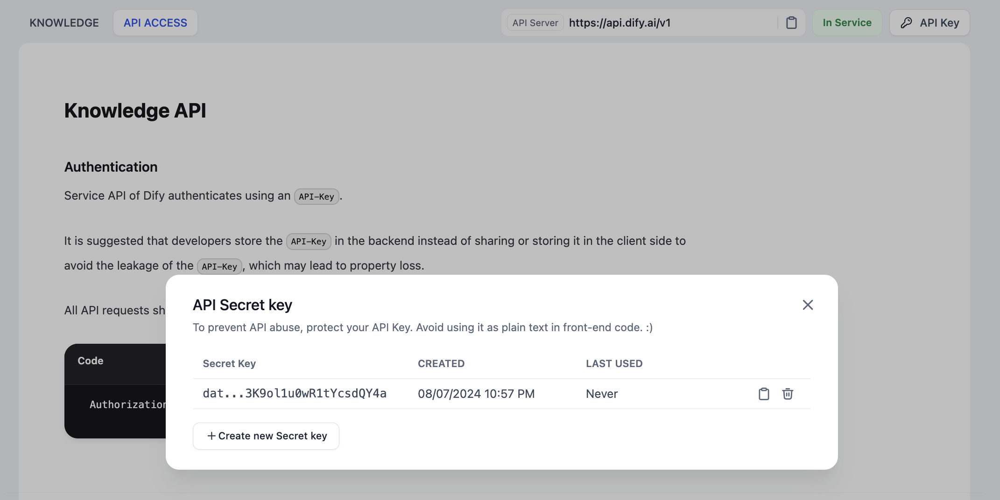

# نگهداری پایگاه دانش از طریق API

> روش‌های احراز هویت و فراخوانی برای API پایگاه دانش با API سرویس‌های کاربردی سازگار است. با این حال، یک توکن API واحد برای پایگاه دانش که تولید می‌شود، مجوز انجام عملیات بر روی تمام پایگاه‌های دانش قابل‌مشاهده تحت همان حساب را دارد. لطفاً به امنیت داده‌ها توجه کنید.

### مزایای استفاده از API پایگاه دانش

استفاده از API برای نگهداری پایگاه دانش به طور قابل‌توجهی راندمان پردازش داده‌ها را افزایش می‌دهد. این API امکان همگام‌سازی یکپارچه داده‌ها از طریق واسط‌های خط فرمان را فراهم می‌کند و عملیات‌های خودکار را به جای دستکاری رابط کاربری تسهیل می‌کند.

مزایای کلیدی شامل:

* **همگام‌سازی خودکار:** امکان ادغام یکپارچه بین سیستم‌های داده‌ای و پایگاه دانش Dify را فراهم می‌کند و ساخت گردش کار کارآمد را تسهیل می‌کند.
* **مدیریت جامع:** امکاناتی مانند لیست کردن پایگاه دانش، شمارش اسناد و پرس‌و‌جوهای دقیق را ارائه می‌دهد و توسعه رابط‌های سفارشی برای مدیریت داده‌ها را تسهیل می‌کند.
* **ورود محتوای انعطاف‌پذیر:** هم روش‌های متن ساده و هم آپلود فایل را در خود جای می‌دهد و از عملیات دسته جمعی برای اضافه و اصلاح تکه‌های محتوا پشتیبانی می‌کند.
* **افزایش بهره‌وری:** نیاز به دستکاری دستی داده‌ها را به حداقل می‌رساند و در نتیجه تجربه کلی کاربر در پلتفرم Dify را بهینه می‌کند.

### نحوه استفاده

به صفحه پایگاه دانش بروید و می‌توانید از طریق ناوبری سمت چپ به صفحه **دسترسی به API** بروید. در این صفحه می‌توانید مستندات API مجموعه داده ارائه شده توسط Dify را مشاهده کنید و اعتبارنامه‌های دسترسی به API مجموعه داده را در **کلیدهای API** مدیریت کنید.

<figure><figcaption><p>مستندات API دانش</p></figcaption></figure>

### نمونه‌های درخواست API

**ایجاد یک سند از متن**

این API مبتنی بر یک دانش موجود است و یک سند جدید از طریق متن بر اساس این دانش ایجاد می‌کند.

نمونه درخواست:

```json
curl --location --request POST 'https://api.dify.ai/v1/datasets/{dataset_id}/document/create_by_text' \
--header 'Authorization: Bearer {api_key}' \
--header 'Content-Type: application/json' \
--data-raw '{"name": "text","text": "text","indexing_technique": "high_quality","process_rule": {"mode": "automatic"}}'
```

نمونه پاسخ:

```json
{
  "document": {
    "id": "",
    "position": 1,
    "data_source_type": "upload_file",
    "data_source_info": {
        "upload_file_id": ""
    },
    "dataset_process_rule_id": "",
    "name": "text.txt",
    "created_from": "api",
    "created_by": "",
    "created_at": 1695690280,
    "tokens": 0,
    "indexing_status": "waiting",
    "error": null,
    "enabled": true,
    "disabled_at": null,
    "disabled_by": null,
    "archived": false,
    "display_status": "queuing",
    "word_count": 0,
    "hit_count": 0,
    "doc_form": "text_model"
  },
  "batch": ""
}
```

#### ایجاد اسناد از فایل‌ها

این API مبتنی بر یک دانش موجود است و یک سند جدید از طریق فایل بر اساس این دانش ایجاد می‌کند.

نمونه درخواست:

```json
curl --location --request POST 'https://api.dify.ai/v1/datasets/{dataset_id}/document/create_by_file' \
--header 'Authorization: Bearer {api_key}' \
--form 'data="{"indexing_technique":"high_quality","process_rule":{"rules":{"pre_processing_rules":[{"id":"remove_extra_spaces","enabled":true},{"id":"remove_urls_emails","enabled":true}],"segmentation":{"separator":"###","max_tokens":500}},"mode":"custom"}}";type=text/plain' \
--form 'file=@"/path/to/file"'
```

نمونه پاسخ:

```json
{
  "document": {
    "id": "",
    "position": 1,
    "data_source_type": "upload_file",
    "data_source_info": {
      "upload_file_id": ""
    },
    "dataset_process_rule_id": "",
    "name": "Dify.txt",
    "created_from": "api",
    "created_by": "",
    "created_at": 1695308667,
    "tokens": 0,
    "indexing_status": "waiting",
    "error": null,
    "enabled": true,
    "disabled_at": null,
    "disabled_by": null,
    "archived": false,
    "display_status": "queuing",
    "word_count": 0,
    "hit_count": 0,
    "doc_form": "text_model"
  },
  "batch": ""
}

```

#### ایجاد یک دانش خالی


فقط برای ایجاد یک پایگاه دانش خالی استفاده می‌شود.


نمونه درخواست:

```bash
curl --location --request POST 'https://api.dify.ai/v1/datasets' \
--header 'Authorization: Bearer {api_key}' \
--header 'Content-Type: application/json' \
--data-raw '{"name": "name", "permission": "only_me"}'
```

نمونه پاسخ:

```json
{
  "id": "",
  "name": "name",
  "description": null,
  "provider": "vendor",
  "permission": "only_me",
  "data_source_type": null,
  "indexing_technique": null,
  "app_count": 0,
  "document_count": 0,
  "word_count": 0,
  "created_by": "",
  "created_at": 1695636173,
  "updated_by": "",
  "updated_at": 1695636173,
  "embedding_model": null,
  "embedding_model_provider": null,
  "embedding_available": null
}
```

#### لیست دانش

نمونه درخواست:

```bash
curl --location --request GET 'https://api.dify.ai/v1/datasets?page=1&limit=20' \
--header 'Authorization: Bearer {api_key}'
```

نمونه پاسخ:

```json
{
  "data": [
    {
      "id": "",
      "name": "name",
      "description": "desc",
      "permission": "only_me",
      "data_source_type": "upload_file",
      "indexing_technique": "",
      "app_count": 2,
      "document_count": 10,
      "word_count": 1200,
      "created_by": "",
      "created_at": "",
      "updated_by": "",
      "updated_at": ""
    },
    ...
  ],
  "has_more": true,
  "limit": 20,
  "total": 50,
  "page": 1
}

```

#### حذف دانش

نمونه درخواست:

```json
curl --location --request DELETE 'https://api.dify.ai/v1/datasets/{dataset_id}' \
--header 'Authorization: Bearer {api_key}'
```

نمونه پاسخ:

```json
204 No Content
```

#### به‌روزرسانی سند از طریق متن

این API مبتنی بر یک دانش موجود است و سند را از طریق متن بر اساس این دانش به‌روزرسانی می‌کند.

نمونه درخواست:

```bash
curl --location --request POST 'https://api.dify.ai/v1/datasets/{dataset_id}/documents/{document_id}/update_by_text' \
--header 'Authorization: Bearer {api_key}' \
--header 'Content-Type: application/json' \
--data-raw '{"name": "name","text": "text"}'
```

نمونه پاسخ:

```json
{
  "document": {
    "id": "",
    "position": 1,
    "data_source_type": "upload_file",
    "data_source_info": {
      "upload_file_id": ""
    },
    "dataset_process_rule_id": "",
    "name": "name.txt",
    "created_from": "api",
    "created_by": "",
    "created_at": 1695308667,
    "tokens": 0,
    "indexing_status": "waiting",
    "error": null,
    "enabled": true,
    "disabled_at": null,
    "disabled_by": null,
    "archived": false,
    "display_status": "queuing",
    "word_count": 0,
    "hit_count": 0,
    "doc_form": "text_model"
  },
  "batch": ""
}
```

#### به‌روزرسانی یک سند از یک فایل

این API مبتنی بر یک دانش موجود است و اسناد را از طریق فایل‌ها بر اساس این دانش به‌روزرسانی می‌کند.

نمونه درخواست:

```bash
curl --location --request POST 'https://api.dify.ai/v1/datasets/{dataset_id}/documents/{document_id}/update_by_file' \
--header 'Authorization: Bearer {api_key}' \
--form 'data="{"name":"Dify","indexing_technique":"high_quality","process_rule":{"rules":{"pre_processing_rules":[{"id":"remove_extra_spaces","enabled":true},{"id":"remove_urls_emails","enabled":true}],"segmentation":{"separator":"###","max_tokens":500}},"mode":"custom"}}";type=text/plain' \
--form 'file=@"/path/to/file"'
```

نمونه پاسخ:

```json
{
  "document": {
    "id": "",
    "position": 1,
    "data_source_type": "upload_file",
    "data_source_info": {
      "upload_file_id": ""
    },
    "dataset_process_rule_id": "",
    "name": "Dify.txt",
    "created_from": "api",
    "created_by": "",
    "created_at": 1695308667,
    "tokens": 0,
    "indexing_status": "waiting",
    "error": null,
    "enabled": true,
    "disabled_at": null,
    "disabled_by": null,
    "archived": false,
    "display_status": "queuing",
    "word_count": 0,
    "hit_count": 0,
    "doc_form": "text_model"
  },
  "batch": "20230921150427533684"
}
```

#### دریافت وضعیت جاسازی سند (پیشرفت)

نمونه درخواست:

```bash
curl --location --request GET 'https://api.dify.ai/v1/datasets/{dataset_id}/documents/{batch}/indexing-status' \
--header 'Authorization: Bearer {api_key}'
```

نمونه پاسخ:

```json
{
  "data":[{
    "id": "",
    "indexing_status": "indexing",
    "processing_started_at": 1681623462.0,
    "parsing_completed_at": 1681623462.0,
    "cleaning_completed_at": 1681623462.0,
    "splitting_completed_at": 1681623462.0,
    "completed_at": null,
    "paused_at": null,
    "error": null,
    "stopped_at": null,
    "completed_segments": 24,
    "total_segments": 100
  }]
}
```

#### حذف سند

نمونه درخواست:

```bash
curl --location --request DELETE 'https://api.dify.ai/v1/datasets/{dataset_id}/documents/{document_id}' \
--header 'Authorization: Bearer {api_key}'
```

نمونه پاسخ:

```bash
{
  "result": "success"
}
```

#### لیست اسناد دانش

نمونه درخواست:

```bash
curl --location --request GET 'https://api.dify.ai/v1/datasets/{dataset_id}/documents' \
--header 'Authorization: Bearer {api_key}'
```

نمونه پاسخ:

```json
{
  "data": [
    {
      "id": "",
      "position": 1,
      "data_source_type": "file_upload",
      "data_source_info": null,
      "dataset_process_rule_id": null,
      "name": "dify",
      "created_from": "",
      "created_by": "",
      "created_at": 1681623639,
      "tokens": 0,
      "indexing_status": "waiting",
      "error": null,
      "enabled": true,
      "disabled_at": null,
      "disabled_by": null,
      "archived": false
    },
  ],
  "has_more": false,
  "limit": 20,
  "total": 9,
  "page": 1
}
```

#### اضافه کردن تکه

نمونه درخواست:

```bash
curl --location --request POST 'https://api.dify.ai/v1/datasets/{dataset_id}/documents/{document_id}/segments' \
--header 'Authorization: Bearer {api_key}' \
--header 'Content-Type: application/json' \
--data-raw '{"segments": [{"content": "1","answer": "1","keywords": ["a"]}]}'
```

نمونه پاسخ:

```json
{
  "data": [{
    "id": "",
    "position": 1,
    "document_id": "",
    "content": "1",
    "answer": "1",
    "word_count": 25,
    "tokens": 0,
    "keywords": [
        "a"
    ],
    "index_node_id": "",
    "index_node_hash": "",
    "hit_count": 0,
    "enabled": true,
    "disabled_at": null,
    "disabled_by": null,
    "status": "completed",
    "created_by": "",
    "created_at": 1695312007,
    "indexing_at": 1695312007,
    "completed_at": 1695312007,
    "error": null,
    "stopped_at": null
  }],
  "doc_form": "text_model"
}

```

### دریافت تکه‌های اسناد

نمونه درخواست:

```bash
curl --location --request GET 'https://api.dify.ai/v1/datasets/{dataset_id}/documents/{document_id}/segments' \
--header 'Authorization: Bearer {api_key}' \
--header 'Content-Type: application/json'
```

نمونه پاسخ:

```bash
{
  "data": [{
    "id": "",
    "position": 1,
    "document_id": "",
    "content": "1",
    "answer": "1",
    "word_count": 25,
    "tokens": 0,
    "keywords": [
        "a"
    ],
    "index_node_id": "",
    "index_node_hash": "",
    "hit_count": 0,
    "enabled": true,
    "disabled_at": null,
    "disabled_by": null,
    "status": "completed",
    "created_by": "",
    "created_at": 1695312007,
    "indexing_at": 1695312007,
    "completed_at": 1695312007,
    "error": null,
    "stopped_at": null
  }],
  "doc_form": "text_model"
}
```

### حذف تکه سند

نمونه درخواست:

```bash
curl --location --request DELETE 'https://api.dify.ai/v1/datasets/{dataset_id}/documents/{document_id}/segments/{segment_id}' \
--header 'Authorization: Bearer {api_key}' \
--header 'Content-Type: application/json'
```

نمونه پاسخ:

```bash
{
  "result": "success"
}
```

### به‌روزرسانی تکه سند

نمونه درخواست:

```bash
curl --location --request POST 'https://api.dify.ai/v1/datasets/{dataset_id}/documents/{document_id}/segments/{segment_id}' \
--header 'Authorization: Bearer {api_key}' \
--header 'Content-Type: application/json'\
--data-raw '{"segment": {"content": "1","answer": "1", "keywords": ["a"], "enabled": false}}'
```

نمونه پاسخ:

```bash
{
  "data": [{
    "id": "",
    "position": 1,
    "document_id": "",
    "content": "1",
    "answer": "1",
    "word_count": 25,
    "tokens": 0,
    "keywords": [
        "a"
    ],
    "index_node_id": "",
    "index_node_hash": "",
    "hit_count": 0,
    "enabled": true,
    "disabled_at": null,
    "disabled_by": null,
    "status": "completed",
    "created_by": "",
    "created_at": 1695312007,
    "indexing_at": 1695312007,
    "completed_at": 1695312007,
    "error": null,
    "stopped_at": null
  }],
  "doc_form": "text_model"
}
```

### پیام خطا

| کد                          | وضعیت | پیام                                                                                      |
| ----------------------------- | ------ | -------------------------------------------------------------------------------------------- |
| no\_file\_uploaded            | 400    | لطفا فایل خود را آپلود کنید.                                                                     |
| too\_many\_files              | 400    | فقط یک فایل مجاز است.                                                                    |
| file\_too\_large              | 413    | اندازه فایل از حد مجاز بیشتر است.                                                                          |
| unsupported\_file\_type       | 415    | نوع فایل مجاز نیست. فرمت‌های پشتیبانی شده: txt, markdown, md, pdf, html, html, xlsx, docx, csv |
| high\_quality\_dataset\_only  | 400    | عملیات فعلی فقط از مجموعه داده‌های "با کیفیت بالا" پشتیبانی می‌کند.                                     |
| dataset\_not\_initialized     | 400    | مجموعه داده هنوز در حال راه‌اندازی یا نمایه سازی است. لطفا لحظه ای صبر کنید.                    |
| archived\_document\_immutable | 403    | سند بایگانی شده قابل ویرایش نیست.                                                       |
| dataset\_name\_duplicate      | 409    | نام مجموعه داده از قبل وجود دارد. لطفا نام مجموعه داده خود را تغییر دهید.                            |
| invalid\_action               | 400    | عمل نامعتبر.                                                                              |
| document\_already\_finished   | 400    | سند پردازش شده است. لطفا صفحه را تازه کنید یا به جزئیات سند بروید.      |
| document\_indexing            | 400    | سند در حال پردازش است و قابل ویرایش نیست.                                        |
| invalid\_metadata             | 400    | محتوای متاداده نادرست است. لطفا بررسی و تأیید کنید.                                  |
