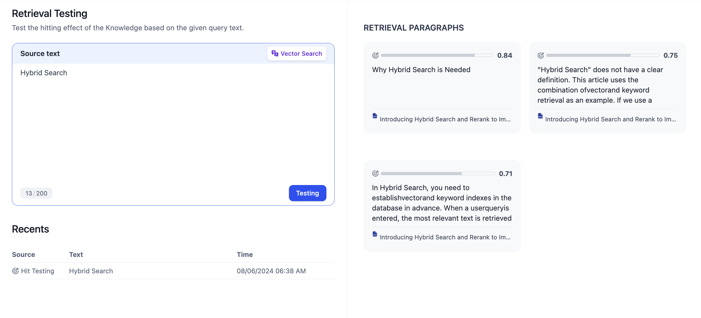
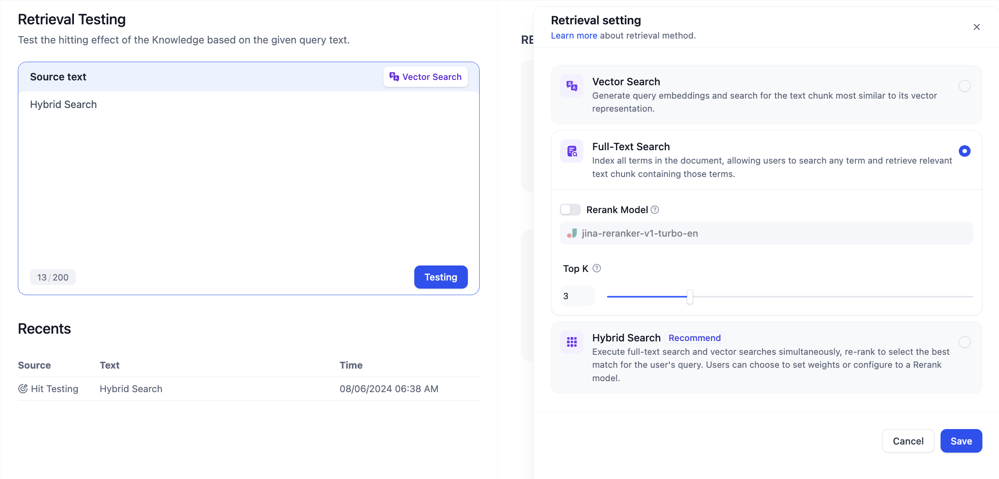
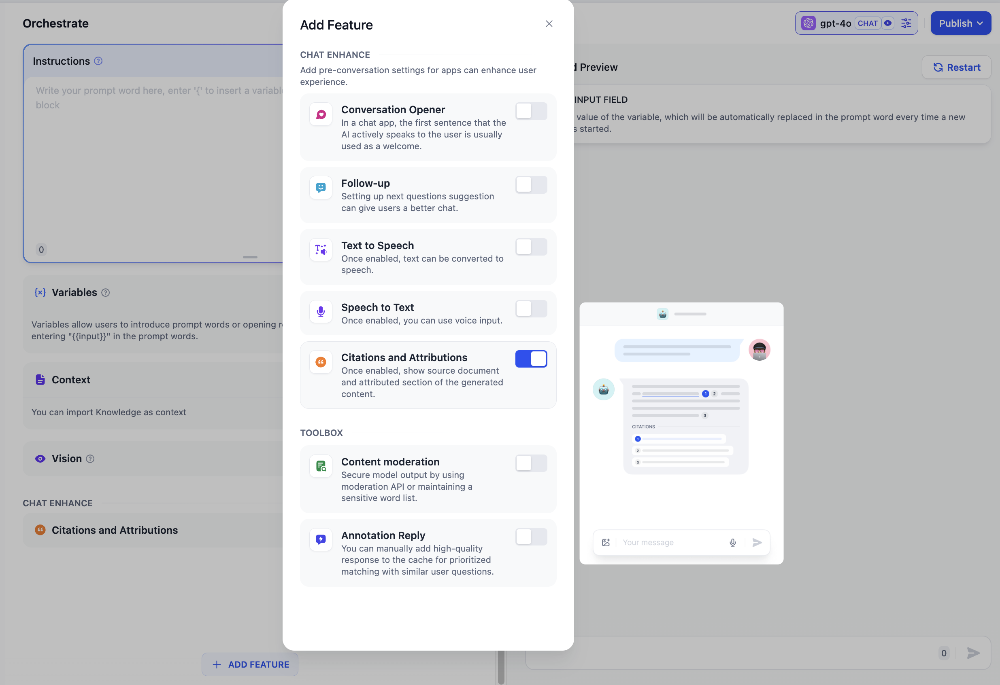
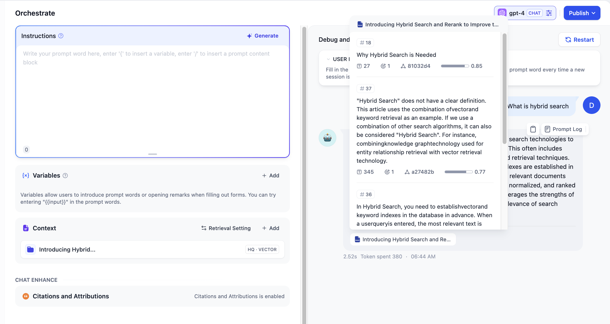

# تست بازیابی/نقل قول

### ۱. تست بازیابی

پایگاه دانش دیفای، ویژگی تست بازیابی متن را برای اشکال زدایی تأثیرات یادآوری تحت روش‌های مختلف بازیابی و پیکربندی پارامترها ارائه می‌دهد. می‌توانید سوالات متداول کاربران را در کادر ورودی **متن منبع** وارد کنید، روی **تست** کلیک کنید و نتایج یادآوری را در بخش **پارگراف‌های بازیابی شده** در سمت راست مشاهده کنید. بخش **پرس و جوهای اخیر** به شما امکان می‌دهد تاریخچه سوابق پرس و جو را مشاهده کنید؛ اگر پایگاه دانش به یک برنامه متصل باشد، پرس و جوهایی که از داخل برنامه فعال شده‌اند نیز در اینجا قابل مشاهده هستند.

<figure><figcaption>
تست یادآوری
</figcaption></figure>

با کلیک کردن روی نماد در گوشه بالا سمت راست کادر ورودی متن منبع، می‌توانید روش بازیابی و پارامترهای خاص پایگاه دانش فعلی را تغییر دهید. **تغییرات فقط در طول فرآیند تست یادآوری اعمال می‌شوند.** پس از اتمام تست یادآوری و تأیید تغییرات پارامترهای بازیابی پایگاه دانش، باید تغییراتی در [تنظیمات پایگاه دانش > تنظیمات بازیابی](create-knowledge-and-upload-documents/#id-6-retrieval-settings) ایجاد کنید.

<figure><figcaption>
تنظیمات بازیابی
</figcaption></figure>

**مراحل پیشنهادی برای تست یادآوری:**

1. طراحی و سازماندهی موارد تست/ مجموعه سوالات تست که سوالات متداول کاربران را پوشش می‌دهند.
2. انتخاب یک استراتژی بازیابی مناسب: جستجوی برداری/جستجوی متن کامل/جستجوی ترکیبی. برای مزایا و معایب روش‌های مختلف بازیابی، لطفاً به مطالعه بیشتر [تولید تقویت شده با بازیابی (RAG)](../../learn-more/extended-reading/retrieval-augment/) مراجعه کنید.
3. عیب یابی تعداد بخش‌های یادآوری (TopK) و آستانه نمره یادآوری (Score). ترکیبات پارامتر مناسب را بر اساس سناریو برنامه، از جمله کیفیت خود اسناد، انتخاب کنید.

**نحوه تنظیم مقدار TopK و آستانه یادآوری (Score)**

* **TopK حداکثر تعداد بخش‌های یادآوری را هنگام مرتب‌سازی به ترتیب نزولی نمره‌های شباهت نشان می‌دهد.** یک مقدار TopK کوچکتر، بخش‌های کمتری را یادآوری می‌کند که ممکن است منجر به یادآوری ناقص متون مرتبط شود؛ یک مقدار TopK بزرگتر، بخش‌های بیشتری را یادآوری می‌کند که ممکن است منجر به یادآوری بخش‌هایی با ارتباط معنایی کمتر شود و کیفیت پاسخ‌های LLM را کاهش دهد.
* **آستانه یادآوری (Score) حداقل نمره شباهت مجاز برای بخش‌های یادآوری را نشان می‌دهد.** یک نمره یادآوری کوچکتر، بخش‌های بیشتری را یادآوری می‌کند که ممکن است منجر به یادآوری بخش‌هایی با ارتباط کمتر شود؛ یک آستانه نمره یادآوری بزرگتر، بخش‌های کمتری را یادآوری می‌کند و اگر خیلی بزرگ باشد، ممکن است منجر به از دست دادن بخش‌های مرتبط شود.

***

### ۲. نقل قول و نسبت دادن

هنگام تست اثر پایگاه دانش در برنامه، می‌توانید به **فضای کاری -- افزودن تابع -- نسبت دادن نقل قول** بروید تا ویژگی نسبت دادن نقل قول را فعال کنید.

<figure><figcaption>
فعال کردن ویژگی نسبت دادن نقل قول
</figcaption></figure>

پس از فعال کردن این ویژگی، وقتی مدل زبان بزرگ به یک سوال با استناد به محتوای پایگاه دانش پاسخ می‌دهد، می‌توانید اطلاعات خاص پاراگراف نقل قول را در زیر محتوای پاسخ مشاهده کنید، از جمله **متن بخش اصلی، شماره بخش، درجه تطبیق** و غیره. کلیک روی **پریدن به پایگاه دانش** در بالای بخش نقل قول شده، دسترسی سریع به لیست بخش‌ها در پایگاه دانش را امکان‌پذیر می‌کند و توسعه دهندگان را در عیب یابی و ویرایش تسهیل می‌کند.

<figure><figcaption>
مشاهده اطلاعات نقل قول در محتوای پاسخ
</figcaption></figure>
