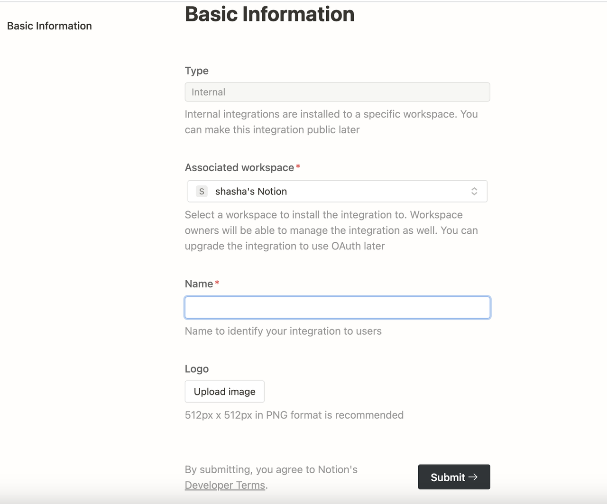
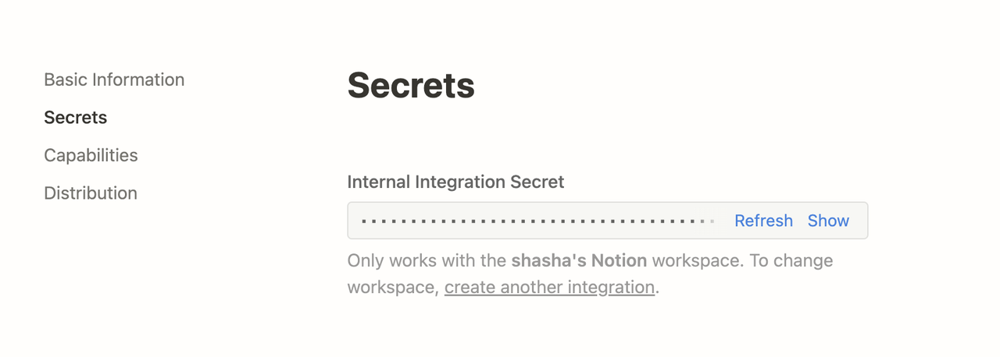
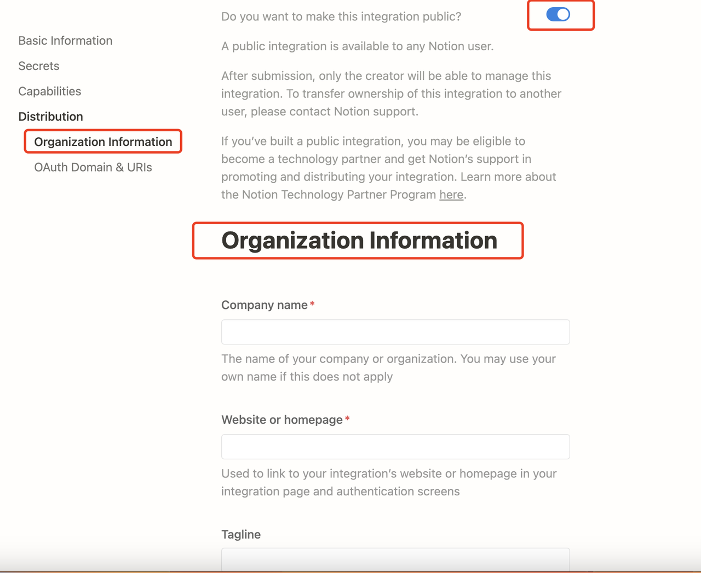
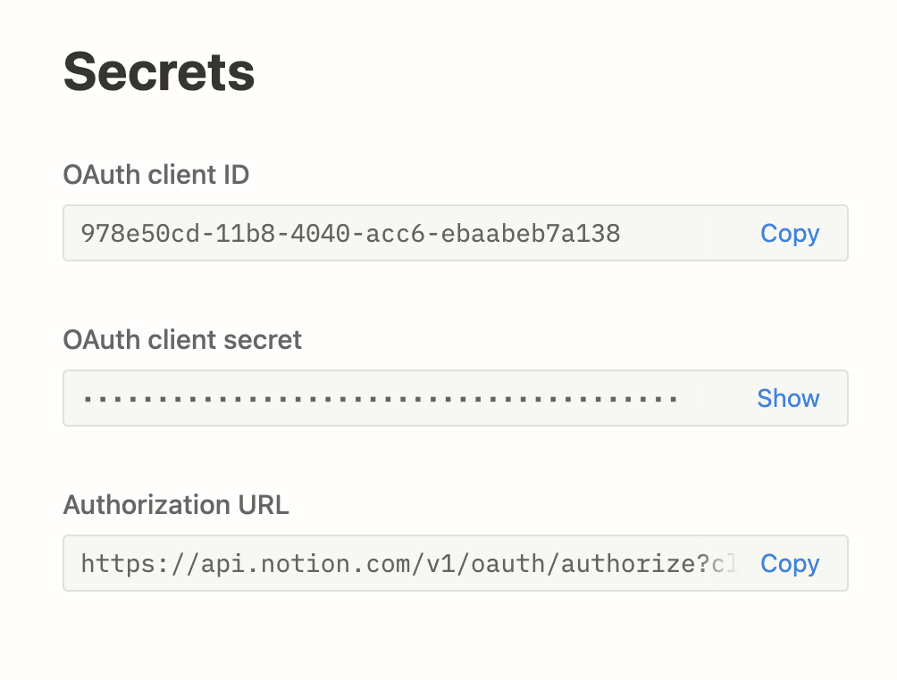

# همگام‌سازی داده‌ها از Notion

مجموعه داده‌های Dify از واردات از Notion و تنظیم **همگام‌سازی** پشتیبانی می‌کنند، به‌طوری که به‌روزرسانی‌های داده در Notion به‌طور خودکار با Dify همگام‌سازی می‌شوند.

### تأیید اعتبار مجوز

1. هنگام ایجاد مجموعه داده و انتخاب منبع داده، روی **همگام‌سازی از محتوای Notion -- هم اکنون پیوند** کلیک کنید و برای تکمیل تأیید اعتبار مجوز، مراحل را دنبال کنید.
2. به‌طور جایگزین، می‌توانید به **تنظیمات -- منابع داده -- افزودن منبع داده** بروید، روی منبع Notion **پیوند** کلیک کنید و تأیید اعتبار مجوز را کامل کنید.

<figure><figcaption>
پیوند دادن Notion
</figcaption></figure>

### وارد کردن داده‌های Notion

پس از تکمیل تأیید اعتبار مجوز، به صفحه ایجاد مجموعه داده بروید، روی **همگام‌سازی از محتوای Notion** کلیک کنید و صفحاتی که نیاز به وارد کردن دارید را انتخاب کنید.

### بخش‌بندی و پاکسازی

سپس، **تنظیمات بخش‌بندی** و **روش نمایه سازی** خود را انتخاب کنید، سپس **ذخیره و پردازش** را کلیک کنید. منتظر بمانید تا Dify این داده‌ها را برای شما پردازش کند، که معمولاً نیاز به مصرف توکن در ارائه دهنده LLM دارد. Dify از وارد کردن نه تنها انواع صفحه استاندارد، بلکه جمع‌آوری و ذخیره ویژگی‌های صفحه در زیر نوع پایگاه داده پشتیبانی می‌کند.

_**لطفاً توجه داشته باشید: تصاویر و فایل‌ها در حال حاضر برای واردات پشتیبانی نمی‌شوند و داده‌های جدولی به نمایش متنی تبدیل می‌شوند.**_

### همگام‌سازی داده‌های Notion

اگر محتوای Notion شما تغییر کرد، می‌توانید به‌طور مستقیم روی **همگام‌سازی** در صفحه **فهرست اسناد** مجموعه داده Dify کلیک کنید تا همگام‌سازی داده‌ها با یک کلیک انجام شود. این مرحله به مصرف توکن نیاز دارد.

<figure><figcaption>
همگام‌سازی محتوای Notion
</figcaption></figure>

### روش پیکربندی ادغام برای نسخه Community Edition Notion

ادغام Notion را می‌توان به دو روش انجام داد: **ادغام داخلی** و **ادغام عمومی**. می‌توانید آن‌ها را در صورت نیاز در Dify پیکربندی کنید. برای تفاوت‌های خاص بین دو روش ادغام، لطفاً به [مستندات رسمی Notion](https://developers.notion.com/docs/authorization) مراجعه کنید.

### 1. **استفاده از ادغام داخلی**

ابتدا یک ادغام در صفحه تنظیمات ادغام [ایجاد ادغام](https://www.notion.so/my-integrations) ایجاد کنید. به طور پیش‌فرض، تمام ادغام‌ها به عنوان ادغام‌های داخلی شروع می‌شوند؛ ادغام‌های داخلی با فضای کاری که انتخاب می‌کنید مرتبط خواهد بود، بنابراین برای ایجاد ادغام، باید مالک فضای کاری باشید.

مراحل خاص:

روی دکمه **ادغام جدید** کلیک کنید. نوع آن به طور پیش‌فرض **داخلی** است (قابل تغییر نیست). فضایی که با آن مرتبط است را انتخاب کنید، نام ادغام را وارد کنید، یک لوگو بارگذاری کنید و روی **ارسال** کلیک کنید تا ادغام با موفقیت ایجاد شود.

<figure><figcaption></figcaption></figure>

پس از ایجاد ادغام، می‌توانید تنظیمات آن را در صورت نیاز در تب Capabilities به‌روزرسانی کنید و روی دکمه **نمایش** در زیر Secrets کلیک کنید تا اسرار را کپی کنید.

<figure><figcaption></figcaption></figure>

پس از کپی کردن، به کد منبع Dify بازگردید و متغیرهای محیط مربوطه را در فایل **.env** پیکربندی کنید. متغیرهای محیط به شرح زیر هستند:

**NOTION\_INTEGRATION\_TYPE**=internal یا **NOTION\_INTEGRATION\_TYPE**=public

**NOTION\_INTERNAL\_SECRET**=your-internal-secret

### 2. **استفاده از ادغام عمومی**

**شما باید ادغام داخلی را به یک ادغام عمومی ارتقا دهید.** به صفحه Distribution ادغام بروید و سوئیچ را برای عمومی کردن ادغام فعال کنید. هنگام تغییر به تنظیم عمومی، باید اطلاعات اضافی را در فرم اطلاعات سازمان در زیر پر کنید، از جمله نام شرکت، وب‌سایت و URL بازگردانی، سپس روی دکمه **ارسال** کلیک کنید.

<figure><figcaption></figcaption></figure>

پس از موفقیت در عمومی کردن ادغام در صفحه تنظیمات ادغام، می‌توانید به کلید ادغام در تب Keys دسترسی پیدا کنید:

<figure><figcaption></figcaption></figure>

به کد منبع Dify بازگردید و متغیرهای محیط مربوطه را در فایل **.env** پیکربندی کنید. متغیرهای محیط به شرح زیر هستند:

* **NOTION\_INTEGRATION\_TYPE**=public
* **NOTION\_CLIENT\_SECRET**=your-client-secret
* **NOTION\_CLIENT\_ID**=your-client-id

پس از پیکربندی، می‌توانید توابع واردات و همگام‌سازی داده‌های Notion را در مجموعه داده‌ها اجرا کنید.

