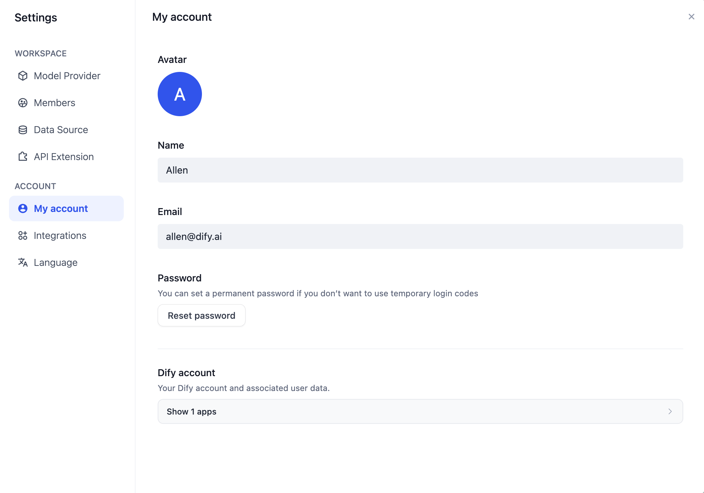
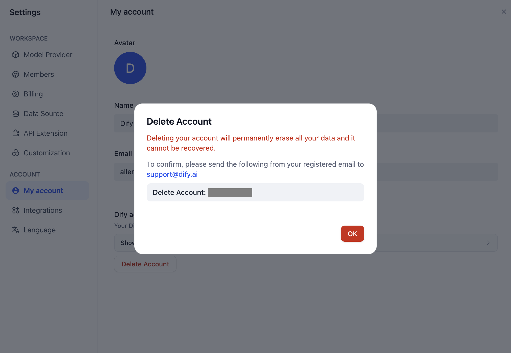

# مدیریت حساب شخصی

### تغییر اطلاعات شخصی

برای به‌روزرسانی اطلاعات حساب شخصی خود:

1. به صفحه اصلی تیم Dify بروید.
2. روی آواتار خود در گوشه سمت راست بالا کلیک کنید.
3. **"حساب من"** را انتخاب کنید.

می‌توانید جزئیات زیر را تغییر دهید:

* آواتار
* نام کاربری
* ایمیل
* رمز عبور

<figure><figcaption></figcaption></figure>

### ادغام‌ها

می‌توانید حساب‌های GitHub و Google خود را به‌عنوان روش‌های ورود به سیستم برای تیم Dify خود پیوند دهید. روی آواتار خود در گوشه سمت راست بالای صفحه اصلی تیم Dify کلیک کنید، سپس برای تنظیم این پیوندها روی **"ادغام‌ها"** کلیک کنید.

### تغییر زبان رابط کاربری

برای تغییر زبان نمایش، روی آواتار خود در گوشه سمت راست بالای صفحه اصلی تیم Dify کلیک کنید، سپس روی **"زبان"** کلیک کنید. Dify از زبان‌های زیر پشتیبانی می‌کند:

* انگلیسی
* چینی ساده
* چینی سنتی
* پرتغالی (برزیل)
* فرانسوی (فرانسه)
* ژاپنی (ژاپن)
* کره‌ای (کره جنوبی)
* روسی (روسیه)
* ایتالیایی (ایتالیا)
* تایلندی (تایلند)
* اندونزیایی
* اوکراینی (اوکراین)

Dify از داوطلبان جامعه برای مشارکت در نسخه‌های زبان اضافی استقبال می‌کند. برای مشارکت، به [مخزن GitHub](https://github.com/langgenius/dify/blob/main/CONTRIBUTING.md) مراجعه کنید!

### حذف حساب شخصی

با توجه به ملاحظات امنیتی داده‌های تیم، حذف خودکار آنلاین اطلاعات حساب شخصی در حال حاضر پشتیبانی نمی‌شود. اگر نیاز به حذف کامل حساب خود دارید، لطفاً اطلاعات زیر را در یک ایمیل قرار داده و آن را به support@dify.ai ارسال کنید.

```
Delete account: your-email
```

<figure><figcaption><p>حذف حساب شخصی</p></figcaption></figure>
