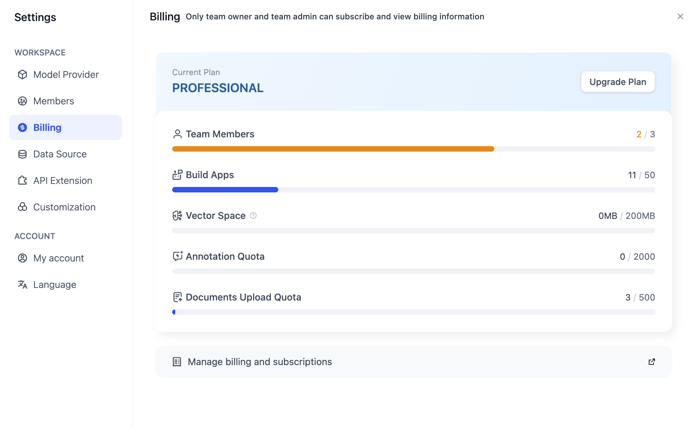
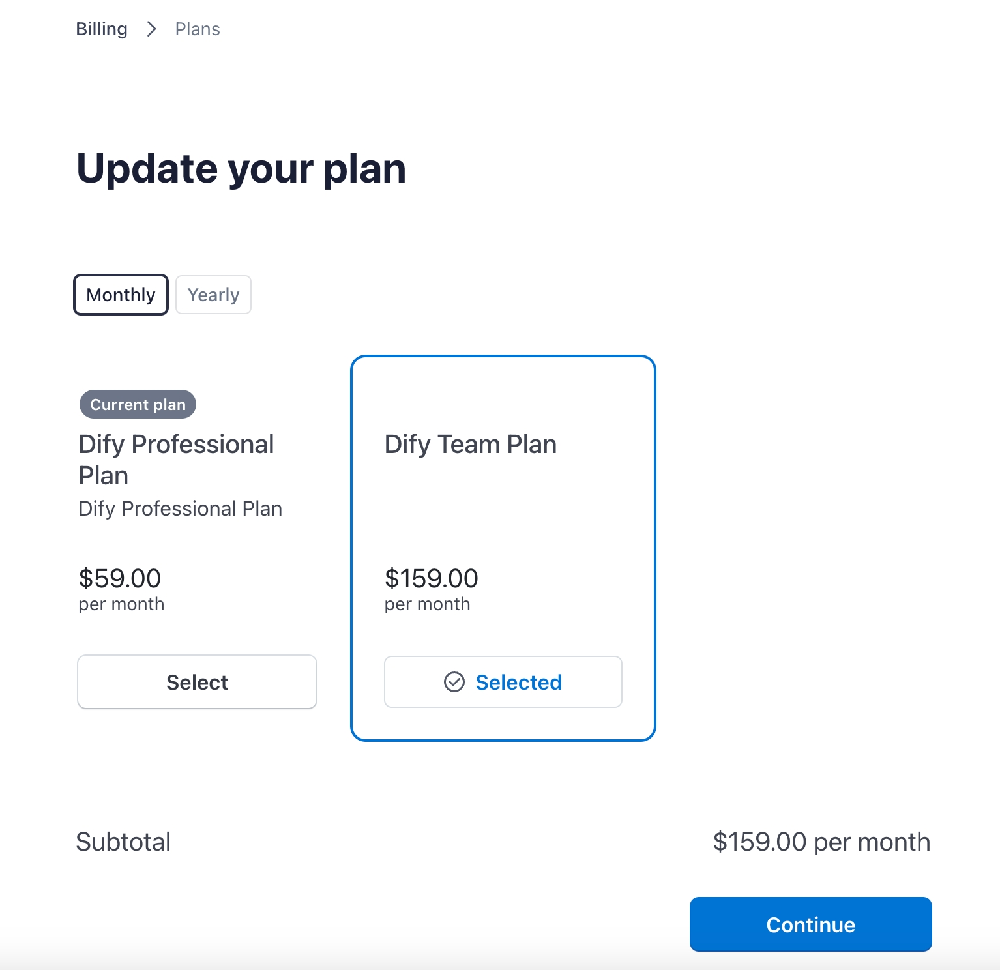

# مدیریت اشتراک

### ارتقا اشتراک تیم Dify

مالکان و مدیران تیم می توانند طرح اشتراک تیم را ارتقا دهند. روی دکمه **"ارتقا"** در گوشه سمت راست بالای صفحه اصلی تیم Dify کلیک کنید، یک بسته مناسب را انتخاب کنید و پرداخت را برای ارتقا اشتراک تیم تکمیل کنید.

### مدیریت اشتراک تیم Dify

پس از اشتراک در خدمات پولی Dify (طرح حرفه ای یا تیم)، مالکان و مدیران تیم می توانند به **"تنظیمات"** → **"حساب"** برای مدیریت جزئیات صورتحساب و اشتراک تیم مراجعه کنند.

در صفحه صورتحساب، می توانید آمار استفاده از منابع مختلف تیم را مشاهده کنید.

<figure><figcaption>
مدیریت صورتحساب تیم
</figcaption></figure>

### سوالات متداول

#### 1. چگونه می توان طرح تیم را ارتقا داد/تنزل داد یا اشتراک را لغو کرد؟

مالکان و مدیران تیم می توانند به **تنظیمات** → **حساب** مراجعه کرده و روی **مدیریت صورتحساب و اشتراک** کلیک کنند تا طرح اشتراک را تغییر دهند.

* ارتقا از طرح حرفه ای به طرح تیم نیاز به پرداخت مابه التفاوت برای ماه جاری دارد و بلافاصله اعمال می شود.
* تنزل از طرح تیم به طرح حرفه ای بلافاصله اعمال می شود.

<figure><figcaption>
تغییر طرح پولی
</figcaption></figure>

با لغو طرح اشتراک، **تیم به طور خودکار در پایان چرخه صورتحساب فعلی به طرح Sandbox/رایگان منتقل خواهد شد.** پس از آن، هر عضوی از تیم و منابعی که محدودیت طرح Sandbox/رایگان را رعایت نمی کنند، غیرقابل دسترسی خواهد بود.

#### 2. چه تغییراتی پس از ارتقا طرح اشتراک در منابع در دسترس تیم ایجاد خواهد شد؟

| منبع                                                                     | رایگان      | حرفه ای      | تیم           |
| ---------------------------------------------------------------------------- | --------- | ------------ | ------------- |
| محدودیت اعضای تیم                                                            | 1         | 3             | نامحدود       |
| محدودیت برنامه                                                            | 10        | 50            | نامحدود       |
| ظرفیت فضای برداری                                                        | 5MB       | 200MB          | 1GB           |
| [پاسخ‌های علامت‌گذاری‌شده](https://docs.dify.ai/guides/biao-zhu/logs) برای برنامه‌ها | 10        | 2000          | 5000          |
| آپلود اسناد برای پایگاه دانش                                          | 50        | 500           | 1000          |
| سهمیه مکالمات OpenAI                                                    | 200 در کل  | 5000 در ماه   | 10000 در ماه  |

نکته:

* هنگام ارتقا از رایگان به حرفه ای، تمام منابع مطابق جدول افزایش می یابند.
* هنگام ارتقا از حرفه ای به تیم، منابع بیشتر گسترش می‌یابند و برخی از آن‌ها نامحدود می‌شوند.

پس از ارتقا طرح اشتراک:

* سهمیه مکالمات OpenAI برای چرخه صورتحساب فعلی به حد جدید تنظیم مجدد خواهد شد.
* منابع محاسباتی قبلاً استفاده شده (مانند استفاده از فضای برداری، آپلود اسناد) تنظیم مجدد یا حذف نمی شوند.

#### 3. اگر تمدید اشتراک را به موقع فراموش کنم چه اتفاقی می افتد؟

اگر تمدید اشتراک خود را فراموش کنید، تیم به طور خودکار به نسخه Sandbox/رایگان تنزل پیدا می کند. به جز مالک تیم، سایرین نمی توانند به تیم ادامه دهند. منابع محاسباتی اضافی در تیم (مانند اسناد، فضای برداری و غیره) نیز قفل خواهند شد.

#### 4. حذف حساب مالک تیم چه تاثیری بر تیم دارد؟

یک تیم باید به یک مالک تیم متصل باشد. اگر مالکیت تیم به موقع به عضو دیگری از تیم منتقل نشود، تمام داده های تیم فعلی همراه با حساب مالک حذف می شود.

#### 5. تفاوت نسخه های اشتراک چیست؟

برای مقایسه دقیق ویژگی ها، لطفا به [قیمت گذاری Dify](https://dify.ai/pricing) مراجعه کنید.

