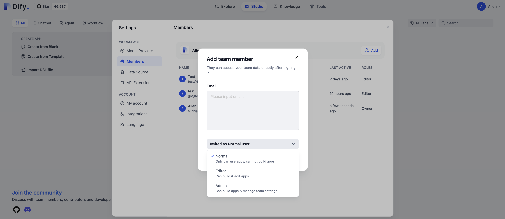
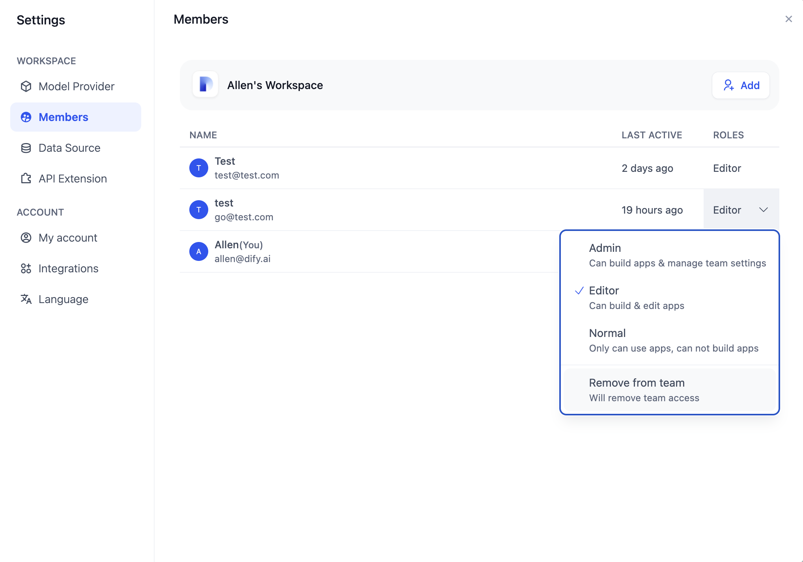

# مدیریت اعضای تیم

این راهنما نحوه مدیریت اعضای یک تیم Dify را توضیح می‌دهد. محدودیت تعداد اعضا برای نسخه‌های مختلف Dify در زیر آورده شده است.

| Sandbox / Free | Professional | Team      | Community | Enterprise |
| -------------- | ------------ | --------- | --------- | ---------- |
| 1              | 3            | Unlimited | Unlimited | Unlimited  |

### اضافه کردن اعضا


تنها مالکان تیم مجوز دعوت از اعضای تیم را دارند.


برای اضافه کردن عضو، مالک تیم می‌تواند روی آواتار در گوشه بالا سمت راست کلیک کند، سپس **"اعضا"** → **"اضافه کردن"** را انتخاب کند. آدرس ایمیل را وارد کنید و مجوزهای عضو را برای تکمیل فرآیند اختصاص دهید.

<figure><figcaption>
اختصاص مجوزها به اعضای تیم
</figcaption></figure>

اعضای دعوت شده می‌توانند ثبت‌نام خود را از طریق یک لینک URL یا دعوتنامه ایمیل کامل کنند.

> برای نسخه Community Edition، فعال‌سازی قابلیت ایمیل نیاز به پیکربندی و فعال‌سازی سرویس ایمیل توسط مالک تیم از طریق [متغیرهای محیطی](https://docs.dify.ai/getting-started/install-self-hosted/environments) سیستم دارد.

### مجوزهای عضو

اعضای تیم به مالکان، مدیران، ویرایشگران و اعضای معمولی تقسیم می‌شوند.

* **مالک**
  * توضیحات نقش: اولین عضو تیم، با بالاترین سطح مجوز، مسئولیت کارکرد و مدیریت کل تیم را بر عهده دارد.
  * نمای کلی مجوزها: مجوز مدیریت اعضای تیم، تنظیم مجوزهای عضو، تنظیم ارائه دهندگان مدل، ایجاد و حذف برنامه‌ها، ایجاد پایگاه‌های دانش، تنظیم کتابخانه‌های ابزار و غیره را دارد.
* **مدیر**
  * توضیحات نقش: مدیر تیم، مسئول مدیریت اعضای تیم و ارائه دهندگان مدل.
  * نمای کلی مجوزها: نمی‌تواند مجوزهای عضو را تنظیم کند؛ مجوز اضافه کردن یا حذف اعضای تیم، تنظیم ارائه دهندگان مدل، ایجاد، ویرایش و حذف برنامه‌ها، ایجاد پایگاه‌های دانش، تنظیم کتابخانه‌های ابزار و غیره را دارد.
* **ویرایشگر**
  * توضیحات نقش: عضو معمولی تیم، مسئولیت ایجاد و ویرایش برنامه‌ها به صورت مشارکتی را بر عهده دارد.
  * نمای کلی مجوزها: نمی‌تواند اعضای تیم را مدیریت کند، ارائه دهندگان مدل را تنظیم کند یا کتابخانه‌های ابزار را تنظیم کند؛ مجوز ایجاد، ویرایش و حذف برنامه‌ها، ایجاد پایگاه‌های دانش را دارد.
* **عضو**
  * توضیحات نقش: عضو معمولی تیم، فقط مجاز به مشاهده و استفاده از برنامه‌هایی است که در داخل تیم ایجاد شده‌اند.
  * نمای کلی مجوزها: فقط مجوز استفاده از برنامه‌های موجود در تیم و استفاده از ابزارها را دارد.

### حذف اعضا


تنها مالکان تیم مجوز حذف اعضای تیم را دارند.


برای حذف عضو، روی آواتار در گوشه بالا سمت راست صفحه اصلی تیم Dify کلیک کنید، به **"تنظیمات"** → **"اعضا"** بروید، عضوی را که می‌خواهید حذف کنید انتخاب کنید و **"حذف از تیم"** را کلیک کنید.

<figure><figcaption>
حذف عضو
</figcaption></figure>

### سوالات متداول

#### 1. چگونه می‌توان مالکیت تیم را انتقال داد؟

مالکان تیم بالاترین سطح مجوز را دارند. برای حفظ ثبات ساختار تیم، مالکیت تیم پس از تاسیس قابل انتقال دستی نیست.

#### 2. چگونه می‌توان یک تیم را حذف کرد؟

به دلایل امنیتی داده‌های تیم، مالکان تیم نمی‌توانند به تنهایی تیم خود را حذف کنند.

#### 3. چگونه می‌توان حساب یک عضو تیم را حذف کرد؟

نه مالکان تیم و نه مدیران می‌توانند حساب یک عضو تیم را حذف کنند. حذف حساب نیاز به درخواست فعالانه توسط صاحب حساب دارد و نمی‌توان توسط دیگران انجام شود. به عنوان جایگزین برای حذف حساب، حذف عضو از تیم دسترسی آن کاربر به تیم را لغو می‌کند.

