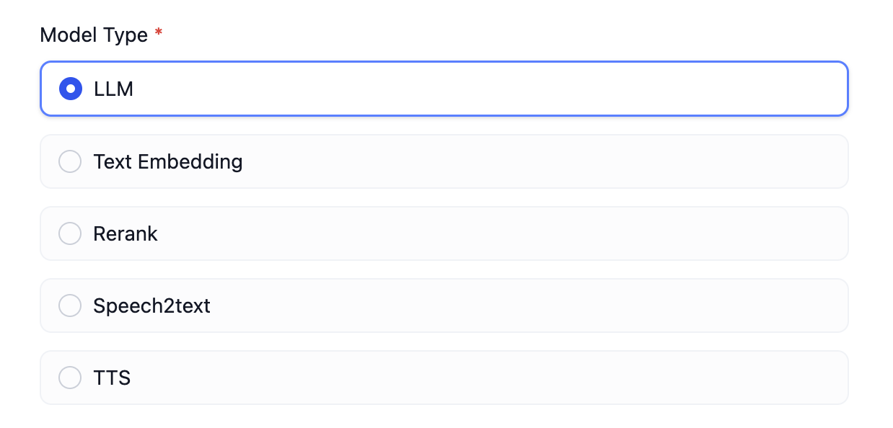

# ادغام مدل سفارشی

### مقدمه

پس از تکمیل ادغام فروشنده، مرحله بعدی ادغام مدل ها در زیر فروشنده است. برای کمک به درک کل فرآیند ادغام، از `Xinference` به عنوان مثال استفاده خواهیم کرد تا به تدریج یک ادغام کامل فروشنده را انجام دهیم.

لازم به ذکر است که برای مدل‌های سفارشی، هر ادغام مدل نیاز به یک اعتبار کامل فروشنده دارد.

بر خلاف مدل های از پیش تعریف شده، ادغام فروشنده سفارشی همیشه دارای دو پارامتر زیر خواهد بود که نیازی به تعریف در فایل YAML فروشنده ندارند.



در بخش قبلی، یاد گرفتیم که فروشندگان نیازی به پیاده‌سازی `validate_provider_credential` ندارند. Runtime به طور خودکار `validate_credentials` لایه مدل مربوطه را بر اساس نوع مدل و نام مدل انتخاب شده توسط کاربر برای اعتبار سنجی فراخوانی می‌کند.

#### نوشتن YAML فروشنده

اولین قدم، تعیین نوع مدل‌های پشتیبانی شده توسط فروشنده است.

انواع مدل‌های پشتیبانی شده در حال حاضر به شرح زیر هستند:

* `llm` مدل تولید متن
* `text_embedding` مدل جاسازی متن
* `rerank` مدل باز رتبه‌بندی
* `speech2text` گفتار به متن
* `tts` متن به گفتار
* `moderation`  moderation

`Xinference` از `LLM`، `Text Embedding` و `Rerank` پشتیبانی می‌کند، بنابراین شروع به نوشتن `xinference.yaml` خواهیم کرد.

```yaml
provider: xinference # تعیین شناسه فروشنده
label: # نام نمایش فروشنده، می‌تواند در en_US (انگلیسی) و zh_Hans (چینی ساده) تنظیم شود. اگر zh_Hans تنظیم نشده باشد، en_US به طور پیش فرض استفاده خواهد شد.
  en_US: Xorbits Inference
icon_small: # آیکون کوچک، به آیکون‌های سایر فروشندگان مراجعه کنید، که در دایرکتوری _assets در زیر دایرکتوری پیاده‌سازی فروشنده مربوطه ذخیره می‌شوند. استراتژی زبان مشابه label است.
  en_US: icon_s_en.svg
icon_large: # آیکون بزرگ
  en_US: icon_l_en.svg
help: # کمک
  title:
    en_US: How to deploy Xinference
    zh_Hans: 如何部署 Xinference
  url:
    en_US: https://github.com/xorbitsai/inference
supported_model_types: # انواع مدل‌های پشتیبانی شده. Xinference از LLM/Text Embedding/Rerank پشتیبانی می‌کند
- llm
- text-embedding
- rerank
configurate_methods: # از آنجایی که Xinference یک فروشنده مستقر در سطح محلی است و مدل‌های از پیش تعریف شده ندارد، باید مدل‌های مورد نیاز را با توجه به مستندات Xinference مستقر کنید. بنابراین، در اینجا فقط مدل‌های سفارشی پشتیبانی می‌شوند.
- customizable-model
provider_credential_schema:
  credential_form_schemas:
```

بعد، باید در نظر بگیریم که چه احراز هویتی برای تعریف یک مدل در Xinference لازم است.

* این فروشنده از سه نوع مدل مختلف پشتیبانی می‌کند، بنابراین به `model_type` نیاز داریم تا نوع مدل را مشخص کنیم. این سه نوع دارد، بنابراین به شرح زیر می‌نویسیم:

```yaml
provider_credential_schema:
  credential_form_schemas:
  - variable: model_type
    type: select
    label:
      en_US: Model type
      zh_Hans: 模型类型
    required: true
    options:
    - value: text-generation
      label:
        en_US: Language Model
        zh_Hans: 语言模型
    - value: embeddings
      label:
        en_US: Text Embedding
    - value: reranking
      label:
        en_US: Rerank
```

* هر مدل دارای نام اختصاصی خود `model_name` است، بنابراین باید آن را در اینجا تعریف کنیم.

```yaml
  - variable: model_name
    type: text-input
    label:
      en_US: Model name
      zh_Hans: 模型名称
    required: true
    placeholder:
      zh_Hans: 填写模型名称
      en_US: Input model name
```

* آدرس را برای استقرار محلی Xinference ارائه می‌دهیم.

```yaml
  - variable: server_url
    label:
      zh_Hans: 服务器URL
      en_US: Server url
    type: text-input
    required: true
    placeholder:
      zh_Hans: 在此输入Xinference的服务器地址，如 https://example.com/xxx
      en_US: Enter the url of your Xinference, for example https://example.com/xxx
```

* هر مدل دارای یک `model_uid` منحصر به فرد است، بنابراین باید آن را در اینجا تعریف کنیم.

```yaml
  - variable: model_uid
    label:
      zh_Hans: 模型 UID
      en_US: Model uid
    type: text-input
    required: true
    placeholder:
      zh_Hans: 在此输入您的 Model UID
      en_US: Enter the model uid
```

در حال حاضر، تعریف اولیه فروشنده را به پایان رسانده‌ایم.

#### نوشتن کد مدل

در مرحله بعد، `llm` را به عنوان مثال انتخاب کرده و `xinference.llm.llm.py` را می‌نویسیم.

در `llm.py`، یک کلاس Xinference LLM ایجاد می‌کنیم، که آن را `XinferenceAILargeLanguageModel` (نام دلخواه) می‌نامیم، که از کلاس پایه `__base.large_language_model.LargeLanguageModel` ارث‌بری می‌کند. روش‌های زیر را پیاده‌سازی می‌کنیم:

*   فراخوانی LLM

    پیاده‌سازی روش اصلی برای فراخوانی LLM، که می‌تواند از هر دو بازگشت جریانی و همزمان پشتیبانی کند.

    ```python
    def _invoke(self, model: str, credentials: dict,
                prompt_messages: list[PromptMessage], model_parameters: dict,
                tools: Optional[list[PromptMessageTool]] = None, stop: Optional[List[str]] = None,
                stream: bool = True, user: Optional[str] = None) \
            -> Union[LLMResult, Generator]:
        """
        فراخوانی مدل زبان بزرگ

        :param model: نام مدل
        :param credentials: اعتبارات مدل
        :param prompt_messages: پیام‌های درخواست
        :param model_parameters: پارامترهای مدل
        :param tools: ابزارها برای فراخوانی ابزار
        :param stop: کلمات توقف
        :param stream: آیا پاسخ جریانی است
        :param user: شناسه کاربری منحصر به فرد
        :return: پاسخ کامل یا نتیجه تولید کننده قطعه پاسخ جریانی
        """
    ```

    هنگام پیاده‌سازی، توجه داشته باشید که باید از دو تابع برای بازگرداندن داده‌ها استفاده کنید، یکی برای رسیدگی به بازگشت همزمان و دیگری برای بازگشت جریانی. این به این دلیل است که پایتون توابع حاوی کلمه کلیدی `yield` را به عنوان توابع تولید کننده شناسایی می‌کند و نوع داده بازگشتی به `Generator` ثابت می‌شود. بنابراین، بازگشت همزمان و جریانی باید به طور جداگانه پیاده‌سازی شوند، همانطور که در زیر نشان داده شده است (توجه داشته باشید که این مثال از پارامترهای ساده شده استفاده می‌کند؛ پیاده‌سازی واقعی باید از لیست پارامترهای بالا پیروی کند):

    ```python
    def _invoke(self, stream: bool, **kwargs) \
            -> Union[LLMResult, Generator]:
        if stream:
              return self._handle_stream_response(**kwargs)
        return self._handle_sync_response(**kwargs)

    def _handle_stream_response(self, **kwargs) -> Generator:
        for chunk in response:
              yield chunk
    def _handle_sync_response(self, **kwargs) -> LLMResult:
        return LLMResult(**response)
    ```
*   پیش محاسبه توکن ورودی

    اگر مدل رابط پیش محاسبه توکن ارائه نمی‌دهد، می‌تواند مستقیماً 0 را برگرداند.

    ```python
    def get_num_tokens(self, model: str, credentials: dict, prompt_messages: list[PromptMessage],
                     tools: Optional[list[PromptMessageTool]] = None) -> int:
      """
      دریافت تعداد توکن‌ها برای پیام‌های درخواست داده شده

      :param model: نام مدل
      :param credentials: اعتبارات مدل
      :param prompt_messages: پیام‌های درخواست
      :param tools: ابزارها برای فراخوانی ابزار
      :return:
      """
    ```

    گاهی اوقات، ممکن است نخواهید که مستقیماً 0 را برگردانید، بنابراین می‌توانید از `self._get_num_tokens_by_gpt2(text: str)` برای دریافت توکن‌های پیش محاسبه شده استفاده کنید. این روش در کلاس پایه `AIModel` قرار دارد و از Tokenizer GPT2 برای محاسبه استفاده می‌کند. با این حال، این روش فقط می‌تواند به عنوان یک روش جایگزین استفاده شود و کاملاً دقیق نیست.
*   اعتبار سنجی اعتبارات مدل

    مشابه اعتبار سنجی اعتبارات فروشنده، این مورد برای اعتبار سنجی اعتبارات مدل منفرد است.

    ```python
    def validate_credentials(self, model: str, credentials: dict) -> None:
        """
        اعتبار سنجی اعتبارات مدل

        :param model: نام مدل
        :param credentials: اعتبارات مدل
        :return:
        """
    ```
*   طرح پارامتر مدل

    بر خلاف انواع سفارشی، از آنجایی که پارامترهای پشتیبانی شده توسط یک مدل در فایل YAML تعریف نشده است، باید طرح پارامتر مدل را به طور پویا تولید کنیم.

    به عنوان مثال، Xinference از پارامترهای `max_tokens`، `temperature` و `top_p` پشتیبانی می‌کند.

    با این حال، برخی از فروشندگان از پارامترهای مختلفی بسته به مدل پشتیبانی می‌کنند. به عنوان مثال، فروشنده `OpenLLM` از `top_k` پشتیبانی می‌کند، اما همه مدل‌های ارائه شده توسط این فروشنده از `top_k` پشتیبانی نمی‌کنند. در اینجا، نشان می‌دهیم که Model A از `top_k` پشتیبانی می‌کند، در حالی که Model B این کار را انجام نمی‌دهد. بنابراین، باید طرح پارامتر مدل را به طور پویا تولید کنیم، همانطور که در زیر نشان داده شده است:

    ```python
    def get_customizable_model_schema(self, model: str, credentials: dict) -> AIModelEntity | None:
        """
            برای تعریف طرح مدل قابل تنظیم استفاده می‌شود
        """
        rules = [
            ParameterRule(
                name='temperature', type=ParameterType.FLOAT,
                use_template='temperature',
                label=I18nObject(
                    zh_Hans='温度', en_US='Temperature'
                )
            ),
            ParameterRule(
                name='top_p', type=ParameterType.FLOAT,
                use_template='top_p',
                label=I18nObject(
                    zh_Hans='Top P', en_US='Top P'
                )
            ),
            ParameterRule(
                name='max_tokens', type=ParameterType.INT,
                use_template='max_tokens',
                min=1,
                default=512,
                label=I18nObject(
                    zh_Hans='最大生成长度', en_US='Max Tokens'
                )
            )
        ]

        # اگر model A باشد، top_k را به rules اضافه کنید
        if model == 'A':
            rules.append(
                ParameterRule(
                    name='top_k', type=ParameterType.INT,
                    use_template='top_k',
                    min=1,
                    default=50,
                    label=I18nObject(
                        zh_Hans='Top K', en_US='Top K'
                    )
                )
            )

        """
            برخی از کد‌های غیر مهم اینجا هستند
        """

        entity = AIModelEntity(
            model=model,
            label=I18nObject(
                en_US=model
            ),
            fetch_from=FetchFrom.CUSTOMIZABLE_MODEL,
            model_type=model_type,
            model_properties={ 
                ModelPropertyKey.MODE:  ModelType.LLM,
            },
            parameter_rules=rules
        )

        return entity
    ```
*   جدول نگاشت خطاهای فراخوانی

    هنگامی که خطای فراخوانی مدل رخ می‌دهد، باید به نوع `InvokeError` مشخص شده توسط Runtime نگاشت شود تا پردازش‌های مختلف Dify برای خطاهای مختلف تسهیل شود.

    خطاهای Runtime:

    * `InvokeConnectionError` خطای اتصال فراخوانی
    * `InvokeServerUnavailableError` سرور فراخوانی در دسترس نیست
    * `InvokeRateLimitError` محدودیت نرخ فراخوانی به اتمام رسیده است
    * `InvokeAuthorizationError` فراخوانی مجوز  ناموفق بوده است
    * `InvokeBadRequestError` خطای پارامتر فراخوانی

    ```python
    @property
    def _invoke_error_mapping(self) -> dict[type[InvokeError], list[type[Exception]]]:
        """
        نگاشت خطای فراخوانی مدل به خطای یکپارچه
        کلید نوع خطایی است که به فراخواننده انداخته می‌شود
        مقدار نوع خطایی است که توسط مدل انداخته می‌شود،
        که باید به یک نوع خطای یکپارچه برای فراخواننده تبدیل شود.

        :return: نگاشت خطای فراخوانی
        """
    ```

    برای توضیح روش‌های رابط، به: [Interfaces](https://github.com/langgenius/dify/blob/main/api/core/model_runtime/docs/en_US/interfaces.md) مراجعه کنید. برای پیاده‌سازی‌های خاص، به: [llm.py](https://github.com/langgenius/dify-runtime/blob/main/lib/model_providers/anthropic/llm/llm.py) مراجعه کنید.


