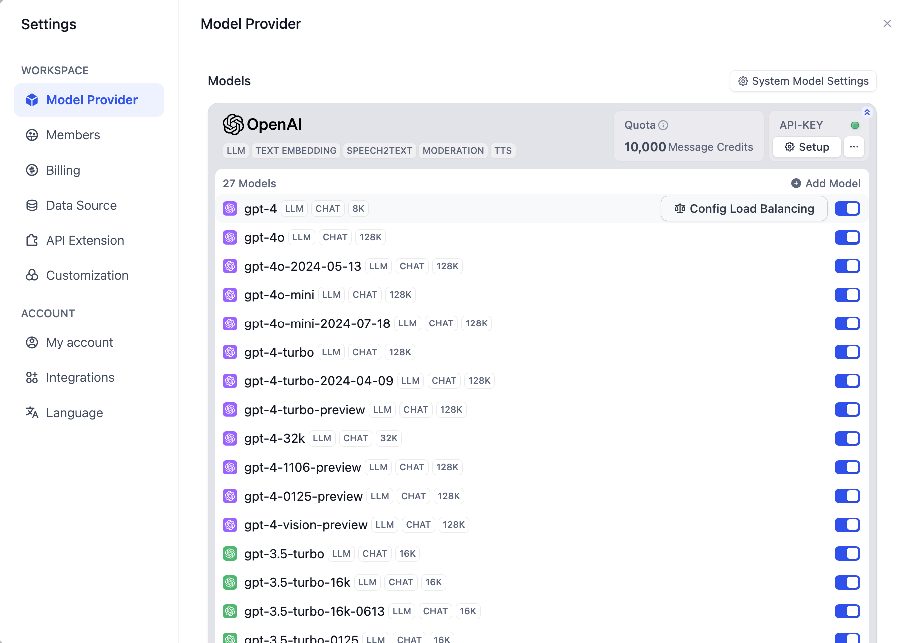
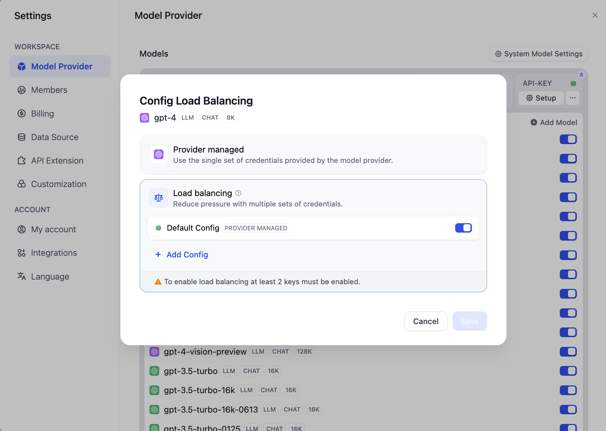
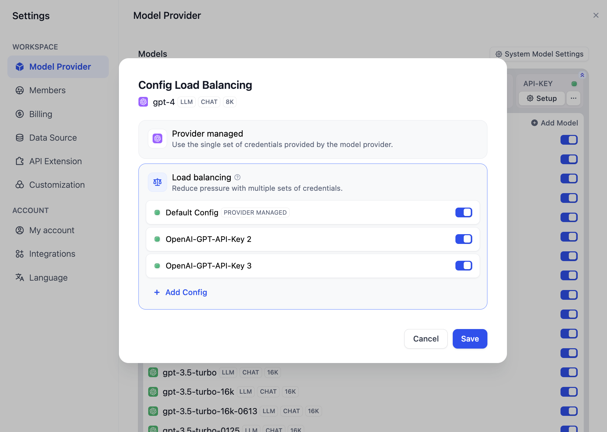
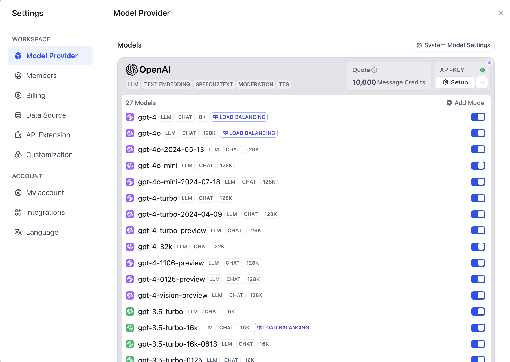

# ترازبندی بار

محدودیت‌های نرخ مدل، محدودیت‌هایی هستند که توسط ارائه دهندگان مدل بر تعداد دفعاتی که کاربران یا مشتریان می‌توانند در یک بازه زمانی مشخص به خدمات API دسترسی داشته باشند، اعمال می‌شود. این محدودیت‌ها به جلوگیری از سوء استفاده یا استفاده نادرست از API، اطمینان از دسترسی عادلانه برای همه کاربران و کنترل بار کلی بر روی زیرساخت کمک می‌کنند.

در تماس‌های API مدل در مقیاس بزرگ در سطح شرکت، درخواست‌های همزمان بالا می‌تواند از محدودیت‌های نرخ فراتر رود و بر دسترسی کاربران تأثیر بگذارد. ترازبندی بار می‌تواند درخواست‌های API را در چندین نقطه انتهایی API توزیع کند، و اطمینان حاصل شود که همه کاربران سریع‌ترین پاسخ و بالاترین توان خروجی فراخوانی مدل را دریافت می‌کنند و در نتیجه عملیات تجاری پایدار را تضمین می‌کنند.

شما می‌توانید این ویژگی را با رفتن به **ارائه دهنده مدل - لیست مدل - پیکربندی ترازبندی بار مدل** و اضافه کردن چندین اعتبارنامه (کلیدهای API) برای همان مدل فعال کنید.

<figure><figcaption>
ترازبندی بار مدل
</figcaption></figure>


ترازبندی بار مدل یک ویژگی پولی است. شما می‌توانید آن را با [اشتراک در خدمات پولی SaaS](../../getting-started/cloud.md#subscription-plan) یا خرید نسخه شرکتی فعال کنید.


کلید API پیش فرض، اعتبارنامه‌ای است که هنگام پیکربندی اولیه ارائه دهنده مدل اضافه شده است. برای استفاده صحیح از ویژگی ترازبندی بار، باید برای استفاده از همان مدل، **افزودن پیکربندی** را کلیک کنید تا کلیدهای API متفاوتی اضافه کنید.

<figure><figcaption>
پیکربندی ترازبندی بار
</figcaption></figure>

**حداقل یک اعتبارنامه مدل اضافی** باید برای ذخیره و فعال کردن ترازبندی بار اضافه شود.

همچنین می‌توانید **به طور موقت غیرفعال** یا **حذف** اعتبارنامه‌های پیکربندی شده را انجام دهید.

<figure><figcaption></figcaption></figure>

پس از پیکربندی، همه مدل‌های دارای ترازبندی بار فعال در لیست مدل نمایش داده می‌شوند.

<figure><figcaption>
فعال کردن ترازبندی بار
</figcaption></figure>


به طور پیش فرض، ترازبندی بار از استراتژی دوره‌ای استفاده می‌کند. اگر محدودیت نرخ فعال شود، یک دوره خنک شدن 1 دقیقه‌ای اعمال می‌شود.


همچنین می‌توانید ترازبندی بار را از **افزودن مدل** با دنبال کردن همان فرایند بالا پیکربندی کنید.

<figure><figcaption>
پیکربندی ترازبندی بار از افزودن مدل
</figcaption></figure>
