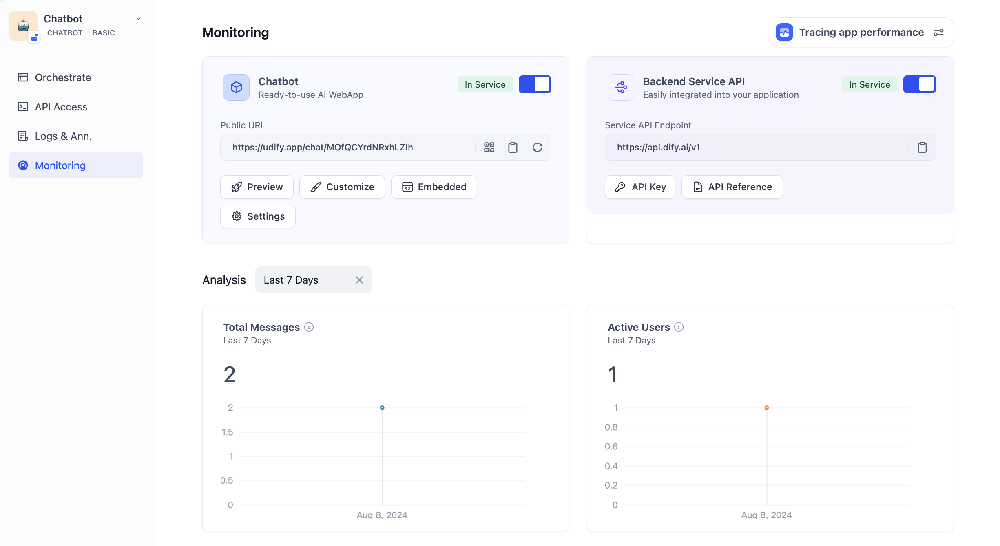

# نظارت

می‌توانید عملکرد برنامه خود را در محیط تولید در بخش **Overview** رصد و پیگیری کنید. در داشبورد تحلیل داده‌ها، می‌توانید شاخص‌های مختلفی مانند هزینه‌های استفاده، تأخیر، بازخورد کاربران و عملکرد در محیط تولید را تجزیه و تحلیل کنید. با اشکال‌زدایی و تکرار مداوم، می‌توانید برنامه خود را به طور مداوم بهبود ببخشید.

<figure><figcaption>
نمای کلی
</figcaption></figure>
