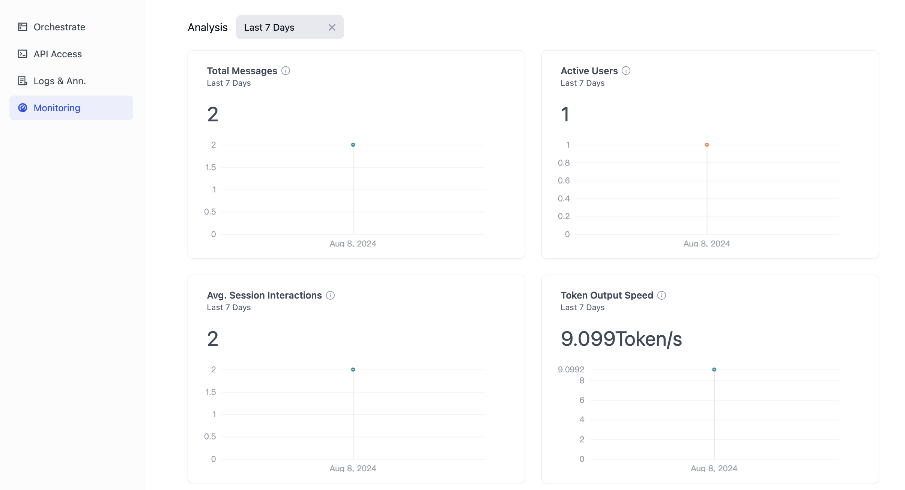

# تجزیه و تحلیل داده‌ها

بخش **بررسی اجمالی - تجزیه و تحلیل داده‌ها** معیارهایی مانند میزان استفاده، کاربران فعال و هزینه‌های فراخوانی LLM (مدل یادگیری زبان) را نمایش می‌دهد. این به شما امکان می‌دهد تا کارایی، تعامل و هزینه‌های عملیاتی برنامه خود را به طور مداوم بهبود ببخشید. ما به تدریج قابلیت‌های تجسم مفیدتری را ارائه خواهیم کرد، بنابراین لطفاً به ما اطلاع دهید که به چه چیزی نیاز دارید.

<figure><figcaption>
بررسی اجمالی - تجزیه و تحلیل داده‌ها
</figcaption></figure>

***

**کل پیام‌ها**

تعداد کل تعاملات روزانه بین کاربران و هوش مصنوعی را نشان می‌دهد. هر بار که هوش مصنوعی به سؤالی از کاربر پاسخ می‌دهد، به عنوان یک پیام حساب می‌شود. تنظیمات درخواست و جلسات رفع اشکال شامل نمی‌شوند.

**کاربران فعال**

تعداد کاربران منحصر به فردی که تعاملات موثری با هوش مصنوعی داشته‌اند، که به عنوان داشتن بیش از یک تبادل پرسش و پاسخ تعریف شده است. تنظیمات درخواست و جلسات رفع اشکال شامل نمی‌شوند.

**میانگین تعاملات جلسه**

تعداد تعاملات مداوم به ازای هر کاربر جلسه را نشان می‌دهد. به عنوان مثال، اگر کاربری 10 دور پرسش و پاسخ با هوش مصنوعی داشته باشد، به عنوان 10 حساب می‌شود. این معیار نشان دهنده تعامل کاربر است. این فقط برای برنامه‌های مکالمه‌ای در دسترس است.

**سرعت خروجی نشانه‌ها**

تعداد نشانه‌های خروجی در هر ثانیه، به طور غیرمستقیم نشان دهنده نرخ تولید مدل و فرکانس استفاده از برنامه است.

**نرخ رضایت کاربر**

تعداد لایک به ازای 1000 پیام، نشان دهنده نسبت کاربرانی است که از پاسخ‌ها بسیار راضی هستند.

**مصرف نشانه‌ها**

هزینه روزانه نشانه‌ها برای درخواست‌های مدل زبان توسط برنامه را نشان می‌دهد، که برای کنترل هزینه مفید است.

**کل مکالمات**

تعداد روزانه مکالمات هوش مصنوعی؛ هر جلسه مکالمه جدید به عنوان یک حساب می‌شود. یک جلسه مکالمه واحد ممکن است شامل چندین تبادل پیام باشد؛ پیام‌های مربوط به مهندسی درخواست و رفع اشکال شامل نمی‌شوند.
