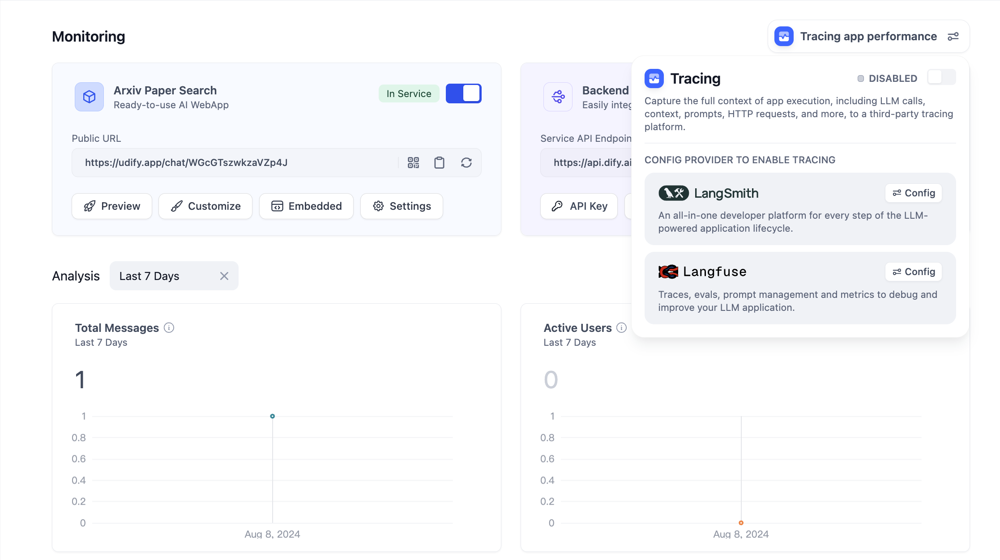
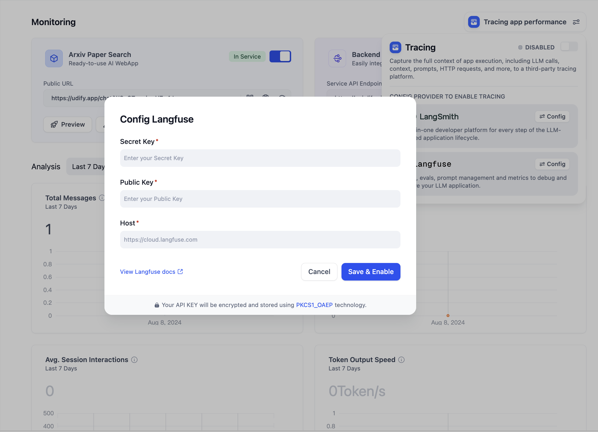
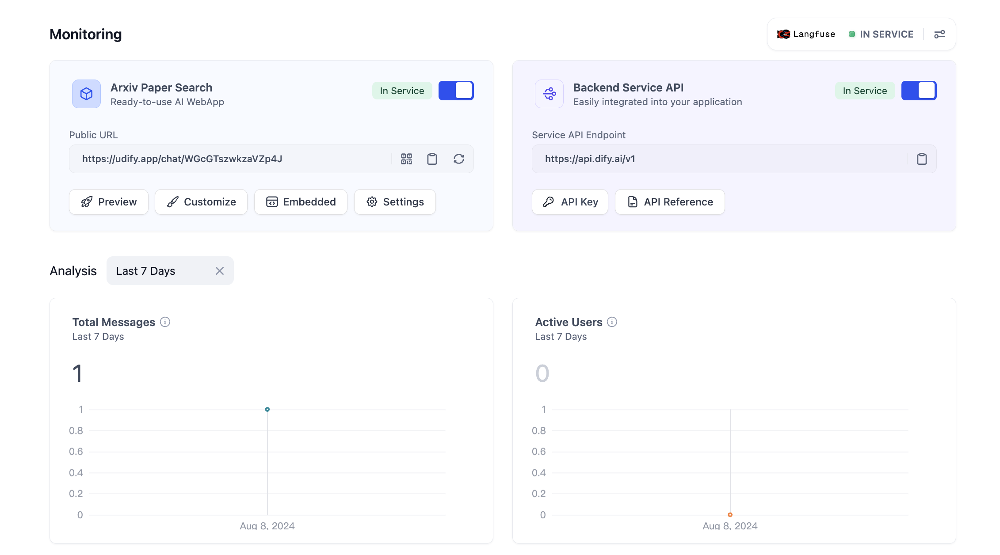
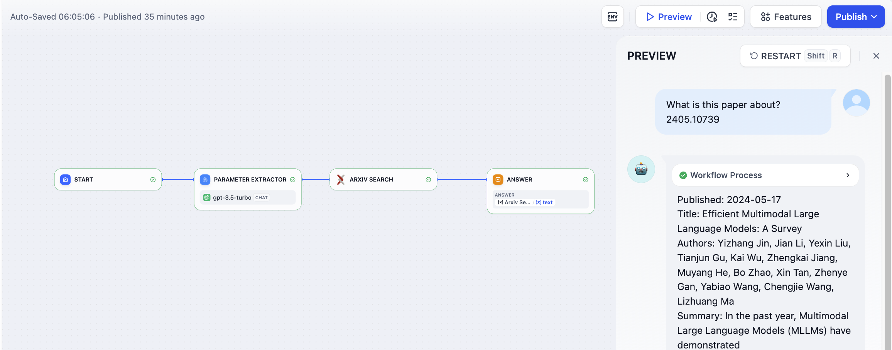
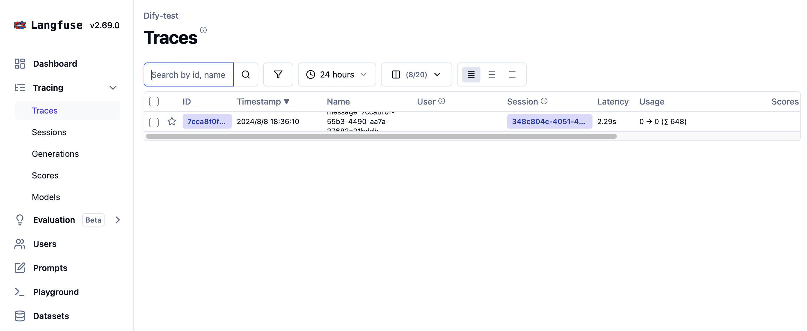

# ادغام Langfuse

### 1. Langfuse چیست؟

Langfuse یک پلتفرم مهندسی LLM منبع باز است که به تیم ها در همکاری در اشکال زدایی، تجزیه و تحلیل و تکرار برنامه های آنها کمک می کند.


معرفی Langfuse: [https://langfuse.com/](https://langfuse.com/)


***

### 2. نحوه تنظیم Langfuse

1. در وبسایت رسمی [Langfuse](https://langfuse.com/) ثبت نام کرده و وارد شوید.
2. یک پروژه در Langfuse ایجاد کنید. پس از ورود به سیستم، برای ایجاد پروژه خودتان بر روی **جدید** در صفحه اصلی کلیک کنید. **پروژه** برای ارتباط با **برنامه ها** در Dify برای نظارت بر داده ها استفاده خواهد شد.

<figure><figcaption>
ایجاد یک پروژه در Langfuse
</figcaption></figure>

یک نام برای پروژه ویرایش کنید.

<figure><figcaption>
ایجاد یک پروژه در Langfuse
</figcaption></figure>

3. اعتبارنامه های API پروژه را ایجاد کنید. در نوار کناری سمت چپ پروژه، بر روی **تنظیمات** کلیک کنید تا تنظیمات باز شود.

<figure><figcaption>
ایجاد اعتبارنامه های API پروژه
</figcaption></figure>

در تنظیمات، برای ایجاد اعتبارنامه های API پروژه بر روی **کلیدهای API را ایجاد کنید** کلیک کنید.

<figure><figcaption>
ایجاد اعتبارنامه های API پروژه
</figcaption></figure>

**کلید مخفی، کلید عمومی** و **میزبان** را کپی و ذخیره کنید.

<figure><figcaption>
دریافت پیکربندی کلید API
</figcaption></figure>

4. Langfuse را در Dify پیکربندی کنید. برنامه مورد نظر خود را برای نظارت باز کنید، **نظارت** را در منوی کناری باز کنید و **ردیابی عملکرد برنامه** را در صفحه انتخاب کنید.

<figure><figcaption>
پیکربندی Langfuse
</figcaption></figure>

پس از کلیک بر روی پیکربندی، **کلید مخفی، کلید عمومی، میزبان** ایجاد شده در Langfuse را در پیکربندی جایگذاری کرده و ذخیره کنید.

<figure><figcaption>
پیکربندی Langfuse
</figcaption></figure>

پس از ذخیره سازی موفقیت آمیز، می توانید وضعیت را در صفحه فعلی مشاهده کنید. اگر شروع نشان داده می شود، تحت نظارت است.

<figure><figcaption>
مشاهده وضعیت پیکربندی
</figcaption></figure>

***

### 3. مشاهده داده های نظارت در Langfuse

پس از پیکربندی، می توان داده های اشکال زدایی یا تولید برنامه در Dify را در Langfuse مشاهده کرد.

<figure><figcaption>
اشکال زدایی برنامه ها در Dify
</figcaption></figure>

<figure><figcaption>
مشاهده داده های برنامه در Langfuse
</figcaption></figure>

***

### 4 لیست داده های نظارت

#### ردیابی اطلاعات Workflow و Chatflow

**ردیابی workflow و chatflow**

| Workflow                                 | ردیابی LangFuse          |
| ---------------------------------------- | ----------------------- |
| workflow\_app\_log\_id/workflow\_run\_id | id                      |
| user\_session\_id                        | user\_id                |
| workflow\_{id}                           | name                    |
| start\_time                              | start\_time             |
| end\_time                                | end\_time               |
| inputs                                   | input                   |
| outputs                                  | output                  |
| مصرف توکن مدل                          | usage                   |
| metadata                                 | metadata                |
| error                                    | level                   |
| error                                    | status\_message         |
| \[workflow]                              | tags                    |
| \["message", conversation\_mode]         | session\_id             |
| conversion\_id                           | parent\_observation\_id |

**اطلاعات ردیابی Workflow**

* workflow\_id - شناسه منحصر به فرد Workflow
* conversation\_id - شناسه مکالمه
* workflow\_run\_id - شناسه Workflow این زمان اجرا
* tenant\_id - شناسه مستاجر
* elapsed\_time - زمان سپری شده در این زمان اجرا
* status - وضعیت زمان اجرا
* version - نسخه Workflow
* total\_tokens - کل توکن مورد استفاده در این زمان اجرا
* file\_list - لیست فایل های پردازش شده
* triggered\_from - منبعی که این زمان اجرا را فعال کرده است
* workflow\_run\_inputs - ورودی این workflow
* workflow\_run\_outputs - خروجی این workflow
* error - پیام خطا
* query - پرس و جوهایی که در زمان اجرا استفاده شده است
* workflow\_app\_log\_id - شناسه لاگ برنامه Workflow
* message\_id - شناسه پیام مرتبط
* start\_time - زمان شروع این زمان اجرا
* end\_time - زمان پایان این زمان اجرا
* workflow node executions - اطلاعات زمان اجرای گره Workflow
* Metadata
  * workflow\_id - شناسه منحصر به فرد Workflow
  * conversation\_id - شناسه مکالمه
  * workflow\_run\_id - شناسه Workflow این زمان اجرا
  * tenant\_id - شناسه مستاجر
  * elapsed\_time - زمان سپری شده در این زمان اجرا
  * status - وضعیت عملیاتی
  * version - نسخه Workflow
  * total\_tokens - کل توکن مورد استفاده در این زمان اجرا
  * file\_list - لیست فایل های پردازش شده
  * triggered\_from - منبعی که این زمان اجرا را فعال کرده است

#### اطلاعات ردیابی پیام

**برای ردیابی مکالمه llm**

| پیام                          | ردیابی/تولید LangFuse |
| -------------------------------- | ------------------------- |
| message\_id                      | id                        |
| user\_session\_id                | user\_id                  |
| message\_{id}                    | name                      |
| start\_time                      | start\_time               |
| end\_time                        | end\_time                 |
| inputs                           | input                     |
| outputs                          | output                    |
| مصرف توکن مدل                  | usage                     |
| metadata                         | metadata                  |
| error                            | level                     |
| error                            | status\_message           |
| \["message", conversation\_mode] | tags                      |
| conversation\_id                 | session\_id               |
| conversion\_id                   | parent\_observation\_id   |

**اطلاعات ردیابی پیام**

* message\_id - شناسه پیام
* message\_data - داده های پیام
* user\_session\_id - شناسه جلسه برای کاربر
* conversation\_model - مدل مکالمه
* message\_tokens - توکن های پیام
* answer\_tokens - توکن های پاسخ
* total\_tokens - کل توکن ها از پیام و پاسخ
* error - پیام خطا
* inputs - داده های ورودی
* outputs - داده های خروجی
* file\_list - لیست فایل های پردازش شده
* start\_time - زمان شروع
* end\_time - زمان پایان
* message\_file\_data - پیام مربوط به داده های فایل
* conversation\_mode - حالت مکالمه
* Metadata
  * conversation\_id - شناسه مکالمه
  * ls\_provider - ارائه دهنده مدل
  * ls\_model\_name - شناسه مدل
  * status - وضعیت پیام
  * from\_end\_user\_id - شناسه کاربر فرستنده
  * from\_account\_id - شناسه حساب فرستنده
  * agent\_based - آیا مبتنی بر عامل است
  * workflow\_run\_id - شناسه Workflow این زمان اجرا
  * from\_source - منبع پیام
  * message\_id - شناسه پیام

#### اطلاعات ردیابی تعدیل

**برای ردیابی تعدیل مکالمه**

| تعدیل    | ردیابی/تولید LangFuse |
| ------------- | ------------------------- |
| user\_id      | user\_id                  |
| moderation    | name                      |
| start\_time   | start\_time               |
| end\_time     | end\_time                 |
| inputs        | input                     |
| outputs       | output                    |
| metadata      | metadata                  |
| \[moderation] | tags                      |
| message\_id   | parent\_observation\_id   |

**اطلاعات ردیابی پیام**

* message\_id - شناسه پیام
* user\_id - شناسه کاربر
* workflow\_app\_log\_id workflow\_app\_log\_id
* inputs - داده های ورودی برای بررسی
* message\_data - داده های پیام
* flagged - اینکه برای توجه علامت گذاری شده است
* action - اقدامات خاص برای اجرا
* preset\_response - پاسخ از پیش تعیین شده
* start\_time - زمان شروع بررسی
* end\_time - زمان پایان بررسی
* Metadata
  * message\_id - شناسه پیام
  * action - اقدامات خاص برای اجرا
  * preset\_response - پاسخ از پیش تعیین شده

#### اطلاعات ردیابی سوالات پیشنهادی

**برای ردیابی سوالات پیشنهادی**

| سوال پیشنهادی     | ردیابی/تولید LangFuse |
| ---------------------- | ------------------------- |
| user\_id               | user\_id                  |
| suggested\_question    | name                      |
| start\_time            | start\_time               |
| end\_time              | end\_time                 |
| inputs                 | input                     |
| outputs                | output                    |
| metadata               | metadata                  |
| \[suggested\_question] | tags                      |
| message\_id            | parent\_observation\_id   |

**اطلاعات ردیابی پیام**

* message\_id - شناسه پیام
* message\_data - داده های پیام
* inputs - داده های ورودی
* outputs - داده های خروجی
* start\_time - زمان شروع
* end\_time - زمان پایان
* total\_tokens - کل توکن ها
* status - وضعیت پیام
* error - پیام خطا
* from\_account\_id - شناسه حساب فرستنده
* agent\_based - آیا مبتنی بر عامل است
* from\_source - منبع پیام
* model\_provider - ارائه دهنده مدل
* model\_id - شناسه مدل
* suggested\_question - سوال پیشنهادی
* level - سطح وضعیت
* status\_message - وضعیت پیام
* Metadata
  * message\_id - شناسه پیام
  * ls\_provider - ارائه دهنده مدل
  * ls\_model\_name - شناسه مدل
  * status - وضعیت پیام
  * from\_end\_user\_id - شناسه کاربر فرستنده
  * from\_account\_id - شناسه حساب فرستنده
  * workflow\_run\_id - شناسه Workflow این زمان اجرا
  * from\_source - منبع پیام

#### اطلاعات ردیابی بازیابی مجموعه داده ها

**برای ردیابی بازیابی پایگاه دانش**

| بازیابی مجموعه داده     | ردیابی/تولید LangFuse |
| --------------------- | ------------------------- |
| user\_id              | user\_id                  |
| dataset\_retrieval    | name                      |
| start\_time           | start\_time               |
| end\_time             | end\_time                 |
| inputs                | input                     |
| outputs               | output                    |
| metadata              | metadata                  |
| \[dataset\_retrieval] | tags                      |
| message\_id           | parent\_observation\_id   |

**اطلاعات ردیابی بازیابی مجموعه داده ها**

* message\_id - شناسه پیام
* inputs - پیام ورودی
* documents - داده های سند
* start\_time - زمان شروع
* end\_time - زمان پایان
* message\_data - داده های پیام
* Metadata
  * message\_id - شناسه پیام
  * ls\_provider - ارائه دهنده مدل
  * ls\_model\_name - شناسه مدل
  * status - وضعیت مدل
  * from\_end\_user\_id - شناسه کاربر فرستنده
  * from\_account\_id - شناسه حساب فرستنده
  * agent\_based - آیا مبتنی بر عامل است
  * workflow\_run\_id - شناسه Workflow این زمان اجرا
  * from\_source - منبع پیام

#### اطلاعات ردیابی ابزار

**برای ردیابی فراخوانی ابزار**

| ابزار                  | ردیابی/تولید LangFuse |
| --------------------- | ------------------------- |
| user\_id              | user\_id                  |
| tool\_name            | name                      |
| start\_time           | start\_time               |
| end\_time             | end\_time                 |
| inputs                | input                     |
| outputs               | output                    |
| metadata              | metadata                  |
| \["tool", tool\_name] | tags                      |
| message\_id           | parent\_observation\_id   |

**اطلاعات ردیابی ابزار**

* message\_id - شناسه پیام
* tool\_name - نام ابزار
* start\_time - زمان شروع
* end\_time - زمان پایان
* tool\_inputs - ورودی های ابزار
* tool\_outputs - خروجی های ابزار
* message\_data - داده های پیام
* error - پیام خطا، اگر وجود داشته باشد
* inputs - ورودی پیام
* outputs - خروجی پیام
* tool\_config - پیکربندی ابزار
* time\_cost - هزینه زمان
* tool\_parameters - پارامترهای ابزار
* file\_url - URL مربوط به فایل ها
* Metadata
  * message\_id - شناسه پیام
  * tool\_name - نام ابزار
  * tool\_inputs - ورودی های ابزار
  * tool\_outputs - خروجی های ابزار
  * tool\_config - پیکربندی ابزار
  * time\_cost - هزینه زمان
  * error - پیام خطا
  * tool\_parameters - پارامترهای ابزار
  * message\_file\_id - شناسه فایل پیام
  * created\_by\_role - ایجاد شده توسط نقش
  * created\_user\_id - شناسه کاربر ایجاد کننده

#### ردیابی نام تولید شده

**برای ردیابی تولید عنوان مکالمه**

| تولید نام     | ردیابی/تولید LangFuse |
| ----------------- | ------------------------- |
| user\_id          | user\_id                  |
| generate\_name    | name                      |
| start\_time       | start\_time               |
| end\_time         | end\_time                 |
| inputs            | input                     |
| outputs           | output                    |
| metadata          | metadata                  |
| \[generate\_name] | tags                      |

**اطلاعات ردیابی نام تولید شده**

* conversation\_id - شناسه مکالمه
* inputs - داده های ورودی
* outputs - نام جلسه تولید شده
* start\_time - زمان شروع
* end\_time - زمان پایان
* tenant\_id - شناسه مستاجر
* Metadata
  * conversation\_id - شناسه مکالمه
  * tenant\_id - شناسه مستاجر
