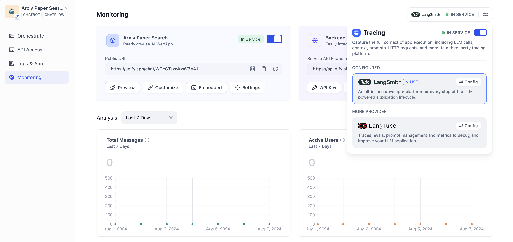
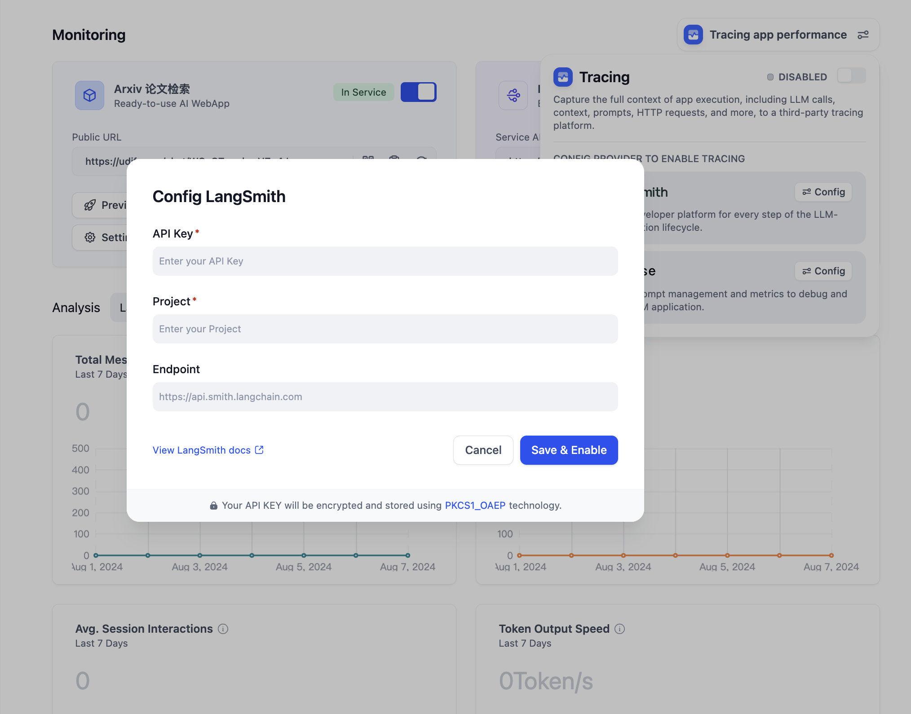
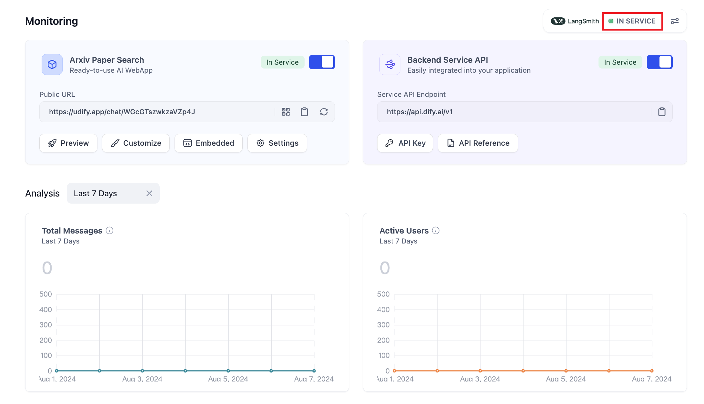
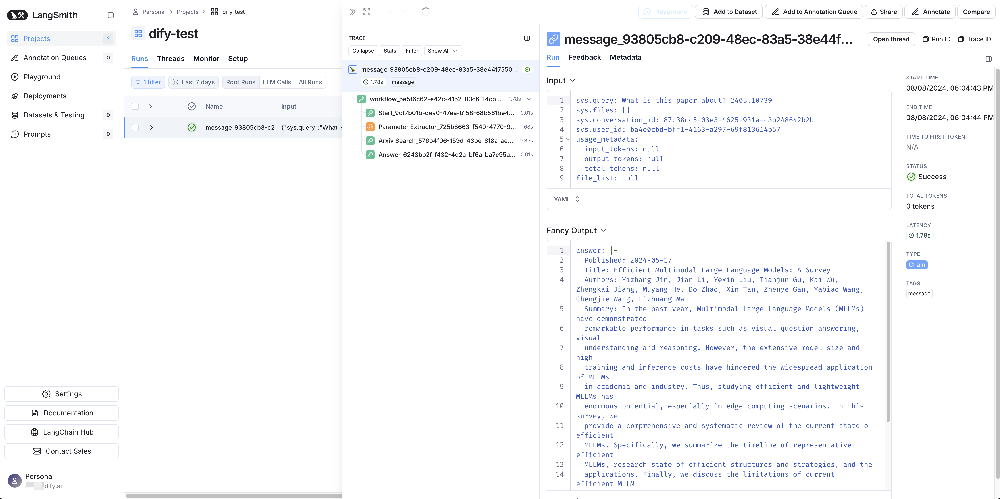

# ادغام LangSmith

### LangSmith چیست؟

LangSmith یک پلتفرم برای ساخت برنامه‌های LLM در سطح تولید است. برای توسعه، همکاری، تست، استقرار و نظارت بر برنامه‌های LLM استفاده می‌شود.


برای اطلاعات بیشتر، لطفا به [LangSmith](https://www.langchain.com/langsmith) مراجعه کنید.


***

### نحوه پیکربندی LangSmith

#### 1. ثبت نام / ورود به [LangSmith](https://www.langchain.com/langsmith)

#### 2. ایجاد یک پروژه

یک پروژه در LangSmith ایجاد کنید. پس از ورود به سیستم، برای ایجاد پروژه خود، روی **پروژه جدید** در صفحه اصلی کلیک کنید. **پروژه** برای ارتباط با **برنامه‌های** Dify جهت نظارت بر داده‌ها استفاده خواهد شد.

<figure><figcaption>
ایجاد یک پروژه در LangSmith
</figcaption></figure>

پس از ایجاد، می‌توانید تمام پروژه‌های ایجاد شده را در بخش پروژه‌ها مشاهده کنید.

<figure><figcaption>
مشاهده پروژه‌های ایجاد شده در LangSmith
</figcaption></figure>

#### 3. ایجاد اعتبارنامه‌های پروژه

تنظیمات پروژه **تنظیمات** را در نوار کناری سمت چپ پیدا کنید.

<figure><figcaption>
تنظیمات پروژه
</figcaption></figure>

برای ایجاد اعتبارنامه‌های پروژه، روی **ایجاد کلید API** کلیک کنید.

<figure><figcaption>
ایجاد یک کلید API پروژه
</figcaption></figure>

**توکن دسترسی شخصی** را برای احراز هویت API بعدی انتخاب کنید.

<figure><figcaption>
ایجاد یک کلید API
</figcaption></figure>

کلید API ایجاد شده را کپی کرده و ذخیره کنید.

<figure><figcaption>
کپی کلید API
</figcaption></figure>

#### 4. ادغام LangSmith با Dify

LangSmith را در برنامه Dify پیکربندی کنید. برنامه مورد نیاز برای نظارت را باز کنید، **نظارت** را در منوی جانبی باز کنید و **ردیابی عملکرد برنامه** را در صفحه انتخاب کنید.

<figure><figcaption>
ردیابی عملکرد برنامه
</figcaption></figure>

پس از کلیک روی پیکربندی، **کلید API** و **نام پروژه** ایجاد شده در LangSmith را در پیکربندی وارد کنید و ذخیره کنید.

<figure><figcaption>
پیکربندی LangSmith
</figcaption></figure>


نام پروژه پیکربندی شده باید با پروژه تنظیم شده در LangSmith مطابقت داشته باشد. اگر نام پروژه‌ها مطابقت نداشته باشد، LangSmith به طور خودکار یک پروژه جدید در حین همگام‌سازی داده‌ها ایجاد می‌کند.


پس از ذخیره موفقیت‌آمیز، می‌توانید وضعیت نظارت را در صفحه فعلی مشاهده کنید.

<figure><figcaption>
مشاهده وضعیت پیکربندی
</figcaption></figure>

### مشاهده داده‌های نظارت در LangSmith

پس از پیکربندی، می‌توان داده‌های اشکال‌زدایی یا تولید از برنامه‌های Dify را در LangSmith نظارت کرد.

<figure><figcaption>
اشکال‌زدایی برنامه‌ها در Dify
</figcaption></figure>

هنگامی که به LangSmith می‌روید، می‌توانید سوابق عملیات دقیق برنامه‌های Dify را در داشبورد مشاهده کنید.

<figure><figcaption>
مشاهده داده‌های برنامه در LangSmith
</figcaption></figure>

سوابق دقیق عملیات LLM از طریق LangSmith به شما در بهینه‌سازی عملکرد برنامه Dify کمک می‌کند.

<figure><figcaption>
مشاهده داده‌های برنامه در LangSmith
</figcaption></figure>

### لیست داده‌های نظارت

#### **اطلاعات ردیابی گردش کار / چت‌فلو**

**برای ردیابی گردش کار و چت‌فلو استفاده می‌شود**

| گردش کار                                 | زنجیره LangSmith              |
| ---------------------------------------- | ---------------------------- |
| workflow\_app\_log\_id/workflow\_run\_id | id                           |
| user\_session\_id                        | - در متاداده قرار داده شده است         |
| workflow\_{id}                           | name                         |
| start\_time                              | start\_time                  |
| end\_time                                | end\_time                    |
| inputs                                   | inputs                       |
| outputs                                  | outputs                      |
| مصرف توکن مدل                          | usage\_metadata              |
| metadata                                 | extra                        |
| error                                    | error                        |
| \[ گردش کار ]                              | tags                         |
| "conversation\_id/none for workflow"     | conversation\_id در متاداده |
| conversion\_id                           | parent\_run\_id              |

**اطلاعات ردیابی گردش کار**

* workflow\_id - شناسه منحصر به فرد گردش کار
* conversation\_id - شناسه گفتگو
* workflow\_run\_id - شناسه اجرای فعلی
* tenant\_id - شناسه مستاجر
* elapsed\_time - زمان صرف شده برای اجرای فعلی
* status - وضعیت اجرا
* version - نسخه گردش کار
* total\_tokens - کل توکن‌های استفاده شده در اجرای فعلی
* file\_list - لیست فایل‌های پردازش شده
* triggered\_from - منبعی که اجرای فعلی را فعال کرده است
* workflow\_run\_inputs - داده‌های ورودی برای اجرای فعلی
* workflow\_run\_outputs - داده‌های خروجی برای اجرای فعلی
* error - خطاهایی که در طول اجرای فعلی رخ داده است
* query - جستجو استفاده شده در طول اجرا
* workflow\_app\_log\_id - شناسه لاگ برنامه گردش کار
* message\_id - شناسه پیام مرتبط
* start\_time - زمان شروع اجرا
* end\_time - زمان پایان اجرا
* workflow node executions - اطلاعات مربوط به اجرای گره‌های گردش کار
* متاداده
  * workflow\_id - شناسه منحصر به فرد گردش کار
  * conversation\_id - شناسه گفتگو
  * workflow\_run\_id - شناسه اجرای فعلی
  * tenant\_id - شناسه مستاجر
  * elapsed\_time - زمان صرف شده برای اجرای فعلی
  * status - وضعیت اجرا
  * version - نسخه گردش کار
  * total\_tokens - کل توکن‌های استفاده شده در اجرای فعلی
  * file\_list - لیست فایل‌های پردازش شده
  * triggered\_from - منبعی که اجرای فعلی را فعال کرده است

#### **اطلاعات ردیابی پیام**

**برای ردیابی گفتگوهای مرتبط با LLM استفاده می‌شود**

| چت                             | LLM LangSmith                |
| -------------------------------- | ---------------------------- |
| message\_id                      | id                           |
| user\_session\_id                | - در متاداده قرار داده شده است         |
| “message\_{id}"                  | name                         |
| start\_time                      | start\_time                  |
| end\_time                        | end\_time                    |
| inputs                           | inputs                       |
| outputs                          | outputs                      |
| مصرف توکن مدل                          | usage\_metadata              |
| metadata                         | extra                        |
| error                            | error                        |
| \["message", conversation\_mode] | tags                         |
| conversation\_id                 | conversation\_id در متاداده |
| conversion\_id                   | parent\_run\_id              |

**اطلاعات ردیابی پیام**

* message\_id - شناسه پیام
* message\_data - داده‌های پیام
* user\_session\_id - شناسه جلسه کاربری
* conversation\_model - حالت گفتگو
* message\_tokens - تعداد توکن‌ها در پیام
* answer\_tokens - تعداد توکن‌ها در پاسخ
* total\_tokens - کل تعداد توکن‌ها در پیام و پاسخ
* error - اطلاعات خطا
* inputs - داده‌های ورودی
* outputs - داده‌های خروجی
* file\_list - لیست فایل‌های پردازش شده
* start\_time - زمان شروع
* end\_time - زمان پایان
* message\_file\_data - داده‌های فایل مرتبط با پیام
* conversation\_mode - حالت گفتگو
* متاداده
  * conversation\_id - شناسه گفتگو
  * ls\_provider - ارائه دهنده مدل
  * ls\_model\_name - شناسه مدل
  * status - وضعیت پیام
  * from\_end\_user\_id - شناسه کاربری فرستنده
  * from\_account\_id - شناسه حساب فرستنده
  * agent\_based - آیا پیام مبتنی بر عامل است
  * workflow\_run\_id - شناسه اجرای گردش کار
  * from\_source - منبع پیام

#### **اطلاعات ردیابی تعدیل**

**برای ردیابی تعدیل گفتگو استفاده می‌شود**

| تعدیل          | ابزار LangSmith       |
| --------------- | -------------------- |
| user\_id      | - در متاداده قرار داده شده است |
| “moderation"  | name                 |
| start\_time   | start\_time          |
| end\_time     | end\_time            |
| inputs        | inputs               |
| outputs       | outputs              |
| metadata      | extra                |
| \[تعدیل]     | tags                 |
| message\_id   | parent\_run\_id      |

**اطلاعات ردیابی تعدیل**

* message\_id - شناسه پیام
* user\_id: شناسه کاربری
* workflow\_app\_log\_id - شناسه لاگ برنامه گردش کار
* inputs - داده‌های ورودی تعدیل
* message\_data - داده‌های پیام
* flagged - آیا محتوا برای توجه علامت گذاری شده است
* action - اقدامات خاص انجام شده
* preset\_response - پاسخ از پیش تعیین شده
* start\_time - زمان شروع تعدیل
* end\_time - زمان پایان تعدیل
* متاداده
  * message\_id - شناسه پیام
  * action - اقدامات خاص انجام شده
  * preset\_response - پاسخ از پیش تعیین شده

#### **اطلاعات ردیابی سوال پیشنهادی**

**برای ردیابی سوالات پیشنهادی استفاده می‌شود**

| سوال پیشنهادی      | LLM LangSmith        |
| ---------------------- | -------------------- |
| user\_id               | - در متاداده قرار داده شده است |
| suggested\_question    | name                 |
| start\_time            | start\_time          |
| end\_time              | end\_time            |
| inputs                 | inputs               |
| outputs                | outputs              |
| metadata               | extra                |
| \[suggested\_question] | tags                 |
| message\_id            | parent\_run\_id      |

**اطلاعات ردیابی پیام**

* message\_id - شناسه پیام
* message\_data - داده‌های پیام
* inputs - محتوای ورودی
* outputs - محتوای خروجی
* start\_time - زمان شروع
* end\_time - زمان پایان
* total\_tokens - تعداد توکن‌ها
* status - وضعیت پیام
* error - اطلاعات خطا
* from\_account\_id - شناسه حساب فرستنده
* agent\_based - آیا پیام مبتنی بر عامل است
* from\_source - منبع پیام
* model\_provider - ارائه دهنده مدل
* model\_id - شناسه مدل
* suggested\_question - سوال پیشنهادی
* level - سطح وضعیت
* status\_message - پیام وضعیت
* متاداده
  * message\_id - شناسه پیام
  * ls\_provider - ارائه دهنده مدل
  * ls\_model\_name - شناسه مدل
  * status - وضعیت پیام
  * from\_end\_user\_id - شناسه کاربری فرستنده
  * from\_account\_id - شناسه حساب فرستنده
  * workflow\_run\_id - شناسه اجرای گردش کار
  * from\_source - منبع پیام

#### **اطلاعات ردیابی بازیابی مجموعه داده‌ها**

**برای ردیابی بازیابی پایگاه دانش استفاده می‌شود**

| بازیابی مجموعه داده     | بازیابی کننده LangSmith  |
| --------------------- | -------------------- |
| user\_id              | - در متاداده قرار داده شده است |
| dataset\_retrieval    | name                 |
| start\_time           | start\_time          |
| end\_time             | end\_time            |
| inputs                | inputs               |
| outputs               | outputs              |
| metadata              | extra                |
| \[dataset\_retrieval] | tags                 |
| message\_id           | parent\_run\_id      |

**اطلاعات ردیابی بازیابی مجموعه داده‌ها**

* message\_id - شناسه پیام
* inputs - محتوای ورودی
* documents - داده‌های سند
* start\_time - زمان شروع
* end\_time - زمان پایان
* message\_data - داده‌های پیام
* متاداده
  * message\_id - شناسه پیام
  * ls\_provider - ارائه دهنده مدل
  * ls\_model\_name - شناسه مدل
  * status - وضعیت پیام
  * from\_end\_user\_id - شناسه کاربری فرستنده
  * from\_account\_id - شناسه حساب فرستنده
  * agent\_based - آیا پیام مبتنی بر عامل است
  * workflow\_run\_id - شناسه اجرای گردش کار
  * from\_source - منبع پیام

#### **اطلاعات ردیابی ابزار**

**برای ردیابی فراخوانی ابزار استفاده می‌شود**

| ابزار                  | ابزار LangSmith       |
| --------------------- | -------------------- |
| user\_id              | - در متاداده قرار داده شده است |
| tool\_name            | name                 |
| start\_time           | start\_time          |
| end\_time             | end\_time            |
| inputs                | inputs               |
| outputs               | outputs              |
| metadata              | extra                |
| \["tool", tool\_name] | tags                 |
| message\_id           | parent\_run\_id      |

#### **اطلاعات ردیابی ابزار**

* message\_id - شناسه پیام
* tool\_name - نام ابزار
* start\_time - زمان شروع
* end\_time - زمان پایان
* tool\_inputs - ورودی‌های ابزار
* tool\_outputs - خروجی‌های ابزار
* message\_data - داده‌های پیام
* error - اطلاعات خطا، در صورت وجود
* inputs - ورودی‌های پیام
* outputs - خروجی‌های پیام
* tool\_config - پیکربندی ابزار
* time\_cost - هزینه زمان
* tool\_parameters - پارامترهای ابزار
* file\_url - URL فایل مرتبط
* متاداده
  * message\_id - شناسه پیام
  * tool\_name - نام ابزار
  * tool\_inputs - ورودی‌های ابزار
  * tool\_outputs - خروجی‌های ابزار
  * tool\_config - پیکربندی ابزار
  * time\_cost - هزینه زمان
  * error - اطلاعات خطا، در صورت وجود
  * tool\_parameters - پارامترهای ابزار
  * message\_file\_id - شناسه فایل پیام
  * created\_by\_role - نقش سازنده
  * created\_user\_id - شناسه کاربری سازنده

**اطلاعات ردیابی تولید نام**

**برای ردیابی تولید عنوان گفتگو استفاده می‌شود**

| تولید نام       | ابزار LangSmith       |
| ----------------- | -------------------- |
| user\_id          | - در متاداده قرار داده شده است |
| generate\_name    | name                 |
| start\_time       | start\_time          |
| end\_time         | end\_time            |
| inputs            | inputs               |
| outputs           | outputs              |
| metadata          | extra                |
| \[generate\_name] | tags                 |

**اطلاعات ردیابی تولید نام**

* conversation\_id - شناسه گفتگو
* inputs - داده‌های ورودی
* outputs - نام گفتگوی تولید شده
* start\_time - زمان شروع
* end\_time - زمان پایان
* tenant\_id - شناسه مستاجر
* متاداده
  * conversation\_id - شناسه گفتگو
  * tenant\_id - شناسه مستاجر

