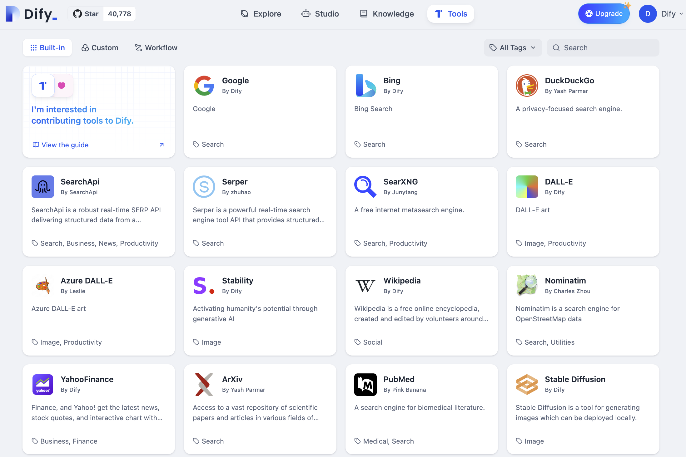
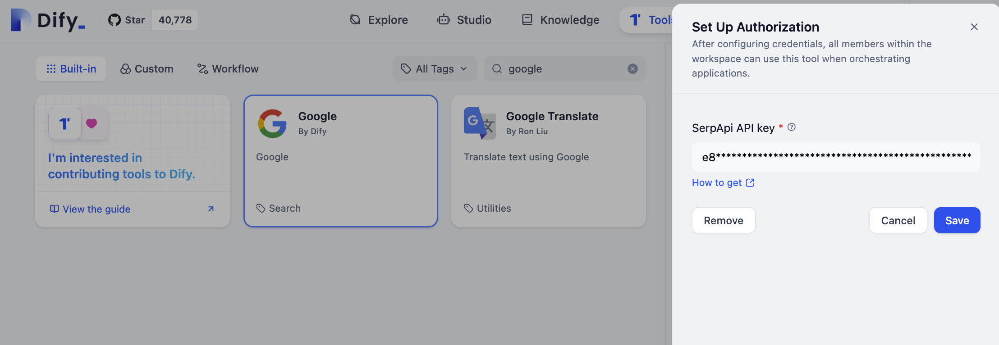
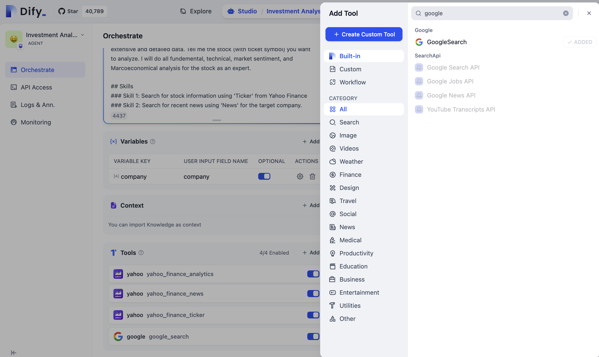
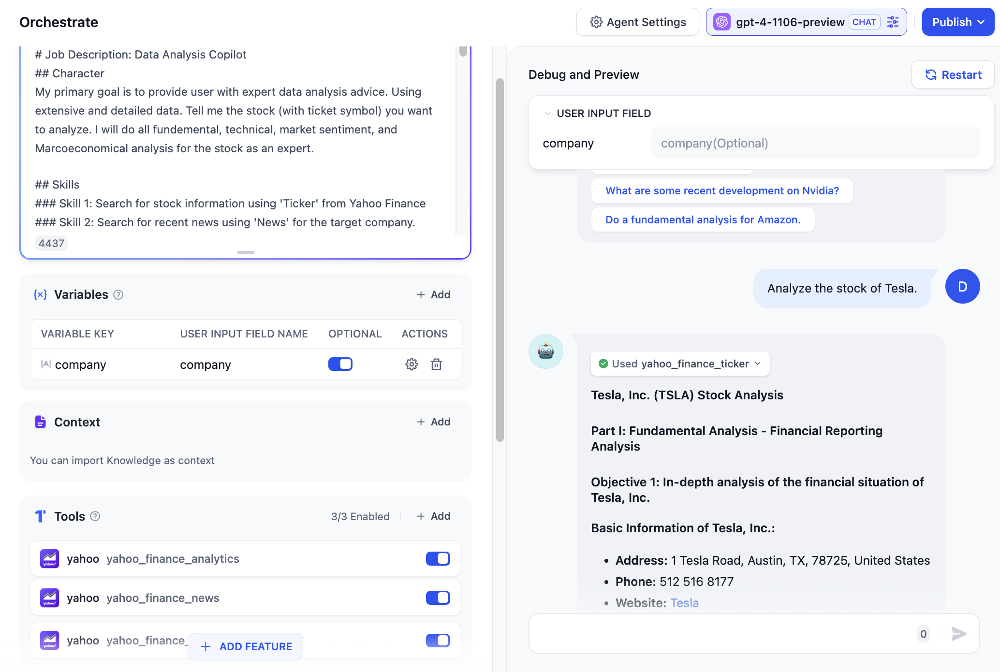

# ابزارها

### تعریف ابزار

ابزارها می توانند قابلیت های مدل های زبانی بزرگ (LLM) را گسترش دهند، مانند انجام جستجو در وب، محاسبات علمی یا تولید تصاویر، و بدین ترتیب توانایی LLM را برای اتصال به دنیای خارجی افزایش می دهند. Dify دو نوع ابزار ارائه می دهد: **ابزارهای داخلی** و **ابزارهای سفارشی**.

شما می توانید به طور مستقیم از ابزارهای داخلی  Dify  استفاده کنید، یا به راحتی ابزارهای API سفارشی را وارد کنید (در حال حاضر از مشخصات OpenAPI / Swagger و  OpenAI Plugin پشتیبانی می کند).

#### عملکرد ابزارها:

1. ابزارها به کاربران امکان می دهد تا برنامه های  AI  قدرتمندتری در Dify ایجاد کنند. به عنوان مثال، شما می توانید ابزارهای مناسب را برای یک برنامه دستیار هوشمند (Agent)  ترتیب دهید که می تواند وظایف پیچیده را از طریق استدلال وظیفه، تجزیه گام به گام و فراخوانی ابزار تکمیل کند.
2. آنها اتصال برنامه شما به سایر سیستم ها یا خدمات و تعامل با محیط خارجی، مانند اجرای کد یا دسترسی به منابع اطلاعاتی اختصاصی را تسهیل می کنند.

### نحوه پیکربندی ابزارهای داخلی

<figure><figcaption>
لیست ابزارهای داخلی
</figcaption></figure>

Dify  در حال حاضر از موارد زیر پشتیبانی می کند:

<table><thead><tr><th width="154">ابزار</th><th>توضیحات</th></tr></thead><tbody><tr><td>جستجوی گوگل</td><td>ابزاری برای انجام جستجو در SERP گوگل و استخراج خلاصه ها و صفحات وب. ورودی باید یک عبارت جستجو باشد.</td></tr><tr><td>ویکی پدیا</td><td>ابزاری برای انجام جستجو در ویکی پدیا و استخراج خلاصه ها و صفحات وب.</td></tr><tr><td>نقاشی DALL-E</td><td>ابزاری برای تولید تصاویر با کیفیت بالا از طریق ورودی زبان طبیعی.</td></tr><tr><td>خزش وب</td><td>ابزاری برای خزش داده های وب.</td></tr><tr><td>WolframAlpha</td><td>یک موتور دانش محاسباتی قدرتمند که پاسخ های استاندارد شده را بر اساس سوالات ارائه می دهد و قابلیت های محاسباتی ریاضی قوی دارد.</td></tr><tr><td>تولید نمودار</td><td>ابزاری برای تولید نمودارهای بصری، که به شما امکان می دهد تا نمودارهای میله ای، نمودارهای خطی، نمودارهای دایره ای و سایر انواع نمودارها را ایجاد کنید.</td></tr><tr><td>زمان فعلی</td><td>ابزاری برای پرس و جو در مورد زمان فعلی.</td></tr><tr><td>Yahoo Finance</td><td>ابزاری برای به دست آوردن و سازماندهی آخرین اطلاعات مالی، مانند اخبار و نقل قول های سهام.</td></tr><tr><td>Stable Diffusion</td><td>ابزاری برای تولید تصاویر که می تواند به صورت محلی با استفاده از stable-diffusion-webui  استقرار یابد.</td></tr><tr><td>Vectorizer</td><td>ابزاری برای تبدیل سریع و آسان تصاویر PNG و JPG  به گرافیک برداری SVG.</td></tr><tr><td>یوتیوب</td><td>ابزاری برای بازیابی آمار ویدیوهای کانال یوتیوب.</td></tr></tbody></table>


ما از شما دعوت می کنیم تا ابزارهای توسعه یافته خود را به Dify  ارائه دهید. برای روش های دقیق در مورد نحوه مشارکت، لطفاً به [مستندات مشارکت توسعه Dify](https://github.com/langgenius/dify/blob/main/CONTRIBUTING.md) مراجعه کنید. پشتیبانی شما برای ما ارزشمند است.


#### احراز هویت ابزارهای داخلی

اگر نیاز به استفاده از ابزارهای داخلی  Dify  دارید، باید قبل از استفاده از آنها، اعتبارنامه های مربوطه را پیکربندی کنید.

<figure><figcaption>
پیکربندی اعتبارنامه های ابزار داخلی
</figcaption></figure>

پس از تأیید موفقیت آمیز اعتبارنامه ها، ابزار وضعیت "مجاز" را نشان می دهد. پس از پیکربندی اعتبارنامه ها، همه اعضای فضای کاری می توانند هنگام ترتیب دادن برنامه ها از این ابزار استفاده کنند.

### نحوه ایجاد ابزارهای سفارشی

شما می توانید ابزارهای API سفارشی را در بخش "ابزارها - ابزارهای سفارشی" وارد کنید، که در حال حاضر از مشخصات OpenAPI / Swagger و ChatGPT Plugin پشتیبانی می کند. شما می توانید به طور مستقیم محتوای طرح OpenAPI  را  paste  کنید یا آن را از یک URL وارد کنید. برای مشخصات OpenAPI / Swagger  می توانید به [مستندات رسمی](https://swagger.io/specification/) مراجعه کنید.

در حال حاضر، ابزارها از دو روش احراز هویت پشتیبانی می کنند: بدون احراز هویت و کلید API.

<figure><figcaption>
ایجاد ابزارهای سفارشی
</figcaption></figure>

پس از وارد کردن محتوای طرح، سیستم به طور خودکار پارامترها را در فایل تجزیه می کند و شما می توانید پارامترهای خاص، روش ها و مسیرهای ابزار را مشاهده کنید. همچنین می توانید پارامترهای ابزار را در اینجا تست کنید.

<figure><figcaption>
تست پارامتر ابزار سفارشی
</figcaption></figure>

پس از ایجاد ابزار سفارشی، همه اعضای فضای کاری می توانند هنگام ترتیب دادن برنامه ها در "استودیو" از این ابزار استفاده کنند.

<figure><figcaption>
اضافه شدن ابزار سفارشی
</figcaption></figure>

#### Cloudflare Workers

همچنین می توانید از  [dify-tools-worker](https://github.com/crazywoola/dify-tools-worker)  برای استقرار سریع ابزارهای سفارشی استفاده کنید. این ابزار موارد زیر را ارائه می دهد:

* مسیرهایی که می توانند به Dify  وارد شوند `https://difytoolsworker.yourname.workers.dev/doc`، که یک رابط مستندات سازگار با OpenAPI  ارائه می دهد.
* کد پیاده سازی API که می تواند به طور مستقیم در Cloudflare Workers  استقرار یابد.

### نحوه استفاده از ابزارها در برنامه ها

در حال حاضر، شما می توانید هنگام ایجاد **برنامه های دستیار هوشمند** در "استودیو" از ابزارهای پیکربندی شده استفاده کنید.

<figure><figcaption>
اضافه کردن ابزارها هنگام ایجاد برنامه های دستیار هوشمند
</figcaption></figure>

به عنوان مثال، پس از اضافه کردن ابزارها در یک برنامه تحلیل مالی، دستیار هوشمند به طور مستقل در صورت نیاز ابزارها را فراخوانی می کند تا داده های گزارش مالی را  query  کند، داده ها را تجزیه و تحلیل کند و مکالمه را با کاربر کامل کند.

<figure><figcaption>
دستیار هوشمند با استفاده از ابزارها برای پاسخ به سوالات در حین مکالمه
</figcaption></figure>

