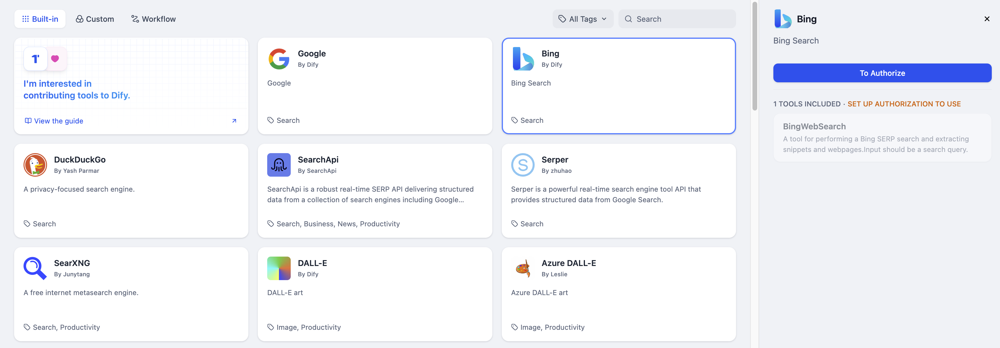

# بینگ

> نویسنده ابزار @Dify.

ابزار جستجوی بینگ می‌تواند به شما در به‌دست آوردن نتایج جستجوی آنلاین هنگام استفاده از برنامه‌های LLM کمک کند. در زیر مراحل پیکربندی و استفاده از ابزار جستجوی بینگ در Dify آورده شده است.

## 1. درخواست کلید API بینگ

لطفاً برای دریافت کلید API در پلتفرم [Azure](https://www.microsoft.com/en-us/bing/apis/bing-web-search-api) درخواست دهید.

## 2. پر کردن تنظیمات در Dify

در صفحه ناوبری Dify، روی `ابزارها > Azure > مجوز` کلیک کنید تا کلید API را وارد کنید.

## 3. استفاده از ابزار

می‌توانید از ابزار بینگ در انواع برنامه‌های زیر استفاده کنید.

* **برنامه‌های Chatflow / Workflow**

هر دو برنامه Chatflow و Workflow از اضافه کردن گره‌های ابزار `Bing` پشتیبانی می‌کنند.

* **برنامه‌های Agent**

ابزار `Bing` را در برنامه Agent اضافه کنید، سپس دستور جستجوی آنلاین را برای فراخوانی این ابزار وارد کنید.

