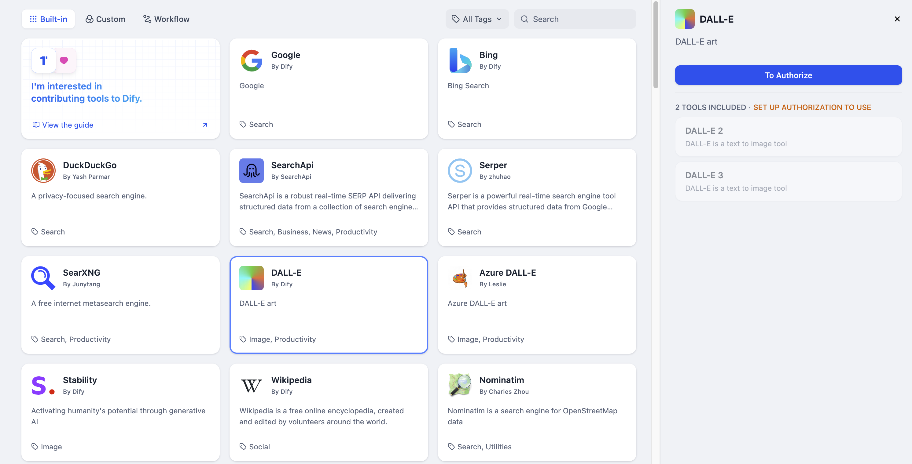

# دلّ-ای

> نویسنده ابزار @Dify.

دلّ-ای یک مولد تصویر هوش مصنوعی است که توسط OpenAI توسعه یافته است و تصاویری را بر اساس  متن هایی که به آن داده می شود، تولید می کند. Dify ابزار دلّ-ای را ادغام کرده است، و در ادامه مراحل پیکربندی و استفاده از ابزار دلّ-ای در Dify آورده شده است.

## 1. درخواست کلید API OpenAI

لطفاً برای دریافت کلید API به [پلتفرم OpenAI](https://platform.openai.com/) مراجعه کنید و مطمئن شوید که حساب شما دارای اعتبار کافی است.

## 2. پر کردن پیکربندی در Dify

در صفحه ناوبری Dify، روی `Tools > DALL-E > Authorize` کلیک کنید و کلید API را وارد کنید.

## 3. استفاده از ابزار

* **برنامه های چت فلو/ورک فلو**

هر دو برنامه چت فلو و ورک فلو از گره ابزار `DALL-E` پشتیبانی می‌کنند. پس از اضافه کردن آن، باید "Input Variables → Prompt" را در گره با [متغیرها](https://docs.dify.ai/guides/workflow/variables)  پر کنید تا به  متن ورودی کاربر یا محتوای تولید شده توسط گره قبلی اشاره کنید. در نهایت، از متغیر برای اشاره به خروجی تصویر توسط `DALL-E` در گره "End" استفاده کنید.

* **برنامه های Agent**

ابزار `DALL-E` را در برنامه Agent اضافه کنید، سپس یک توصیف تصویر را در کادر گفتگو ارسال کنید تا از ابزار برای تولید یک تصویر هوش مصنوعی استفاده کنید.

