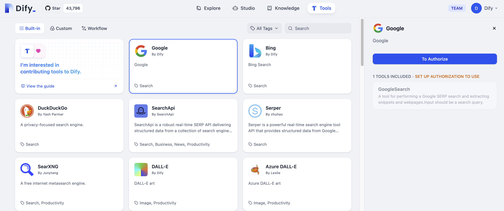

# گوگل

> نویسنده ابزار @Dify.

ابزار جستجوی گوگل می‌تواند به شما در دریافت نتایج جستجوی آنلاین هنگام استفاده از برنامه‌های LLM کمک کند. در اینجا مراحل پیکربندی و استفاده از ابزار جستجوی گوگل در Dify آمده است:

## 1. درخواست برای کلید API Serp

لطفاً برای دریافت کلید API از [Serp](https://serpapi.com/dashboard) درخواست دهید.

## 2. پر کردن پیکربندی در Dify

در صفحه ناوبری Dify، روی `ابزارها > گوگل > به مجوز برو` کلیک کنید تا کلید API را پر کنید.

## 3. استفاده از ابزار

می‌توانید از ابزار گوگل در انواع برنامه‌های زیر استفاده کنید:

* **برنامه‌های چت‌فلو / گردش کار**

هر دو برنامه چت‌فلو و گردش کار از اضافه کردن یک گره ابزار `گوگل` پشتیبانی می‌کنند.

* **برنامه‌های عامل**

ابزار `گوگل` را در برنامه Agent اضافه کنید، سپس دستورالعمل‌های جستجوی آنلاین را برای تماس با این ابزار وارد کنید.
