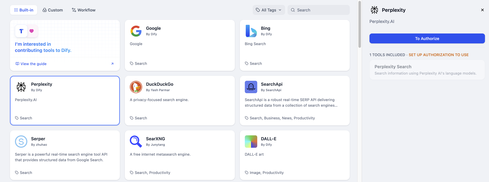
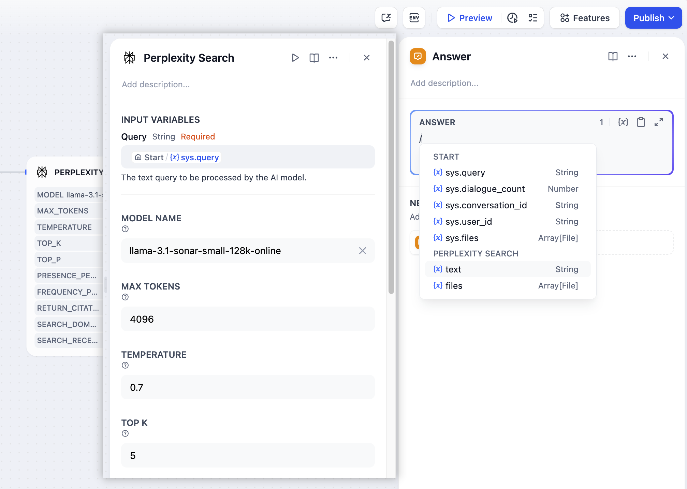
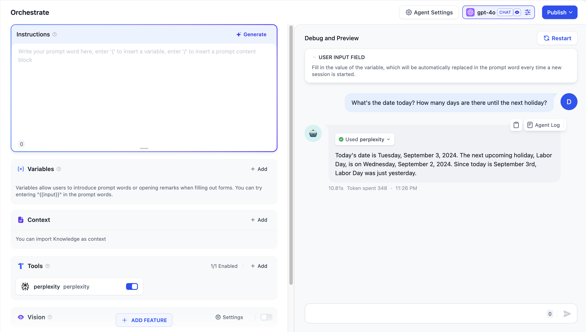

# جستجوی پرپلکسیتی

> نویسنده ابزار @Dify.

پرپلکسیتی یک موتور جستجوی مبتنی بر هوش مصنوعی است که می‌تواند پرس‌وجوهای پیچیده را درک کند و پاسخ‌های دقیق و مرتبط در زمان واقعی ارائه دهد. در اینجا مراحل پیکربندی و استفاده از ابزار جستجوی پرپلکسیتی در Dify آمده است.

## 1. درخواست کلید API پرپلکسیتی

لطفاً برای دریافت کلید API به [پرپلکسیتی](https://www.perplexity.ai/settings/api) مراجعه کنید و اطمینان حاصل کنید که حساب شما اعتبار کافی دارد.

## 2. پر کردن پیکربندی در Dify

در صفحه ناوبری Dify، روی `ابزارها > پرپلکسیتی > به تأیید بروید` کلیک کنید تا کلید API را پر کنید.

## 3. استفاده از ابزار

می‌توانید از ابزار جستجوی پرپلکسیتی در انواع برنامه‌های زیر استفاده کنید.

* **برنامه‌های چت‌فلوی / گردش کار**

هر دو برنامه چت‌فلوی و گردش کار از اضافه کردن گره‌های ابزار پرپلکسیتی پشتیبانی می‌کنند. محتوای ورودی کاربر را از طریق متغیرها به جعبه "پرس‌وجو" در گره ابزار پرپلکسیتی ارسال کنید، پارامترهای داخلی ابزار پرپلکسیتی را در صورت نیاز تنظیم کنید و در نهایت محتوای خروجی گره ابزار پرپلکسیتی را در جعبه پاسخ گره "پایان" انتخاب کنید.

* **برنامه‌های عامل**

ابزار `جستجوی پرپلکسیتی` را در برنامه عامل اضافه کنید، سپس دستورات مربوطه را برای فراخوانی این ابزار وارد کنید.

