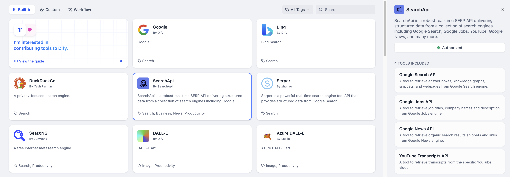
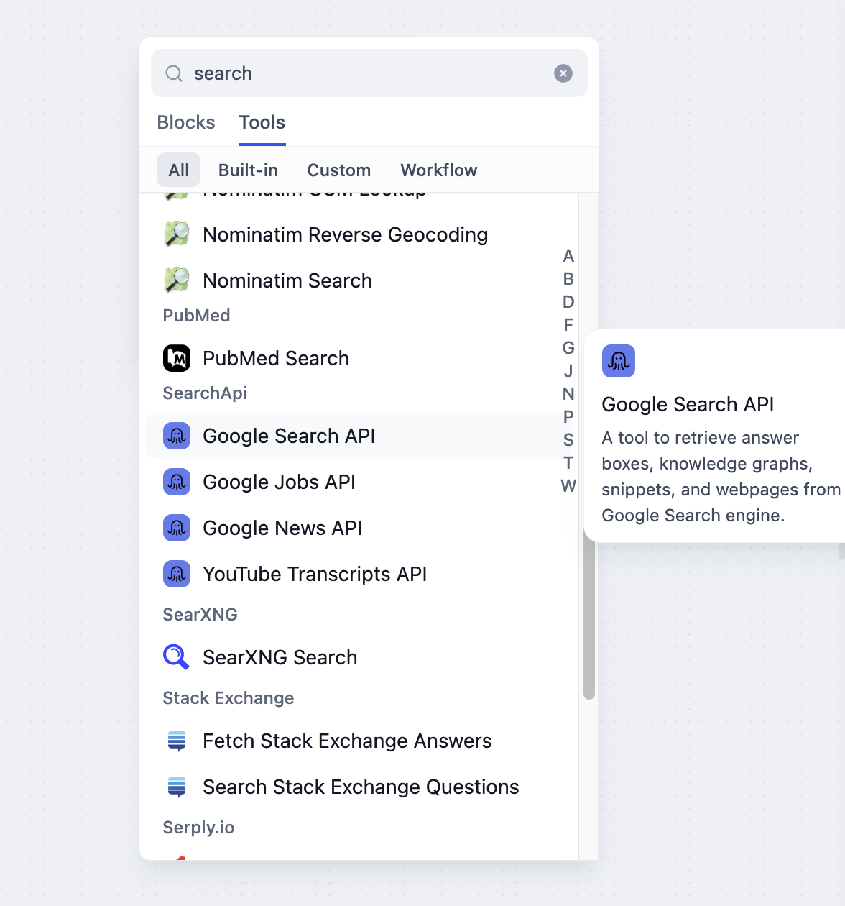

# SearchApi

> نویسنده ابزار @SearchApi.

SearchApi یک API  SERP  قدرتمند و بلادرنگ است که داده‌های ساختار یافته را از مجموعه‌ای از موتورهای جستجو از جمله جستجوی گوگل، Google Jobs، YouTube، Google News و موارد دیگر ارائه می‌دهد. در اینجا مراحل پیکربندی و استفاده از ابزار جستجوی SearchApi در Dify آورده شده است.

## 1. درخواست کلید API SearchApi

لطفاً برای دریافت کلید API به [SearchApi](https://www.searchapi.io/) مراجعه کنید.

## 2. پر کردن تنظیمات در Dify

در صفحه ناوبری Dify، روی `ابزار > SearchApi > رفتن به مجوز` کلیک کنید تا کلید API را پر کنید.

## 3. استفاده از ابزار

می توانید از ابزار SearchApi در انواع برنامه های زیر استفاده کنید.

* **برنامه های Chatflow / Workflow**

هر دو برنامه Chatflow و Workflow از افزودن گره های ابزار سری `SearchApi` پشتیبانی می‌کنند و چهار ابزار را ارائه می‌دهند: Google Jobs API، Google News API، Google Search API و YouTube Scraper API.

* **برنامه های Agent**

ابزار `SearchApi` مورد نظر خود را برای اضافه کردن در برنامه Agent انتخاب کنید، سپس دستورات را برای فراخوانی ابزار وارد کنید.

