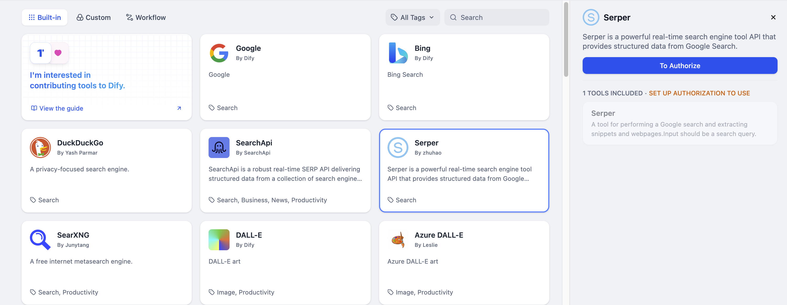

# سرپر

> نویسنده ابزار @zhuhao.

سرپر یک API قدرتمند ابزار موتور جستجوی بلادرنگ است که داده‌های ساختاریافته از نتایج موتور جستجوی گوگل را ارائه می‌دهد. مراحل پیکربندی و استفاده از ابزار جستجوی سرپر در دیفای در زیر آمده است.

## 1. درخواست کلید API سرپر

لطفاً برای دریافت کلید API از [پلتفرم سرپر](https://serper.dev/signup) درخواست دهید.

## 2. پر کردن پیکربندی در دیفای

در صفحه ناوبری دیفای، روی `ابزارها > سرپر > مجوز` کلیک کنید تا کلید API را وارد کنید.

## 3. استفاده از ابزار

می‌توانید از ابزار سرپر در انواع برنامه‌های زیر استفاده کنید.

* **برنامه‌های چت‌فلو / گردش کار**

هم برنامه‌های چت‌فلو و هم برنامه‌های گردش کار از اضافه کردن گره‌های ابزار `سرپر` پشتیبانی می‌کنند.

* **برنامه‌های عامل**

در برنامه‌های عامل، ابزار `سرپر` مورد نظر را انتخاب کرده و سپس دستورات را برای فراخوانی ابزار وارد کنید.

