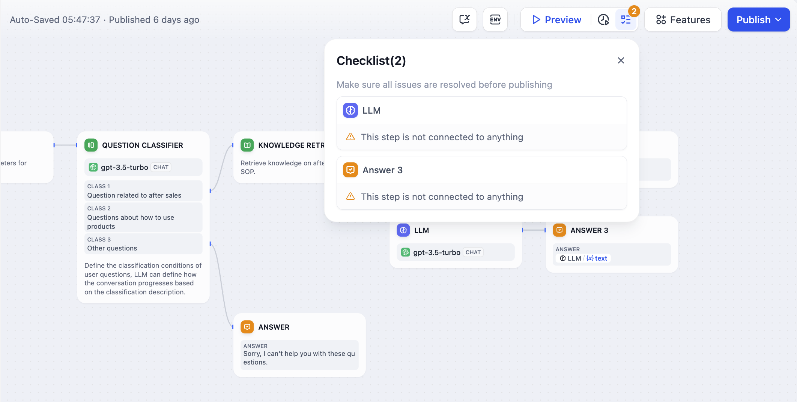

# لیست چک

قبل از انتشار برنامه، می‌توانید با استفاده از لیست چک بررسی کنید که آیا گره‌هایی با پیکربندی‌های ناقص یا گره‌هایی که متصل نشده‌اند وجود دارد یا خیر.

<figure><figcaption></figcaption></figure> 
