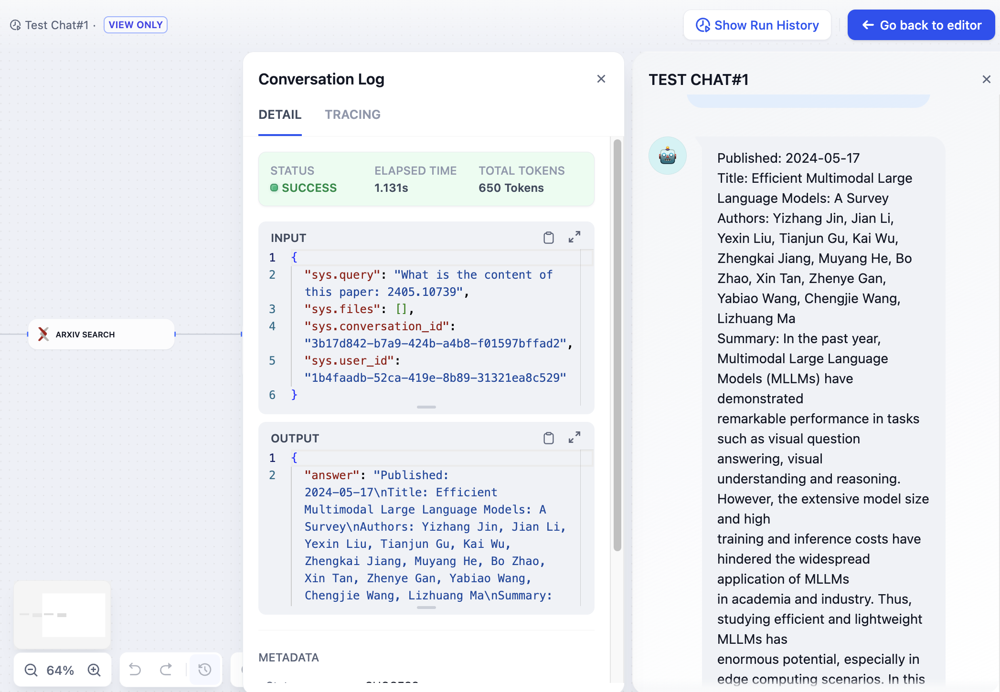

# لاگ‌های گفتگو/اجرا

با کلیک بر روی **"تاریخچه اجرا - مشاهده لاگ - جزئیات"**  می‌توانید  نمای کاملی از اجرا را در بخش جزئیات مشاهده کنید. این شامل اطلاعات در مورد ورودی‌ها و خروجی‌ها، فراداده‌ها و سایر داده‌های مرتبط است.

این اطلاعات دقیق به شما امکان می‌دهد تا جنبه‌های مختلف هر گره را در طول فرآیند اجرای کامل گردش کار بررسی کنید. می‌توانید ورودی‌ها و خروجی‌ها را بررسی کنید، مصرف نشانه‌ها را تحلیل کنید، مدت زمان اجرا را ارزیابی کنید و سایر معیارهای مرتبط را ارزیابی کنید.

<figure><figcaption></figcaption></figure> 
