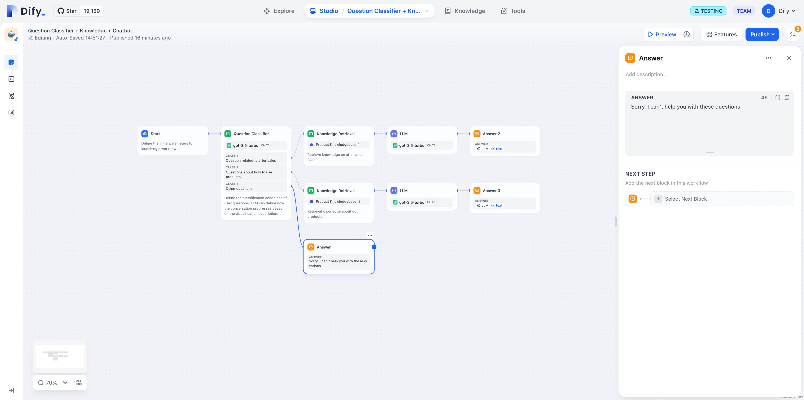
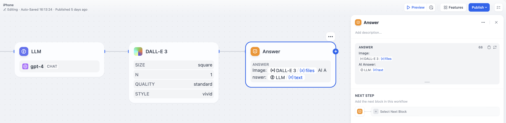
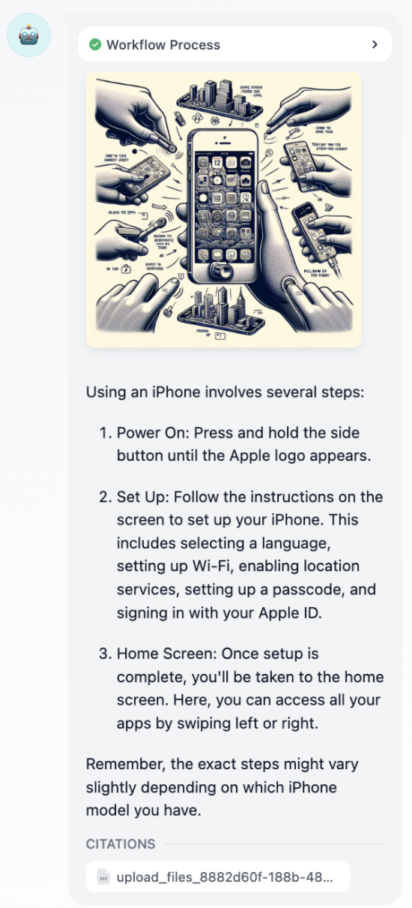

# پاسخ مستقیم

تعریف محتوای پاسخ در فرآیند گفتگو. در یک ویرایشگر متن، شما انعطاف‌پذیری برای تعیین فرمت پاسخ را دارید. این شامل ساختن یک بلوک ثابت از متن، استفاده از متغیرهای خروجی از مراحل قبلی به عنوان محتوای پاسخ، یا ادغام متن سفارشی با متغیرها برای پاسخ است.

گره پاسخ را می توان به طور یکپارچه در هر نقطه ای برای ارائه پویا محتوا به پاسخ های گفتگو ادغام کرد. این تنظیم از یک حالت پیکربندی ویرایش زنده پشتیبانی می کند که اجازه می دهد تا محتوای متن و تصویر با هم مرتب شوند. پیکربندی ها شامل موارد زیر است:

1. خروجی محتوای پاسخ از یک گره مدل زبان (LLM).
2. خروجی تصاویر تولید شده.
3. خروجی متن ساده.

مثال 1: خروجی متن ساده.

<figure><figcaption></figcaption></figure>

مثال 2: خروجی تصویر و پاسخ LLM.

<figure><figcaption></figcaption></figure>

<figure><figcaption></figcaption></figure>
