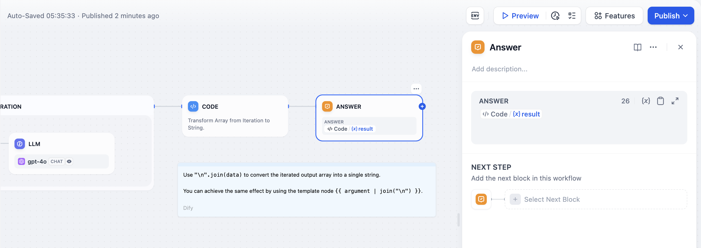
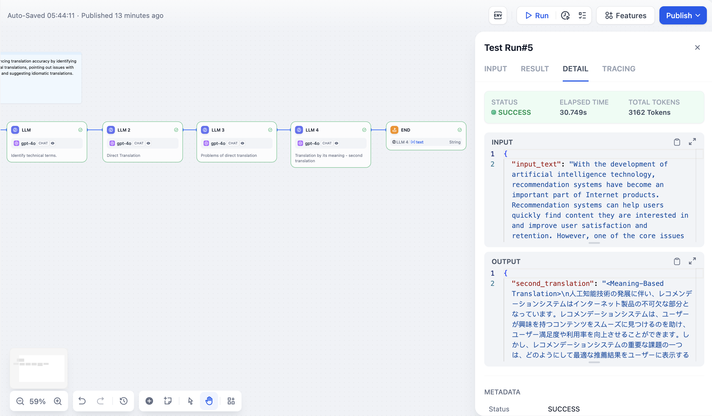

# پایان

### 1 تعریف

محتوای خروجی نهایی یک گردش کار را مشخص کنید. هر گردش کار برای خروجی دادن نتیجه نهایی پس از اجرای کامل، به حداقل یک گره انتهایی نیاز دارد.

گره انتهایی نقطه خاتمه در فرآیند است؛ پس از آن هیچ گره دیگری قابل اضافه شدن نیست. در یک برنامه گردش کار، نتایج فقط زمانی خروجی داده می‌شوند که گره انتهایی به آن برسد. اگر انشعابات شرطی در فرآیند وجود داشته باشد، باید چندین گره انتهایی تعریف شود.

گره انتهایی باید یک یا چند متغیر خروجی اعلام کند، که می‌تواند به متغیرهای خروجی هر گره بالادستی ارجاع دهد.


گره‌های انتهایی در چت‌فلو پشتیبانی نمی‌شوند.


***

### 2 سناریوها

در [گردش کار تولید داستان طولانی](iteration.md#example-2-long-article-iterative-generation-another-scheduling-method) زیر، متغیر `Output` که توسط گره انتهایی اعلام شده، خروجی گره کد بالادستی است. این بدان معناست که گردش کار پس از تکمیل اجرای گره کد به پایان می‌رسد و نتیجه اجرای کد را خروجی می‌دهد.

<figure><figcaption>
گره انتهایی - مثال تولید داستان طولانی
</figcaption></figure>

**مثال اجرای مسیر منفرد:**

<figure><figcaption></figcaption></figure>

**مثال اجرای چند مسیری:**

<figure><figcaption></figcaption></figure>

