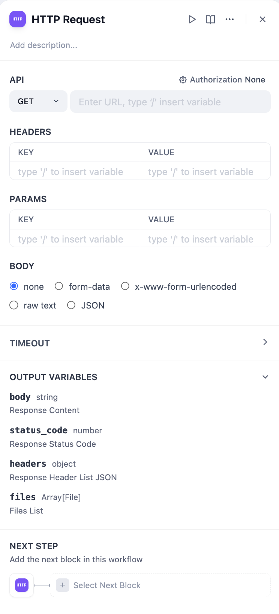
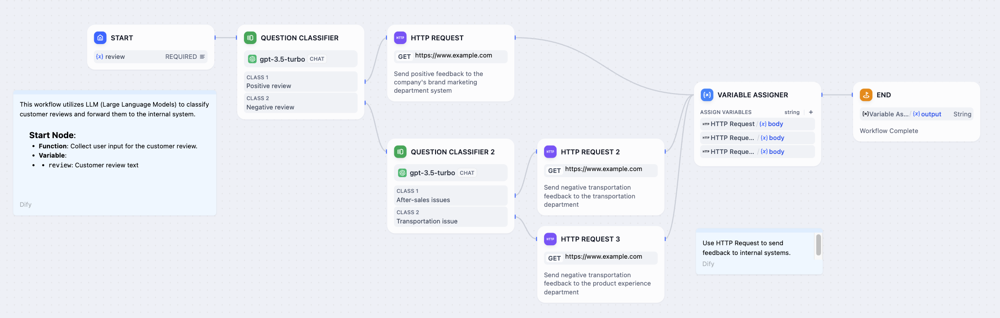

# درخواست HTTP

### 1. تعریف

امکان ارسال درخواست به سرور از طریق پروتکل HTTP را فراهم می‌کند. این قابلیت برای سناریوهایی مانند بازیابی داده‌های خارجی، وب‌هو‌ک‌ها، تولید تصاویر و دانلود فایل‌ها مناسب است. این گره به شما امکان می‌دهد درخواست‌های HTTP سفارشی به آدرس‌های وب مشخص ارسال کنید و به این ترتیب با خدمات مختلف خارجی ارتباط برقرار کنید.

این گره از متدهای رایج درخواست HTTP پشتیبانی می‌کند:

* **GET**: برای درخواست ارسال یک منبع خاص از سرور استفاده می‌شود.
* **POST**: برای ارسال داده‌ها به سرور استفاده می‌شود، معمولا برای ارسال فرم‌ها یا آپلود فایل‌ها.
* **HEAD**: شبیه به درخواست‌های GET است، اما سرور فقط هدرهای پاسخ را بدون بدنه منبع برمی‌گرداند.
* **PATCH**: برای اعمال تغییرات جزئی در یک منبع استفاده می‌شود.
* **PUT**: برای آپلود منابع به سرور استفاده می‌شود، معمولا برای به روزرسانی یک منبع موجود یا ایجاد یک منبع جدید.
* **DELETE**: برای درخواست حذف یک منبع مشخص از سرور استفاده می‌شود.

شما می‌توانید جنبه‌های مختلف درخواست HTTP، از جمله URL، هدرهای درخواست، پارامترهای کوئری، محتوای بدنه درخواست و اطلاعات احراز هویت را پیکربندی کنید.

<figure><figcaption>
پیکربندی درخواست HTTP
</figcaption></figure>

***

### 2. سناریوها

یکی از ویژگی‌های عملی این گره، امکان درج متغیرها به صورت پویا در بخش‌های مختلف درخواست بر اساس سناریو است. به عنوان مثال، هنگام رسیدگی به درخواست‌های بازخورد مشتری، می‌توانید متغیرهایی مانند نام کاربری یا شناسه مشتری، محتوای بازخورد و غیره را در درخواست جاسازی کنید تا پاسخ‌های خودکار را سفارشی کنید یا اطلاعات خاص مشتری را بازیابی و منابع مربوطه را به یک سرور مشخص ارسال کنید.

<figure><figcaption>
طبقه بندی بازخورد مشتری
</figcaption></figure>

مقادیر برگشتی یک درخواست HTTP شامل بدنه پاسخ، کد وضعیت، هدرهای پاسخ و فایل‌ها است. قابل توجه است که اگر پاسخ شامل یک فایل (در حال حاضر فقط انواع تصاویر پشتیبانی می‌شوند) باشد، این گره می‌تواند به طور خودکار فایل را برای استفاده در مراحل بعدی گردش کار ذخیره کند. این طراحی نه تنها کارایی پردازش را بهبود می‌بخشد، بلکه رسیدگی به پاسخ‌های دارای فایل را ساده و مستقیم می‌کند.
