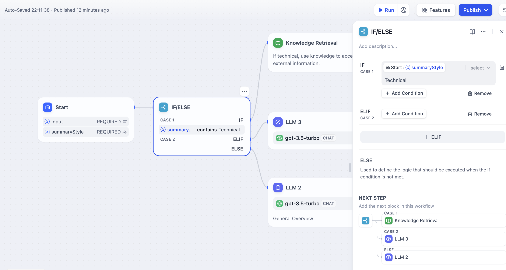

# شرطی شاخه IF/ELSE

### تعریف

به شما امکان می‌دهد تا فرآیند کار را بر اساس شرایط if/else به دو شاخه تقسیم کنید.

یک گره شاخه شرطی سه قسمت دارد:

* شرط IF: یک متغیر را انتخاب کنید، شرط را تنظیم کنید و مقدار رضایت‌بخش شرط را مشخص کنید.
* اگر شرط IF برابر با `True` باشد، مسیر IF را اجرا کنید.
* اگر شرط IF برابر با `False` باشد، مسیر ELSE را اجرا کنید.
* اگر شرط ELIF برابر با `True` باشد، مسیر ELIF را اجرا کنید;
* اگر شرط ELIF برابر با `False` باشد، به ارزیابی مسیر بعدی ELIF ادامه دهید یا مسیر نهایی ELSE را اجرا کنید.

**انواع شرط**

* شامل است
* شامل نیست
* با آن شروع می‌شود
* با آن پایان می‌یابد
* هست
* نیست
* خالی است
* خالی نیست

***

### سناریو

<figure><figcaption></figcaption></figure>

با استفاده از **فرآیند کار خلاصه متن** بالا به عنوان مثال:

* شرط IF: متغیر `summarystyle` را از گره شروع انتخاب کنید، با شرط **شامل است** `technical`.
* اگر شرط IF برابر با `True` باشد، مسیر IF را با پرس‌و‌جو از دانش مرتبط با فناوری از طریق گره بازیابی دانش دنبال کنید، سپس از طریق گره LLM پاسخ دهید (همانطور که در نیمه بالایی نمودار نشان داده شده است);
* اگر شرط IF برابر با `False` باشد، اما شرط `ELIF` اضافه شده است، جایی که ورودی برای متغیر `summarystyle` **شامل** `technology` نیست، با این حال شرط `ELIF` شامل `science` است، بررسی کنید که آیا شرط در `ELIF` `True` است، سپس مراحل تعریف شده در آن مسیر را اجرا کنید;
* اگر شرط در `ELIF` `False` باشد، به این معنی که متغیر ورودی نه `technology` و نه `science` را شامل می‌شود، به ارزیابی شرط بعدی `ELIF` ادامه دهید یا مسیر نهایی `ELSE` را اجرا کنید;
* اگر شرط IF برابر با `False` باشد، یعنی ورودی متغیر `summarystyle` **شامل** `technical` نیست، مسیر ELSE را اجرا کنید، با استفاده از گره LLM2 پاسخ دهید (قسمت پایین نمودار).

**قضاوت‌های شرط چندگانه**

برای قضاوت‌های شرط پیچیده، می‌توانید قضاوت‌های شرط چندگانه را تنظیم کنید و **AND** یا **OR** را بین شرایط برای گرفتن **تقاطع** یا **اتحاد** شرایط، به ترتیب، پیکربندی کنید.

<figure><figcaption>
قضاوت‌های شرط چندگانه
</figcaption></figure>

