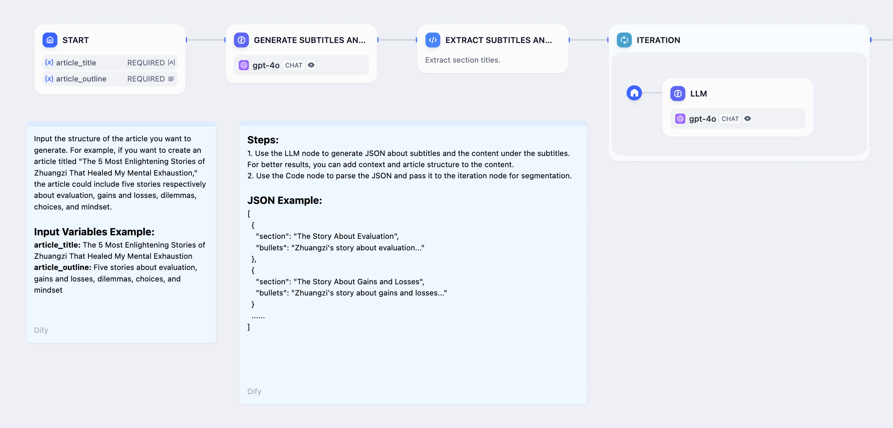
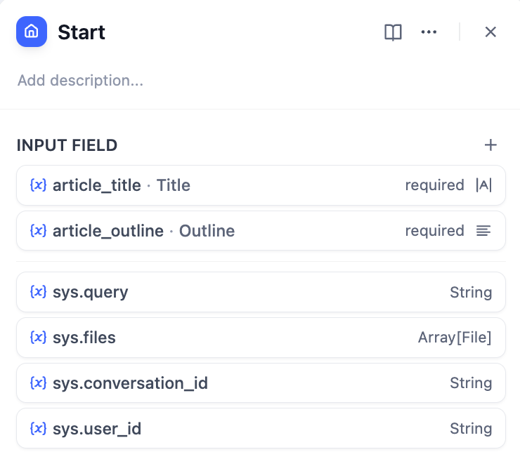
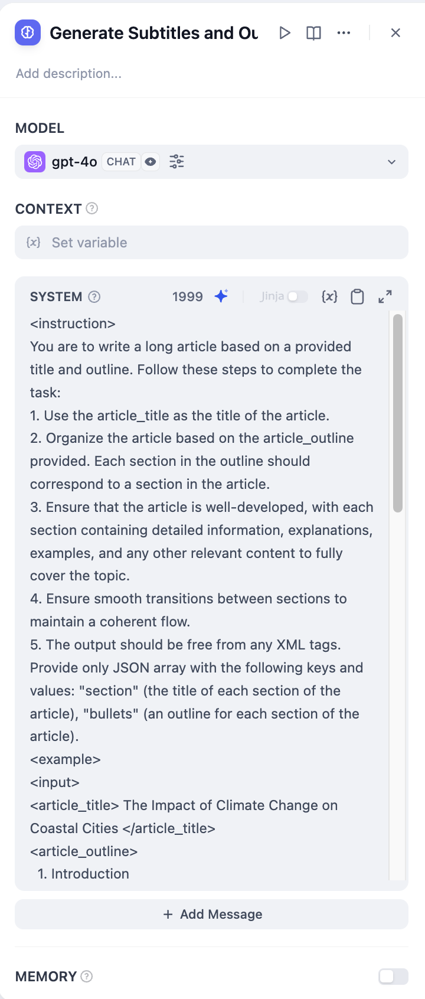
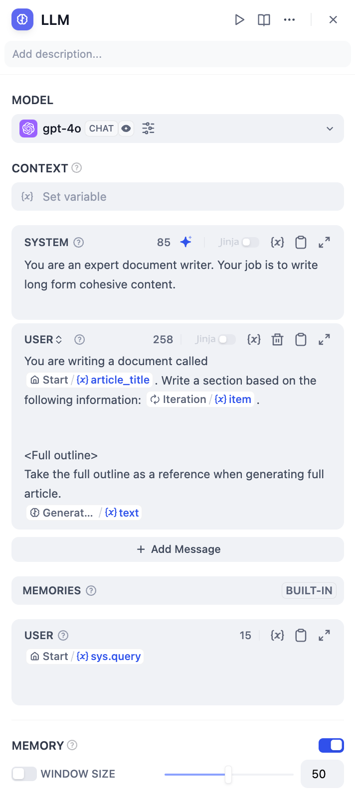
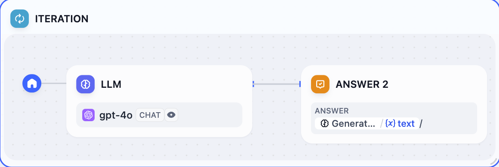
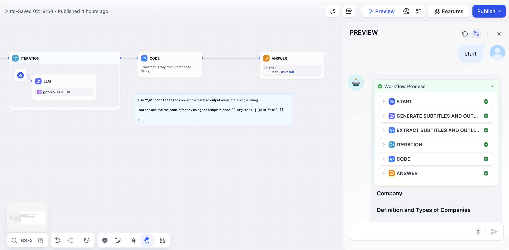
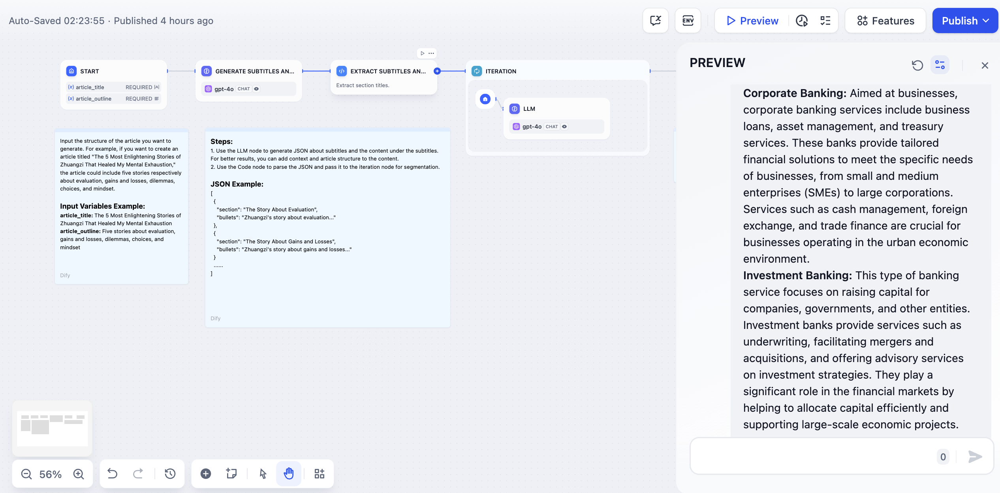
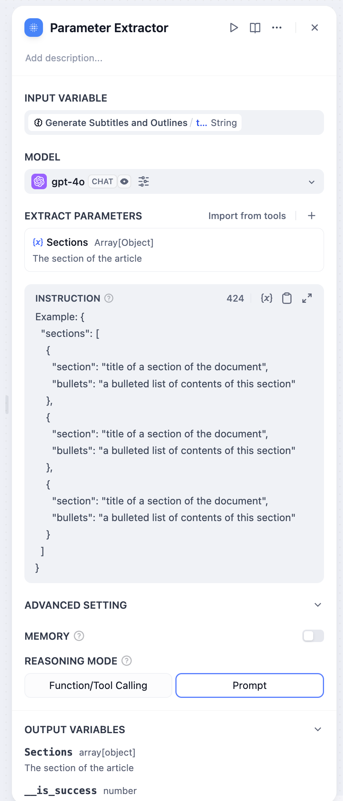
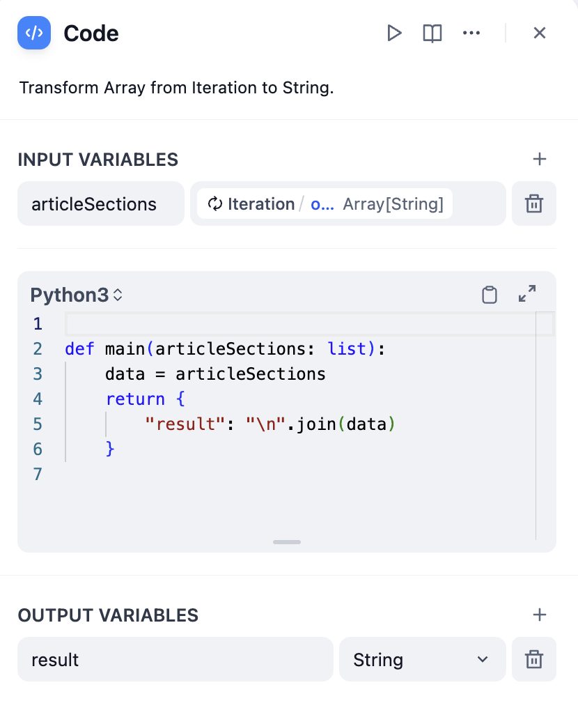
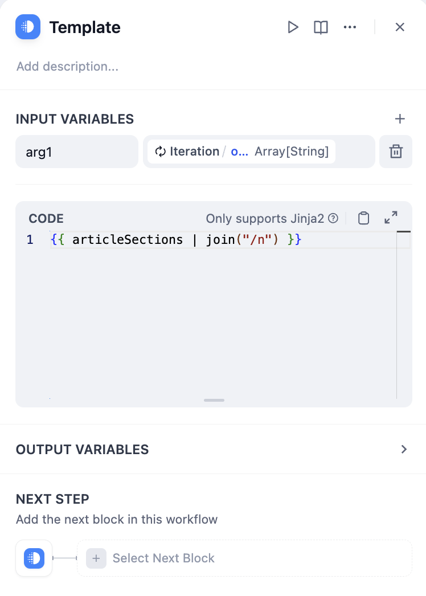

# تکرار

### تعریف

اجرای چندین مرحله روی یک آرایه تا زمانی که همه نتایج خروجی شوند.

مرحله تکرار، مراحل یکسانی را روی هر آیتم در یک لیست انجام می دهد. برای استفاده از تکرار، مطمئن شوید که مقدار ورودی به عنوان یک شی لیست قالب بندی شده است. گره تکرار به گردش کارهای هوش مصنوعی اجازه می دهد تا منطق پردازش پیچیده تری را اداره کنند. این یک نسخه کاربرپسند از گره حلقه است که با انجام برخی سازش ها در سفارشی سازی، به کاربران غیرفنی اجازه می دهد تا به سرعت کار را شروع کنند.

***

### سناریوها

#### **مثال 1: تولید کننده تکرار مقاله طولانی**

<figure><figcaption><p>تولید کننده داستان بلند</p></figcaption></figure>

1. عنوان و طرح کلی داستان را در **گره شروع** وارد کنید.
2. از یک **گره تولید زیرعنوان ها و طرح کلی ها** برای استفاده از LLM برای تولید محتوای کامل از ورودی کاربر استفاده کنید.
3. از یک **گره استخراج زیرعنوان ها و طرح کلی ها** برای تبدیل محتوای کامل به یک فرمت آرایه استفاده کنید.
4. از یک **گره تکرار** برای احاطه کردن یک **گره LLM** و تولید محتوا برای هر فصل از طریق چندین تکرار استفاده کنید.
5. یک **گره پاسخ مستقیم** را در داخل گره تکرار اضافه کنید تا خروجی جریان پس از هر تکرار حاصل شود.

**مراحل پیکربندی دقیق**

1. عنوان داستان (عنوان) و طرح کلی (طرح کلی) را در **گره شروع** پیکربندی کنید.

<figure><figcaption><p>پیکربندی گره شروع</p></figcaption></figure>

2. از یک **گره تولید زیرعنوان ها و طرح کلی ها** برای تبدیل عنوان و طرح کلی داستان به متن کامل استفاده کنید.

<figure><figcaption><p>گره الگو</p></figcaption></figure>

3. از یک **گره استخراج زیرعنوان ها و طرح کلی ها** برای تبدیل متن داستان به یک ساختار آرایه (Array) استفاده کنید. پارامتر برای استخراج `sections` است و نوع پارامتر `Array[Object]` است.

<figure><figcaption><p>استخراج پارامتر</p></figcaption></figure>


کارایی استخراج پارامتر تحت تأثیر توانایی استنباط مدل و دستورالعمل های داده شده است. استفاده از یک مدل با توانایی های استنباط قوی تر و اضافه کردن مثال ها در **دستورالعمل ها** می تواند نتایج استخراج پارامتر را بهبود بخشد.


4. از طرح کلی داستان با فرمت آرایه به عنوان ورودی برای گره تکرار استفاده کنید و آن را در داخل گره تکرار با استفاده از یک **گره LLM** پردازش کنید.

<figure><figcaption><p>پیکربندی گره تکرار</p></figcaption></figure>

متغیرهای ورودی `GenerateOverallOutline/output` و `Iteration/item` را در گره LLM پیکربندی کنید.

<figure><figcaption><p>پیکربندی گره LLM</p></figcaption></figure>


متغیرهای داخلی برای تکرار: `items[object]` و `index[number]`.

`items[object]` نشان دهنده آیتم ورودی برای هر تکرار است.

`index[number]` نشان دهنده دور تکرار فعلی است.


1. یک **گره پاسخ مستقیم** را در داخل گره تکرار پیکربندی کنید تا خروجی جریان پس از هر تکرار حاصل شود.

<figure><figcaption><p>پیکربندی گره پاسخ</p></figcaption></figure>

6. اشکال زدایی و پیش نمایش را کامل کنید.

<figure><figcaption><p>تولید با تکرار از طریق فصول داستان</p></figcaption></figure>

#### **مثال 2: تولید کننده تکرار مقاله طولانی (ترتیب دیگر)**

<figure><figcaption></figcaption></figure>

* عنوان و طرح کلی داستان را در **گره شروع** وارد کنید.
* از یک **گره LLM** برای تولید زیرعنوان ها و محتوای مربوطه برای مقاله استفاده کنید.
* از یک **گره کد** برای تبدیل محتوای کامل به یک فرمت آرایه استفاده کنید.
* از یک **گره تکرار** برای احاطه کردن یک **گره LLM** و تولید محتوا برای هر فصل از طریق چندین تکرار استفاده کنید.
* از یک **گره تبدیل الگو** برای تبدیل خروجی آرایه رشته از گره تکرار به یک رشته استفاده کنید.
* در نهایت، یک **گره پاسخ مستقیم** را برای خروجی مستقیم رشته تبدیل شده اضافه کنید.

### محتوای آرایه چیست

یک لیست یک نوع داده خاص است که در آن عناصر با کاما از هم جدا می شوند و در `[` و `]` محصور می شوند. به عنوان مثال:

**عددی:**

```
[0,1,2,3,4,5]
```

**رشته:**

```
["Monday", "Tuesday", "Wednesday", "Thursday"]
```

**شی JSON:**

```
[
    {
        "name": "Alice",
        "age": 30,
        "email": "alice@example.com"
    },
    {
        "name": "Bob",
        "age": 25,
        "email": "bob@example.com"
    },
    {
        "name": "Charlie",
        "age": 35,
        "email": "charlie@example.com"
    }
]
```

***

### گره های پشتیبانی کننده بازگشت آرایه

* گره کد
* استخراج پارامتر
* بازیابی پایگاه دانش
* تکرار
* ابزارها
* درخواست HTTP

### نحوه بدست آوردن محتوای با فرمت آرایه

**بازگشت با استفاده از گره CODE**

<figure><figcaption><p>استخراج پارامتر</p></figcaption></figure>

**بازگشت با استفاده از گره استخراج پارامتر**

<figure><figcaption><p>استخراج پارامتر</p></figcaption></figure>

### نحوه تبدیل یک آرایه به متن

متغیر خروجی گره تکرار در فرمت آرایه است و نمی توان مستقیماً آن را خروجی داد. می توانید از یک مرحله ساده برای تبدیل آرایه به متن استفاده کنید.

**تبدیل با استفاده از یک گره کد**

<figure><figcaption><p>تبدیل گره کد</p></figcaption></figure>

مثال کد:

```python
def main(articleSections: list):
    data = articleSections
    return {
        "result": "/n".join(data)
    }
```

**تبدیل با استفاده از یک گره الگو**

<figure><figcaption><p>تبدیل گره الگو</p></figcaption></figure>

مثال کد:

```django
{{ articleSections | join("/n") }}
```


