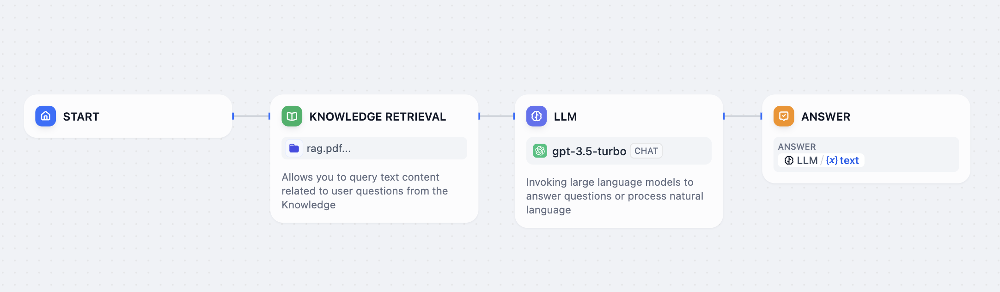
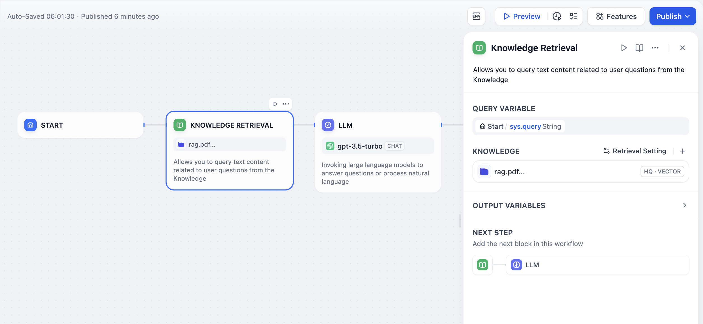
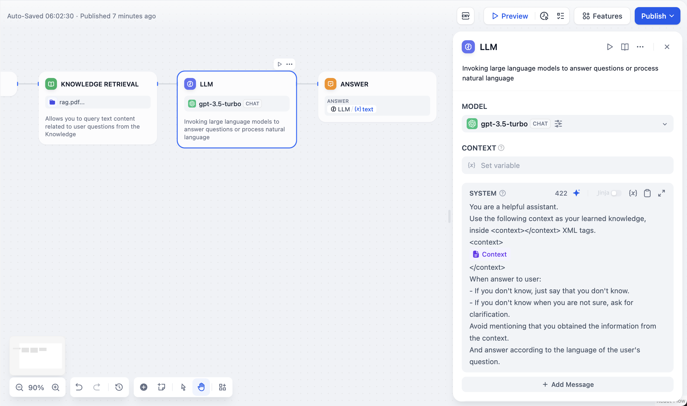

# بازیابی دانش

گره بازیابی پایگاه دانش برای استخراج محتوای متنی مرتبط با سوالات کاربر از پایگاه دانش Dify طراحی شده است که می تواند به عنوان زمینه برای پاسخ‌های بعدی توسط مدل زبان بزرگ (LLM) مورد استفاده قرار گیرد.

<figure><figcaption></figcaption></figure>

تنظیم گره بازیابی پایگاه دانش شامل سه مرحله اصلی است:

1. **انتخاب متغیر پرس و جو**
2. **انتخاب پایگاه دانش برای پرس و جو**
3. **تنظیم استراتژی بازیابی**

**انتخاب متغیر پرس و جو**

در سناریوهای بازیابی پایگاه دانش، متغیر پرس و جو به طور معمول نشان دهنده سوال ورودی کاربر است. در گره "شروع" برنامه‌های کاربردی مکالمه، سیستم "sys.query" را به عنوان متغیر ورودی کاربر از پیش تنظیم می‌کند. از این متغیر می‌توان برای پرس و جو از پایگاه دانش برای یافتن قطعات متنی مرتبط با سوال کاربر استفاده کرد. حداکثر محتوای پرس و جو ارسال شده به پایگاه دانش 200 کاراکتر است.

**انتخاب پایگاه دانش برای پرس و جو**

در گره بازیابی پایگاه دانش، می‌توانید یک پایگاه دانش موجود از Dify را اضافه کنید. برای دریافت راهنمایی در مورد ایجاد پایگاه دانش در Dify، لطفاً به [مستندات راهنما](https://docs.dify.ai/guides/knowledge-base/create-knowledge-and-upload-documents) پایگاه دانش مراجعه کنید.

**تنظیم استراتژی بازیابی**

امکان تغییر استراتژی نمایه سازی و حالت بازیابی برای یک پایگاه دانش منفرد در گره وجود دارد. برای توضیحات مفصل در مورد این تنظیمات، لطفاً به [مستندات راهنما](https://docs.dify.ai/guides/knowledge-base/retrieval-test-and-citation) پایگاه دانش مراجعه کنید.

<figure><figcaption></figcaption></figure>

Dify دو استراتژی یادآوری برای سناریوهای مختلف بازیابی پایگاه دانش ارائه می‌دهد: "یادآوری N به 1" و "یادآوری چند طرفه". در حالت N به 1، پرس و جوهای پایگاه دانش از طریق فراخوانی تابع انجام می‌شوند و نیاز به انتخاب یک مدل استدلال سیستم دارد. در حالت یادآوری چند طرفه، نیاز به پیکربندی یک مدل Rerank برای رتبه بندی مجدد نتایج وجود دارد. برای توضیحات مفصل در مورد این دو استراتژی یادآوری، لطفاً به توضیحات حالت بازیابی در [مستندات راهنما](https://docs.dify.ai/guides/knowledge-base/create-knowledge-and-upload-documents#id-5-indexing-methods) مراجعه کنید.

<figure><figcaption></figcaption></figure>
