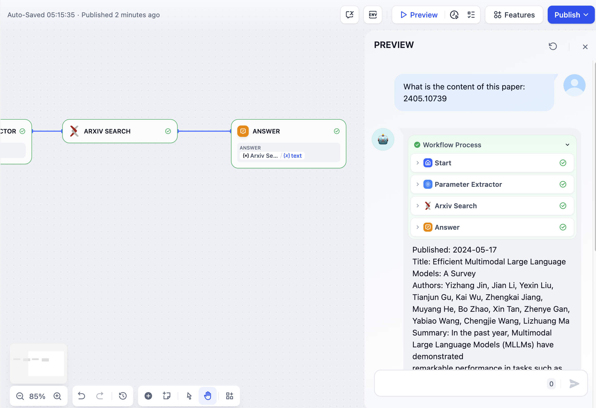
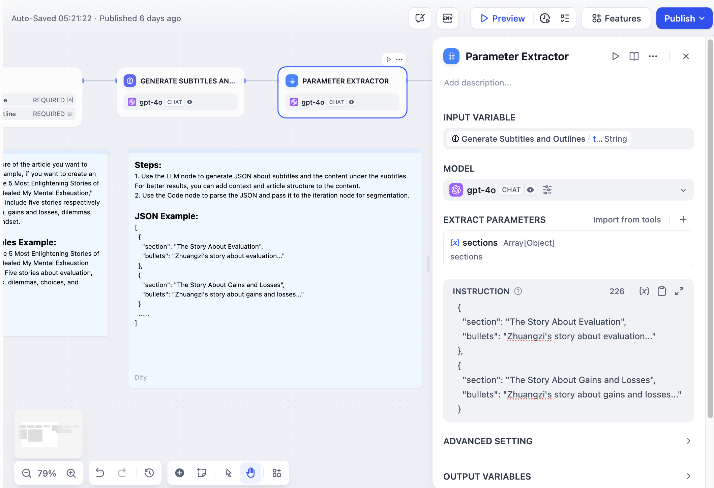

# استخراج پارامتر

### 1 تعریف

از LLM برای استنباط و استخراج پارامترهای ساختاریافته از زبان طبیعی برای فراخوانی ابزار بعدی یا درخواست های HTTP استفاده کنید.

ورک فلوهای Dify  انتخاب غنی از [ابزارها](../../tools.md)  را ارائه می‌دهند، که اکثر آن‌ها به پارامترهای ساختاریافته به عنوان ورودی نیاز دارند. استخراج کننده پارامتر می‌تواند زبان طبیعی کاربر را به پارامترهایی تبدیل کند که توسط این ابزارها قابل شناسایی هستند، و فراخوانی ابزار را تسهیل می‌کند.

برخی از گره‌ها در ورک فلو به فرمت‌های داده‌ای خاص به عنوان ورودی نیاز دارند، مانند گره [تکرار](iteration.md#definition)، که به فرمت آرایه‌ای نیاز دارد. استخراج کننده پارامتر می‌تواند به طور راحت [تبدیل پارامتر ساختاریافته](iteration.md#example-1-long-article-iteration-generator) را انجام دهد.

***

### 2 سناریوهای

1. **استخراج پارامترهای کلیدی مورد نیاز توسط ابزارها از زبان طبیعی**، مانند ساخت یک برنامه ساده ی گفتگو برای بازیابی مقالات Arxiv.

در این مثال: ابزار بازیابی مقاله Arxiv به  **نویسنده مقاله** یا **شناسه مقاله**  به عنوان پارامتر ورودی نیاز دارد. استخراج کننده پارامتر، شناسه مقاله **2405.10739** را از عبارت "محتوای این مقاله چیست: 2405.10739" استخراج می‌کند و از آن به عنوان پارامتر ابزار برای پرس و جو دقیق استفاده می‌کند.

<figure><figcaption>
ابزار بازیابی مقاله Arxiv
</figcaption></figure>

2. **تبدیل متن به داده‌های ساختاریافته**، مانند برنامه ی تولید تکرار داستان بلند، که در آن به عنوان گام قبل از گره [تکرار](iteration.md)  عمل می‌کند، و محتوای فصل را در فرمت متنی به فرمت آرایه‌ای تبدیل می‌کند، تا پردازش تولید چند دوره‌ای توسط گره تکرار تسهیل شود.

<figure><figcaption></figcaption></figure>

1. **استخراج داده‌های ساختاریافته و استفاده از [درخواست HTTP](https://docs.dify.ai/guides/workflow/node/http-request)**، که می‌تواند هر URL قابل دسترسی را درخواست کند، مناسب برای  به دست آوردن نتایج بازیابی خارجی، وب هوک‌ها، تولید تصاویر و سایر سناریوها.

***

### 3 نحوه پیکربندی

**مراحل پیکربندی**

1. متغیر ورودی را انتخاب کنید، که معمولاً متغیر ورودی برای استخراج پارامتر است.
2. مدل را انتخاب کنید، زیرا استخراج کننده پارامتر به توانایی استنباط و تولید ساختاریافته LLM  متکی است.
3. پارامترهایی را که باید استخراج شوند تعریف کنید، که می‌توانند به صورت دستی اضافه شوند یا به سرعت از ابزارهای موجود **وارد شوند**.
4. دستورالعمل‌ها را بنویسید، که ارائه مثال‌ها می‌تواند به LLM در بهبود کارایی و پایداری استخراج پارامترهای پیچیده کمک کند.

**تنظیمات پیشرفته**

**حالت استنباط**

برخی از مدل‌ها از دو حالت استنباط پشتیبانی می‌کنند، که استخراج پارامتر را از طریق تماس‌های تابع/ابزار یا روش‌های صرفاً اعلان انجام می‌دهند، با تفاوت‌هایی در  انطباق دستورالعمل.  برای مثال، برخی از مدل‌ها ممکن است در استنباط اعلان عملکرد بهتری داشته باشند اگر تماس تابع کمتر موثر باشد.

* تماس تابع/تماس ابزار
* اعلان

**حافظه**

هنگامی که حافظه فعال است، هر ورودی به طبقه بندی کننده سوال، تاریخچه ی چت در مکالمه را شامل می‌شود تا به LLM در درک  زمینه  و  بهبود فهم سوال در طول گفتگوهای تعاملی کمک کند.

**متغیرهای خروجی**

* متغیرهای تعریف شده ی استخراج شده
* متغیرهای داخلی گره

`__is_success Number`  وضعیت موفقیت آمیز استخراج، با مقدار 1 برای موفقیت و 0 برای شکست.

`__reason String`  دلیل خطای استخراج 

