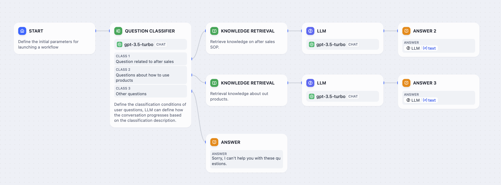
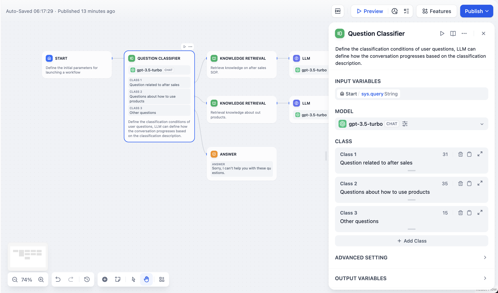

# طبقه‌بندی سوال

### 1. تعریف

طبقه‌بندی‌کننده سوال با تعریف توصیف‌های طبقه‌بندی، می‌تواند ورودی‌های کاربر را به دسته‌های مربوطه تخصیص دهد و نتایج طبقه‌بندی را نمایش دهد.

***

### 2. سناریو‌ها

موارد استفاده معمول شامل **طبقه‌بندی قصد مکالمه خدمات مشتری، طبقه‌بندی نظرات محصولات و طبقه‌بندی ایمیل‌های انبوه** است.

در یک سناریوی معمولی سؤال و پاسخ خدمات مشتری محصول، طبقه‌بندی‌کننده سوال می‌تواند به عنوان مرحله‌ای اولیه قبل از بازیابی پایگاه دانش عمل کند. این طبقه‌بندی، ورودی سوال کاربر را طبقه‌بندی می‌کند و آن را به پرس‌وجوهای مختلف پایگاه دانش هدایت می‌کند تا به طور دقیق به سوال کاربر پاسخ دهد.

نمودار زیر یک الگوی گردش کار نمونه برای یک سناریوی خدمات مشتری محصول است:

<figure><figcaption></figcaption></figure>

در این سناریو، سه برچسب/توصیف طبقه‌بندی راه‌اندازی می‌کنیم:

* دسته 1: **سوالات مربوط به خدمات پس از فروش**
* دسته 2: **سوالات مربوط به استفاده از محصول**
* دسته 3: **سوالات دیگر**

هنگامی که کاربران سوالات مختلف را وارد می‌کنند، طبقه‌بندی‌کننده سوال به طور خودکار آنها را بر اساس برچسب‌های/توصیف‌های طبقه‌بندی تنظیم شده، طبقه‌بندی می‌کند:

* "**چگونه می‌توانم مخاطبین را روی آیفون ۱۴ تنظیم کنم؟**" —> "**سوالات مربوط به استفاده از محصول**"
* "**مدت زمان گارانتی چقدر است؟**" —> "**سوالات مربوط به خدمات پس از فروش**"
* "**وضعیت هوا امروز چگونه است؟**" —> "**سوالات دیگر**"

***

### 3. نحوه پیکربندی

<figure><figcaption></figcaption></figure>

**مراحل پیکربندی:**

1. **انتخاب متغیر ورودی**: به محتوائی که باید طبقه‌بندی شود اشاره دارد، معمولاً سوال کاربر در یک سناریوی سؤال و پاسخ خدمات مشتری، مانند `sys.query`.
2. **انتخاب مدل استنتاج**: طبقه‌بندی‌کننده سوال از توانایی‌های طبقه‌بندی و استنتاج زبان طبیعی مدل‌های زبان بزرگ استفاده می‌کند. انتخاب یک مدل مناسب می‌تواند اثربخشی طبقه‌بندی را افزایش دهد.
3. **نوشتن برچسب‌ها/توصیف‌های طبقه‌بندی**: می‌توانید با نوشتن کلمات کلیدی یا عبارات توصیفی برای هر دسته، چندین طبقه‌بندی را به صورت دستی اضافه کنید و به مدل زبان بزرگ کمک کنید تا معیارهای طبقه‌بندی را بهتر درک کند.
4. **انتخاب گره‌های پایین دست مربوطه**: پس از طبقه‌بندی، گره طبقه‌بندی سوال می‌تواند جریان را به مسیرهای مختلف هدایت کند، بر اساس رابطه بین طبقه‌بندی و گره‌های پایین دست.

#### تنظیمات پیشرفته:

**دستورالعمل‌ها**: در **تنظیمات پیشرفته - دستورالعمل‌ها**، می‌توانید دستورالعمل‌های تکمیلی مانند معیارهای طبقه‌بندی دقیق‌تر را برای افزایش قابلیت‌های طبقه‌بندی‌کننده اضافه کنید.

**حافظه**: هنگامی که فعال است، هر ورودی به طبقه‌بندی‌کننده سوال شامل تاریخچه گفتگو از مکالمه خواهد بود تا به LLM در درک زمینه و بهبود درک سوال در گفتگوهای تعاملی کمک کند.

**پنجره حافظه**: هنگامی که پنجره حافظه بسته است، سیستم به طور پویا مقدار تاریخچه گفتگو را بر اساس پنجره زمینه مدل فیلتر می‌کند؛ هنگامی که باز است، کاربران می‌توانند به طور دقیق مقدار تاریخچه گفتگو (به لحاظ عدد) را کنترل کنند.

**متغیر خروجی**:

`class_name`

این نام طبقه‌بندی است که پس از طبقه‌بندی خروجی می‌شود. می‌توانید از متغیر نتیجه طبقه‌بندی در گره‌های پایین دست به دلخواه استفاده کنید.

