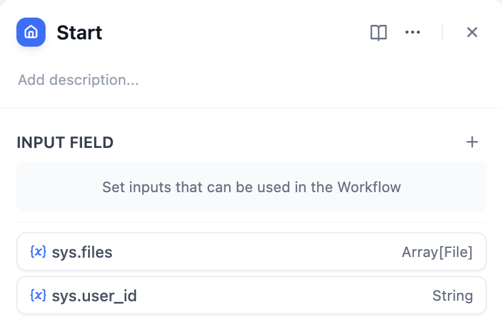

# شروع

### تعریف

پارامترهای اولیه برای شروع یک گردش کار را تعریف کنید.

می‌توانید متغیرهای ورودی برای شروع گردش کار را در گره شروع سفارشی کنید. هر گردش کاری به یک گره شروع نیاز دارد.

<figure><figcaption>
گره شروع گردش کار
</figcaption></figure>

گره شروع از تعریف متغیرهای ورودی از چهار نوع پشتیبانی می‌کند:

* متن
* پاراگراف
* گزینه‌های کشویی
* عدد
* فایل (به زودی)

<figure><figcaption>
تنظیم متغیرهای گره شروع
</figcaption></figure>

پس از پیکربندی، گردش کار در حین اجرا از شما درخواست می‌کند که مقادیر متغیرهای تعریف شده در گره شروع را وارد کنید.

<figure><figcaption></figcaption></figure>


نکته: در چت فلو، گره شروع متغیرهای سیستمی داخلی را ارائه می‌دهد: `sys.query` و `sys.files`.

`sys.query` برای سوالات ورودی کاربر در برنامه‌های مکالمه ای استفاده می‌شود.

`sys.files` برای آپلود فایل در مکالمات، مانند آپلود تصویر، که باید همراه با یک مدل درک تصویر استفاده شود، استفاده می‌شود.


