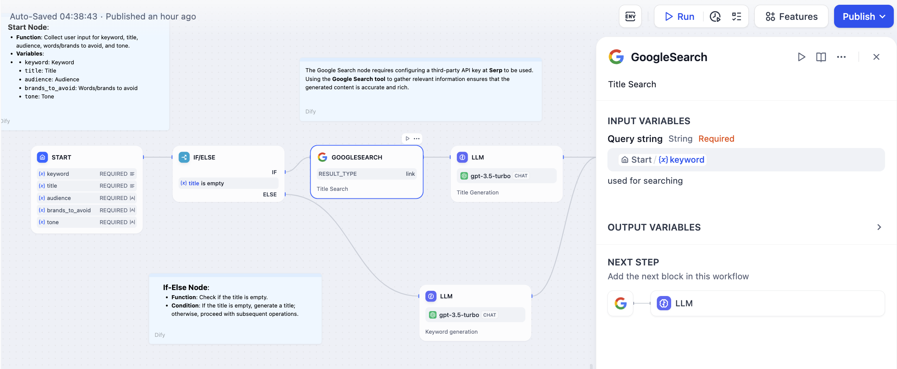

# ابزارها

### تعریف

این گردش کار، انتخاب غنی از ابزارها را در سه دسته ارائه می‌دهد:

* **ابزارهای داخلی**: ابزارهای ارائه شده توسط Dify.
* **ابزارهای سفارشی**: ابزارهای وارد شده یا پیکربندی شده از طریق فرمت استاندارد OpenAPI/Swagger.
* **گردش کارها**: گردش کارهایی که به عنوان ابزار منتشر شده‌اند.

قبل از استفاده از ابزارهای داخلی، ممکن است نیاز به **مجوزدهی** آنها داشته باشید.

اگر ابزارهای داخلی نیازهای شما را برآورده نمی‌کنند، می‌توانید ابزارهای سفارشی را در بخش **منوی پیمایش Dify -- ابزارها** ایجاد کنید.

همچنین می‌توانید یک گردش کار پیچیده‌تر را تنظیم و آن را به عنوان یک ابزار منتشر کنید.

<figure><figcaption>
انتخاب ابزار
</figcaption></figure>

<figure><figcaption>
پیکربندی ابزار جستجوی گوگل برای بازیابی دانش خارجی
</figcaption></figure>

پیکربندی یک گره ابزار معمولاً شامل دو مرحله است:

1. مجوزدهی به ابزار/ایجاد ابزار سفارشی/انتشار یک گردش کار به عنوان ابزار.
2. پیکربندی ورودی و پارامترهای ابزار.

برای اطلاعات بیشتر در مورد چگونگی ایجاد ابزارهای سفارشی و پیکربندی آنها، لطفا به [راهنمای پیکربندی ابزار](https://docs.dify.ai/guides/tools) مراجعه کنید.
