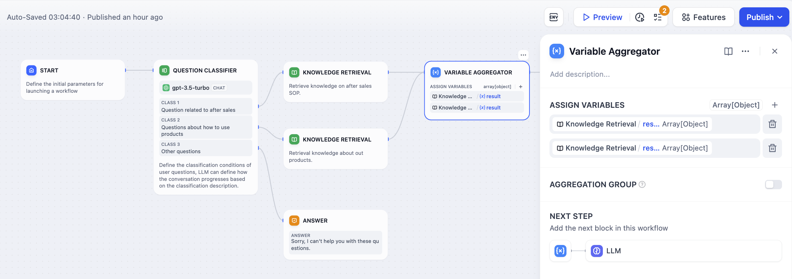
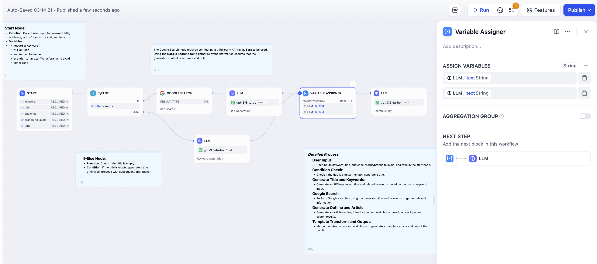

# جمع‌کننده متغیرها

### ۱ تعریف

جمع‌کننده متغیرها  (که قبلا گره انتساب متغیر نامیده می شد) یک گره کلیدی در گردش کار است. این گره مسئول ادغام نتایج خروجی از شاخه‌های مختلف است و تضمین می‌کند که صرف‌نظر از اینکه کدام شاخه اجرا می‌شود، نتایج آن را می‌توان از طریق یک متغیر واحد مرجع و دسترسی داشت. این امر به ویژه در سناریوهای چندشاخه‌ای مفید است، زیرا متغیرهایی با عملکرد مشابه را از شاخه‌های مختلف به یک متغیر خروجی واحد نگاشت می‌کند و از نیاز به تعاریف تکراری در گره‌های پایین‌دست جلوگیری می‌کند.

***

### ۲ سناریوها

از طریق جمع‌کننده متغیرها می‌توانید خروجی‌های مختلف، مانند طبقه‌بندی موضوع یا انشعاب شرطی، را به یک خروجی واحد برای استفاده و دستکاری توسط گره‌های پایین‌دست جمع‌آوری کنید، و این امر مدیریت جریان داده را ساده می‌کند.

**جمع‌کننده چند شاخه‌ای پس از طبقه‌بندی موضوع**

بدون جمع‌کننده متغیرها، شاخه‌های طبقه‌بندی ۱ و طبقه‌بندی ۲، پس از بازیابی‌های پایگاه دانش مختلف، به تعاریف تکراری برای گره‌های LLM و پاسخ مستقیم پایین‌دست نیاز خواهند داشت.

<figure><figcaption>
طبقه‌بندی موضوع (بدون جمع‌کننده متغیرها)
</figcaption></figure>

با اضافه کردن جمع‌کننده متغیرها، خروجی‌های دو گره بازیابی دانش می‌توانند در یک متغیر واحد جمع‌آوری شوند.

<figure><figcaption>
جمع‌کننده چند شاخه‌ای پس از طبقه‌بندی موضوع
</figcaption></figure>

**جمع‌کننده چند شاخه‌ای پس از انشعاب شرطی IF/ELSE**

<figure><figcaption>
جمع‌کننده چند شاخه‌ای پس از انشعاب شرطی
</figcaption></figure>

### ۳ الزامات فرمت

جمع‌کننده متغیرها از جمع‌آوری انواع داده‌های مختلف، از جمله رشته‌ها (`String`)، اعداد (`Number`)، اشیاء (`Object`) و آرایه‌ها (`Array`) پشتیبانی می‌کند.

**جمع‌کننده متغیرها فقط می‌تواند متغیرهایی با نوع داده یکسان را جمع‌آوری کند.** اگر اولین متغیر اضافه شده به گره جمع‌کننده متغیرها از نوع داده `String` باشد، اتصالات بعدی به طور خودکار فیلتر می‌شوند و فقط به متغیرهای نوع `String` اجازه اضافه شدن را می‌دهند.

**گروه بندی جمع‌آوری**

از نسخه v0.6.10 به بعد، گروه بندی جمع‌آوری پشتیبانی می‌شود.

هنگامی که گروه بندی جمع‌آوری فعال است، جمع‌کننده متغیرها می‌تواند گروه‌های متعددی از متغیرها را جمع‌آوری کند، که هر گروه برای جمع‌آوری نیاز به نوع داده یکسان دارد.
