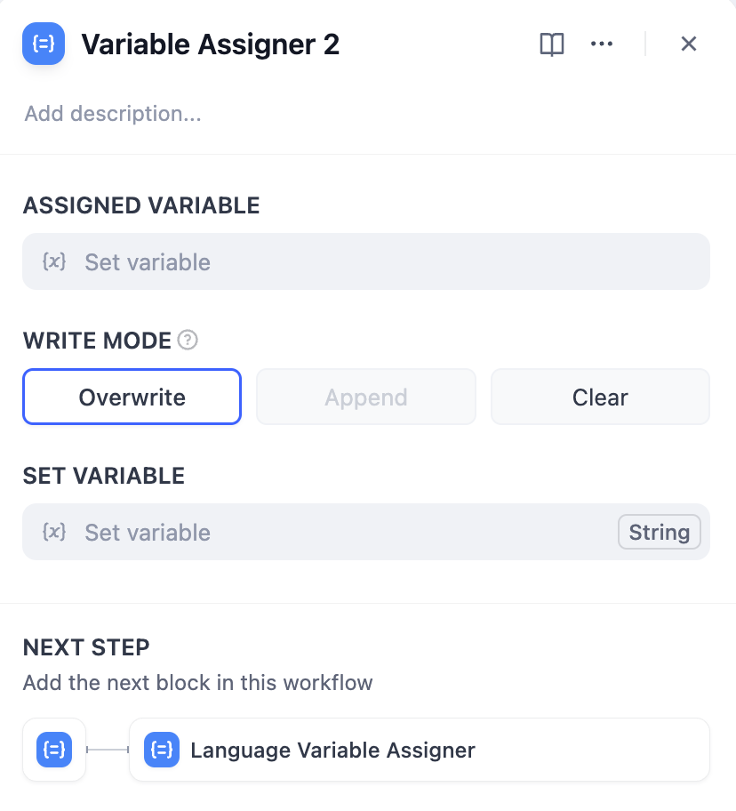
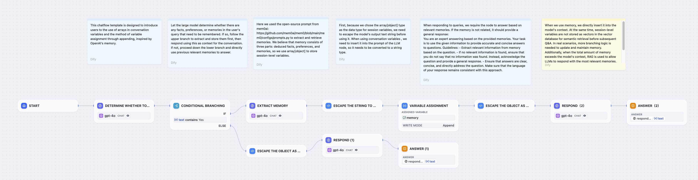
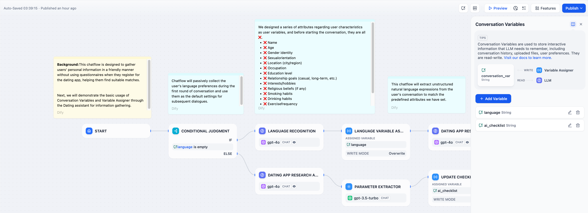
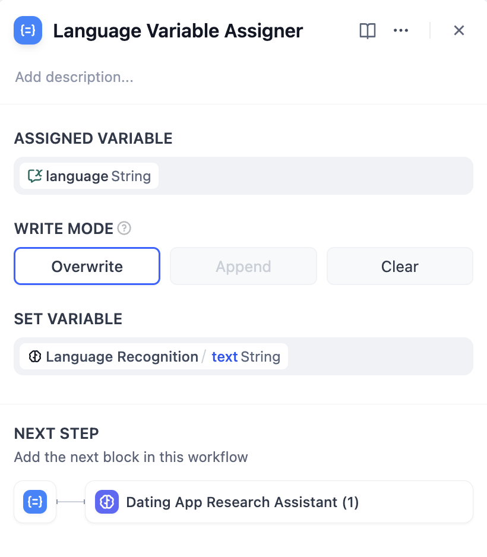

# متغیر اختصاص دهنده

### تعریف

گره اختصاص دهنده متغیر برای اختصاص دادن مقادیر به متغیرهای قابل نوشتن استفاده می شود. در حال حاضر متغیرهای قابل نوشتن پشتیبانی شده شامل موارد زیر هستند:

* [متغیرهای مکالمه](https://docs.dify.ai/guides/workflow/key-concepts#conversation-variables).

نحوه استفاده: از طریق گره اختصاص دهنده متغیر، می توانید متغیرهای گردش کار را برای ذخیره سازی موقت به متغیرهای مکالمه اختصاص دهید، که می تواند در مکالمات بعدی به طور مداوم به آن ها مراجعه شود.

<figure><figcaption></figcaption></figure>

***

### مثال های سناریو استفاده

با استفاده از گره اختصاص دهنده متغیر، می توانید زمینه را از فرآیند مکالمه، فایل های آپلود شده در کادر گفتگو (به زودی در دسترس خواهد بود) و اطلاعات ترجیحی کاربر را در متغیرهای مکالمه بنویسید. سپس می توانید به این متغیرهای ذخیره شده در مکالمات بعدی مراجعه کنید تا جریان پردازش متفاوتی را هدایت یا پاسخ هایی را تدوین کنید.

**سناریو 1**

می توانید **زمینه در حین مکالمه، فایل آپلود شده در کادر چت (به زودی در دسترس خواهد بود)، اطلاعات ترجیحی وارد شده توسط کاربر و غیره** را با استفاده از گره **اختصاص دهنده متغیر** در متغیر مکالمه بنویسید. این اطلاعات ذخیره شده را می توان در چت های بعدی برای هدایت جریان های پردازش متفاوت یا ارائه پاسخ ها به آن ها مراجعه کرد.

**سناریو 1**

**به طور خودکار محتوا را قضاوت و استخراج کنید**، سابقه را در مکالمه ذخیره کنید، اطلاعات مهم کاربر را از طریق آرایه متغیر جلسه در مکالمه ثبت کنید و از این محتوای سابقه برای شخصی سازی پاسخ ها در چت های بعدی استفاده کنید.

مثال: پس از شروع مکالمه، LLM به طور خودکار تعیین می کند که آیا ورودی کاربر حاوی حقایق، ترجیحات یا سابقه چت است که باید به خاطر سپرده شود. اگر اینطور است، LLM ابتدا آن اطلاعات را استخراج و ذخیره می کند، سپس از آن به عنوان زمینه برای پاسخگویی استفاده می کند. اگر اطلاعات جدیدی برای به خاطر سپردن وجود ندارد، LLM مستقیماً از خاطرات مرتبط قبلی برای پاسخ به سؤالات استفاده می کند.



**فرآیند پیکربندی:**

1. **تنظیم متغیرهای مکالمه:**
   * ابتدا، یک آرایه متغیرهای مکالمه `memories` از نوع array\[object] را برای ذخیره اطلاعات کاربر، ترجیحات و سابقه چت تنظیم کنید.
2. **تعیین و استخراج خاطرات:**
   * یک گره شاخه بندی شرطی اضافه کنید و از LLM برای تعیین اینکه آیا ورودی کاربر حاوی اطلاعات جدیدی است که باید به خاطر سپرده شود، استفاده کنید.
   * اگر اطلاعات جدیدی وجود دارد، شاخه بالایی را دنبال کنید و از یک گره LLM برای استخراج این اطلاعات استفاده کنید.
   * اگر اطلاعات جدیدی وجود ندارد، شاخه پایین را دنبال کنید و مستقیماً از خاطرات موجود برای پاسخگویی استفاده کنید.
3. **اختصاص/نوشتن متغیر:**
   * در شاخه بالایی، از گره اختصاص دهنده متغیر برای الحاق اطلاعات جدیداً استخراج شده به آرایه `memories` استفاده کنید.
   * از تابع escape برای تبدیل رشته متنی خروجی داده شده توسط LLM به فرمتی مناسب برای ذخیره سازی در یک array\[object] استفاده کنید.
4. **خواندن و استفاده از متغیر:**
   * در گره های LLM بعدی، محتوای آرایه `memories` را به یک رشته تبدیل کنید و آن را به عنوان زمینه در اعلان LLM درج کنید.
   * از این خاطرات برای تولید پاسخ های شخصی استفاده کنید.

کد گره در نمودار فوق به شرح زیر است:

1. تبدیل رشته به شیء

```python
import json

def main(arg1: str) -> object:
    try:
        # تجزیه رشته JSON ورودی
        input_data = json.loads(arg1)
        
        # استخراج شیء memory
        memory = input_data.get("memory", {})
        
        # ساخت شیء بازگشتی
        result = {
            "facts": memory.get("facts", []),
            "preferences": memory.get("preferences", []),
            "memories": memory.get("memories", [])
        }
        
        return {
            "mem": result
        }
    except json.JSONDecodeError:
        return {
            "result": "Error: رشته JSON نامعتبر"
        }
    except Exception as e:
        return {
            "result": f"Error: {str(e)}"
        }
```

2. تبدیل شیء به رشته

```python
import json

def main(arg1: list) -> str:
    try:
        # فرض کنید arg1[0] فرهنگ لغت مورد نیاز ما برای پردازش است
        context = arg1[0] if arg1 else {}
        
        # ساخت شیء memory
        memory = {"memory": context}
        
        # تبدیل شیء به یک رشته JSON
        json_str = json.dumps(memory, ensure_ascii=False, indent=2)
        
        # قرار دادن رشته JSON در تگ های <answer>
        result = f"<answer>{json_str}</answer>"
        
        return {
            "result": result
        }
    except Exception as e:
        return {
            "result": f"<answer>Error: {str(e)}</answer>"
        }
```

**سناریو 2**

**ثبت اولیه ورودی ترجیحات کاربر**: ترجیح زبان ورودی کاربر را در طول مکالمه به خاطر بسپارید و این زبان را در مکالمات بعدی برای پاسخ ها به طور مداوم استفاده کنید.

مثال: قبل از چت، کاربر "انگلیسی" را در کادر ورودی `language` مشخص می کند. این زبان در متغیر مکالمه نوشته می شود و LLM در پاسخگویی به این اطلاعات مراجعه می کند و در مکالمات بعدی به طور مداوم از "انگلیسی" استفاده می کند.

<figure><figcaption></figcaption></figure>

**راهنمای پیکربندی:**

**تنظیم متغیر مکالمه**: ابتدا یک متغیر مکالمه `language` تنظیم کنید. یک گره قضاوت شرطی در ابتدای جریان مکالمه اضافه کنید تا بررسی کنید که آیا متغیر `language` خالی است.

**نوشتن/اختصاص متغیر**: در ابتدای اولین دور چت، اگر متغیر `language` خالی باشد، از یک گره LLM برای استخراج زبان ورودی کاربر استفاده کنید، سپس از یک گره اختصاص دهنده متغیر برای نوشتن این نوع زبان در متغیر مکالمه `language` استفاده کنید.

**خواندن متغیر**: در دورهای مکالمه بعدی، متغیر `language` ترجیح زبان کاربر را ذخیره کرده است. گره LLM برای پاسخگویی با استفاده از نوع زبان ترجیحی کاربر، به متغیر زبان مراجعه می کند.

**سناریو 3**

**کمک به بررسی های چک لیست**: ورودی های کاربر را در طول مکالمه با استفاده از متغیرهای مکالمه ثبت کنید، محتوای چک لیست را به روز کنید و در مکالمات بعدی وجود اقلام گم شده را بررسی کنید.

مثال: پس از شروع مکالمه، LLM از کاربر می خواهد تا مواردی را که مربوط به چک لیست است در کادر چت وارد کند. هنگامی که کاربر محتوای چک لیست را ذکر می کند، آن را به روز می کند و در متغیر مکالمه ذخیره می کند. LLM پس از هر دور گفتگو به کاربر یادآوری می کند که به تکمیل اقلام گم شده ادامه دهد.

<figure><figcaption></figcaption></figure>

**فرآیند پیکربندی:**

* **تنظیم متغیر مکالمه:** ابتدا یک متغیر مکالمه `ai_checklist` تنظیم کنید و به این متغیر در LLM به عنوان زمینه برای بررسی مراجعه کنید.
* **اختصاص/نوشتن متغیر**: در هر دور از گفتگو، مقدار موجود در `ai_checklist` را در گره LLM بررسی کنید و آن را با ورودی کاربر مقایسه کنید. اگر کاربر اطلاعات جدیدی ارائه می دهد، چک لیست را به روز کنید و محتوای خروجی را با استفاده از گره اختصاص دهنده متغیر به `ai_checklist` بنویسید.
* **خواندن متغیر:** مقدار موجود در `ai_checklist` را بخوانید و آن را با ورودی کاربر در هر دور از گفتگو مقایسه کنید تا زمانی که همه اقلام چک لیست کامل شوند.

***

### استفاده از گره اختصاص دهنده متغیر

روی علامت + در سمت راست گره کلیک کنید، گره "اختصاص دهنده متغیر" را انتخاب کنید و "متغیر اختصاص داده شده" و "تنظیم متغیر" را پر کنید.

<figure><figcaption></figcaption></figure>

**تنظیم متغیرها:**

متغیر اختصاص داده شده: متغیری را که باید به آن اختصاص داده شود، انتخاب کنید، یعنی متغیر مکالمه هدف را که باید به آن اختصاص داده شود، مشخص کنید.

تنظیم متغیر: متغیری را که باید اختصاص داده شود، انتخاب کنید، یعنی متغیر منبع را که باید تبدیل شود، مشخص کنید.

با در نظر گرفتن منطق اختصاص در شکل بالا به عنوان مثال: آیتم خروجی متن `Language Recognition/text` را از گره قبلی به متغیر مکالمه `language` اختصاص دهید.

**حالت نوشتن:**

* بازنویسی: محتوای متغیر منبع را در متغیر مکالمه هدف بازنویسی می کند
* ضمیمه: هنگامی که متغیر مشخص شده از نوع آرایه است
* پاکسازی: محتوای موجود در متغیر مکالمه هدف را پاک می کند

