# هماهنگ‌سازی گره

هر دو برنامه Chatflow و Workflow از طریق کشیدن و رها کردن بصری، از هماهنگ‌سازی گره پشتیبانی می‌کنند، و دو الگوی طراحی هماهنگ‌سازی را ارائه می‌دهند: سریال و موازی.

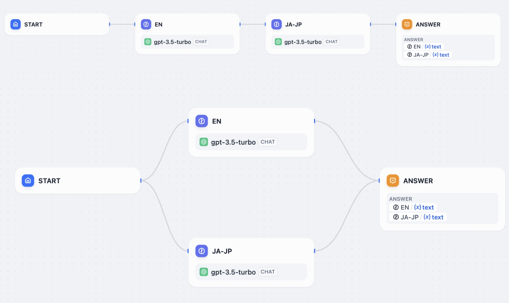

## الگوی طراحی گره سریال

در این الگو، گره‌ها به ترتیب از پیش تعیین شده به طور متوالی اجرا می‌شوند. هر گره فقط پس از تکمیل کار گره قبلی و تولید خروجی، عملیات خود را آغاز می‌کند. این امر به اطمینان از اجرای وظایف در یک توالی منطقی کمک می‌کند.

یک برنامه Workflow "تولید رمان" را در نظر بگیرید که الگوی سریال را پیاده‌سازی می‌کند: پس از اینکه کاربر سبک، ریتم و شخصیت‌های رمان را وارد می‌کند، LLM به طور متوالی طرح، داستان و پایان رمان را کامل می‌کند. هر گره بر اساس خروجی گره قبلی کار می‌کند و ثبات در سبک رمان را تضمین می‌کند.

### طراحی ساختار سریال

1. برای درج یک گره سریال جدید، روی نماد `+` بین دو گره کلیک کنید.
2. گره‌ها را به طور متوالی به هم متصل کنید.
3. همه مسیرها را به گره "پایان" برای نهایی کردن گردش کار همگرا کنید.

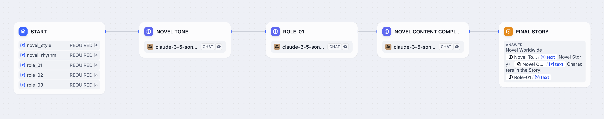

### مشاهده لاگ‌های برنامه با ساختار سریال

در یک برنامه با ساختار سریال، لاگ‌ها عملیات گره‌ها را به ترتیب نمایش می‌دهند. برای مشاهده فرآیند کامل گردش کار، از جمله ورودی/خروجی، مصرف توکن و زمان اجرا برای هر گره، روی "مشاهده لاگ‌ها - ردیابی" در گوشه سمت راست بالای کادر گفتگو کلیک کنید.

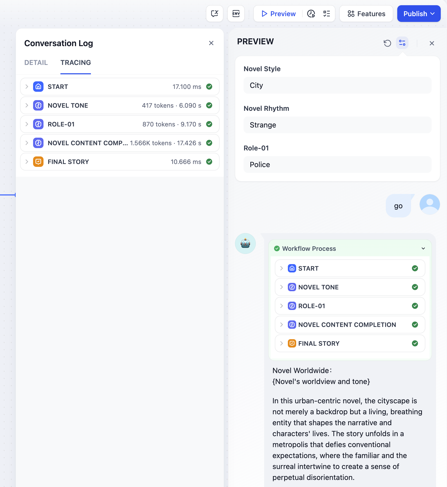

## طراحی ساختار موازی

این الگوی معماری، اجرای همزمان چندین گره را امکان‌پذیر می‌کند. گره قبلی می‌تواند همزمان چندین گره را در ساختار موازی فعال کند. این گره‌های موازی به طور مستقل عمل می‌کنند، وظایف را به طور همزمان اجرا می‌کنند و به طور قابل توجهی کارایی کلی گردش کار را افزایش می‌دهند.

یک برنامه گردش کار ترجمه را در نظر بگیرید که معماری موازی را پیاده‌سازی می‌کند: پس از اینکه کاربر متن منبع را وارد می‌کند و گردش کار را فعال می‌کند، همه گره‌ها در ساختار موازی به طور همزمان دستورالعمل‌هایی را از گره قبلی دریافت می‌کنند. این امر اجازه می‌دهد تا ترجمه به طور همزمان به چندین زبان انجام شود و زمان پردازش کلی را به طور قابل توجهی کاهش می‌دهد.

### الگوی طراحی ساختار موازی

چهار روش زیر نشان می‌دهد که چگونه می‌توان از طریق افزودن گره یا دستکاری بصری، یک ساختار موازی ایجاد کرد:

**روش ۱** روی یک گره بروید تا دکمه `+` ظاهر شود. برای افزودن چندین گره روی آن کلیک کنید و به طور خودکار یک ساختار موازی تشکیل می‌شود.

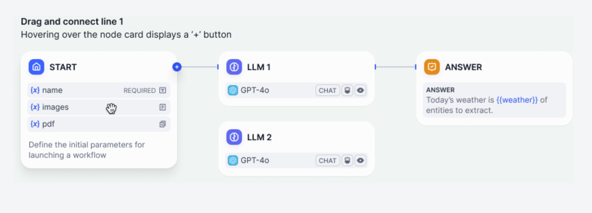

**روش ۲** با کشیدن دکمه `+` یک گره، یک اتصال از یک گره ایجاد کنید و یک ساختار موازی ایجاد کنید.

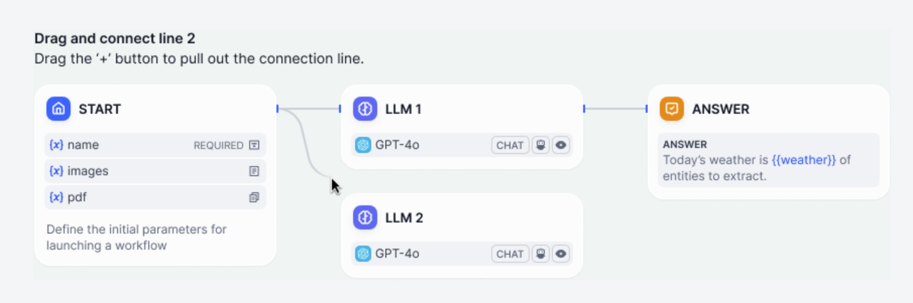

**روش ۳** با چندین گره روی بوم، آنها را به صورت بصری بکشید و به هم متصل کنید تا یک ساختار موازی تشکیل شود.

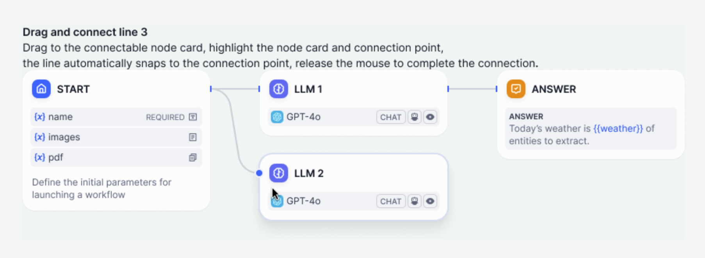

**روش ۴** علاوه بر روش‌های مبتنی بر بوم، می‌توانید از طریق بخش "گام بعدی" در پنل سمت راست یک گره، ساختارهای موازی ایجاد کنید. این روش به طور خودکار پیکربندی موازی را ایجاد می‌کند.

**نکات:**

* هر گره می‌تواند به عنوان گره پایین‌دست یک ساختار موازی عمل کند؛
* برنامه‌های Workflow به یک گره "پایان" واحد و منحصر به فرد نیاز دارند؛
* برنامه‌های Chatflow از چندین گره "پاسخ" پشتیبانی می‌کنند. هر ساختار موازی در این برنامه‌ها باید با یک گره "پاسخ" خاتمه یابد تا خروجی صحیح محتوا تضمین شود؛
* همه ساختارهای موازی به طور همزمان اجرا می‌شوند؛ گره‌ها در ساختار موازی پس از تکمیل وظایف خود نتایج را خروجی می‌کنند، بدون هیچ‌گونه رابطه ترتیبی در خروجی. هرچه ساختار موازی ساده‌تر باشد، خروجی نتایج سریعتر خواهد بود.

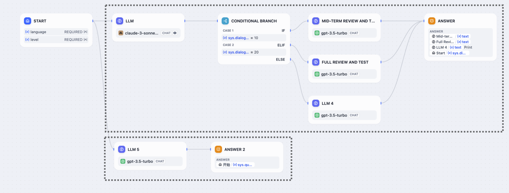

### طراحی الگوهای ساختار موازی

چهار الگوی زیر، طراحی‌های رایج ساختار موازی را نشان می‌دهند:

#### ۱. موازی معمولی

موازی معمولی به رابطه `شروع | گره‌های موازی | پایان سه لایه` اشاره دارد، که کوچکترین واحد ساختار موازی نیز هست. این ساختار بصری است و اجازه می‌دهد گردش کار پس از ورودی کاربر، چندین کار را به طور همزمان اجرا کند.

حداکثر تعداد شاخه‌های موازی ۱۰ است.

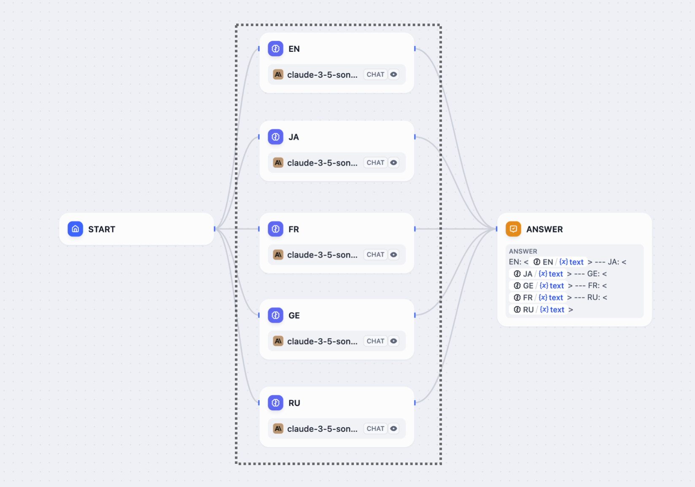

#### ۲. موازی تو در تو

موازی تو در تو به رابطه `شروع | ساختارهای موازی متعدد | پایان چند لایه` اشاره دارد. این ساختار برای گردش کارهای پیچیده‌تر مناسب است، مانند نیاز به درخواست API خارجی در یک گره خاص و به طور همزمان ارسال نتایج برگشتی به گره‌های پایین‌دست برای پردازش.

یک گردش کار از حداکثر ۳ لایه از روابط تو در تو پشتیبانی می‌کند.

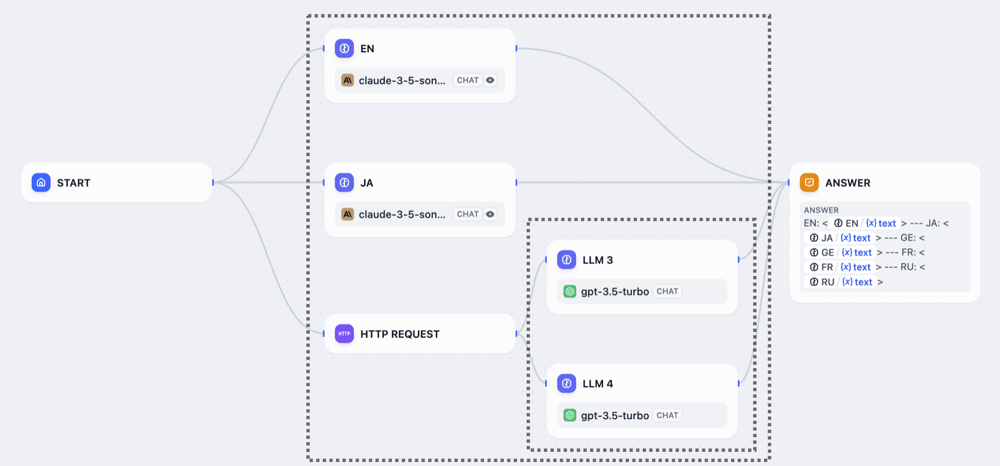

#### ۳. شاخه شرطی + موازی

ساختارهای موازی را می‌توان در ارتباط با شاخه‌های شرطی نیز استفاده کرد.

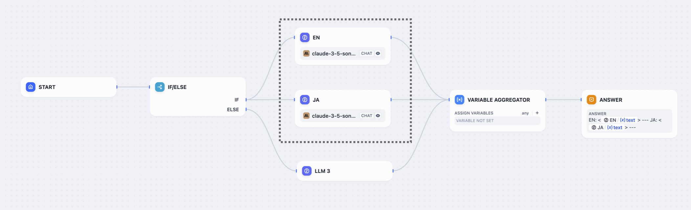

#### ۴. شاخه تکرار + موازی

این الگو ساختارهای موازی را در شاخه‌های تکرار ادغام می‌کند و کارایی اجرای وظایف تکراری را بهینه می‌کند.

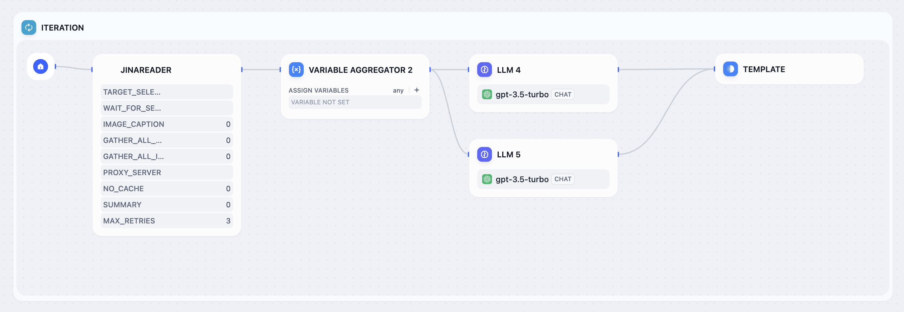

### مشاهده لاگ‌های برنامه با ساختار موازی

برنامه‌هایی با ساختار موازی، لاگ‌ها را در یک فرمت درختی تولید می‌کنند. گروه‌های گره موازی قابل جمع شدن، مشاهده لاگ‌های گره‌های فردی را آسان‌تر می‌کند.

